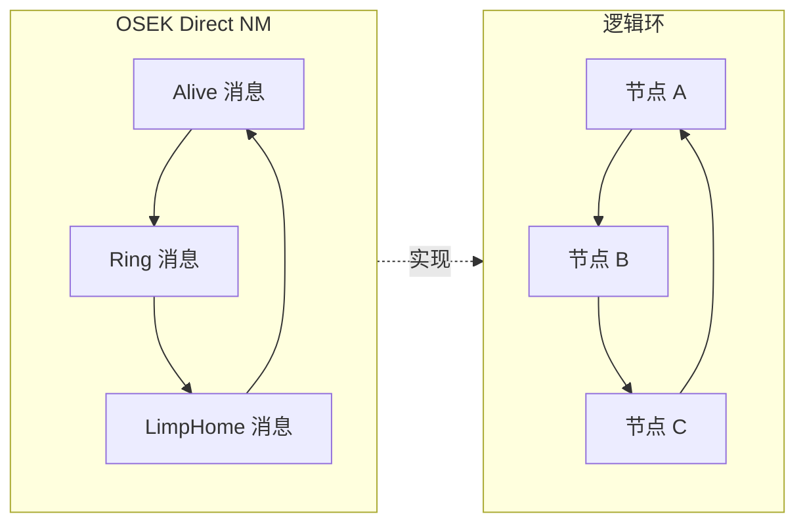
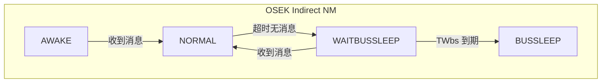
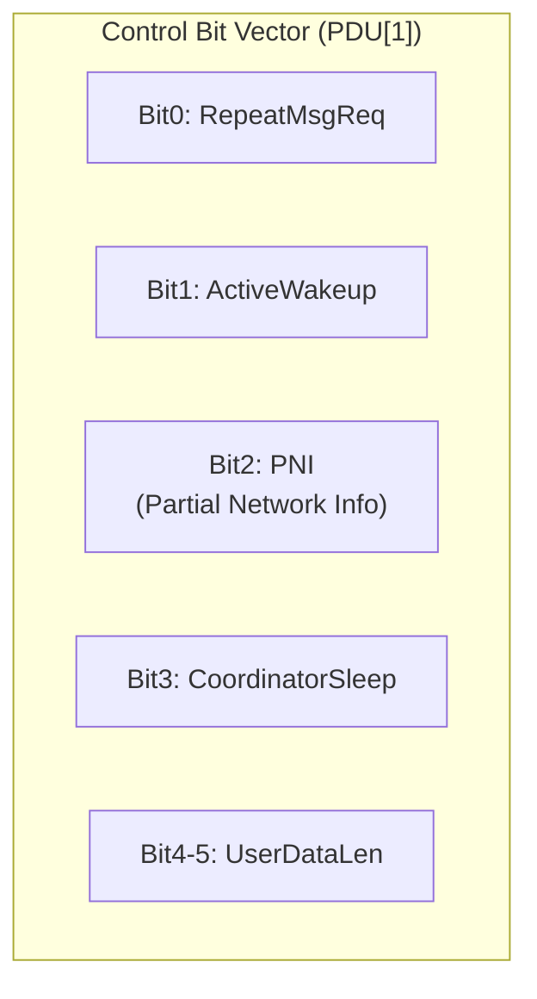
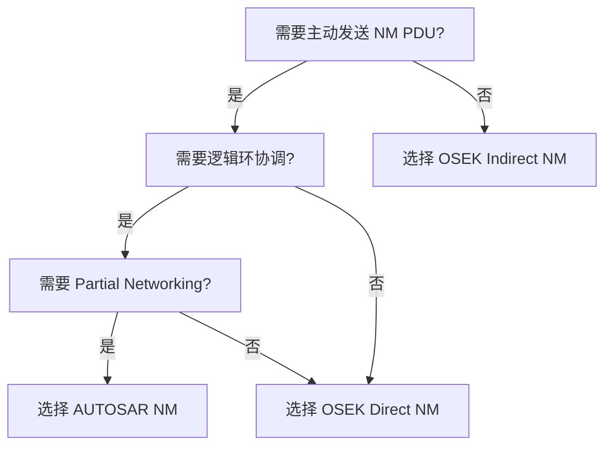

# 三种 NM 模式对比

> 属于 [[../00_MOC_总索引|MOC 总索引]] > **01_概述**

---

## 总览表

| 维度 | OSEK Direct NM | OSEK Indirect NM | AUTOSAR NM |
|------|:---:|:---:|:---:|
| **配置常量** | `NM_MODE_DIRECT` | `NM_MODE_INDIRECT` | `NM_MODE_AUTOSAR` |
| **状态数** | 10 | 7 | 7 |
| **是否发送 NM PDU** | 是 (Alive/Ring/LimpHome) | 否（静默监听） | 是 (CBV 广播) |
| **协议机制** | 逻辑环 (Alive → Ring) | 应用消息超时 | 广播 + CBV 协调 |
| **休眠协调** | Ring 传递 sleep.ind / sleep.ack | 应用消息停止即休眠 | CoordinatorSleep 位 + 协调器 |
| **总线负载控制** | Bus Load Reduction (TTyp × 2) | 不需要（无发送） | 不需要（固定周期） |
| **故障处理** | LimpHome (TMax 超时) | LimpHome (无消息超时) | 直接 BUS_SLEEP (无 LimpHome) |
| **节点标识** | NodeID (CAN ID 范围或 PDU[1]) | NodeID (PDU[1]) | Source Node ID (PDU[0]) |
| **Partial Networking** | 不支持 | 不支持 | 支持 (PNI 位) |
| **协调器角色** | 无（对等环） | 无（对等） | 可选 (Coordinator) |
| **开发状态** | 完整 | 完整 | 骨架（CBV 框架就位） |
| **适用典型场景** | 动力 CAN、底盘 CAN | 车身 CAN、信息 CAN | AUTOSAR 标准平台 |

---

## OSEK Direct NM 特征

**关键定时器**:
| 定时器 | 含义 | 模式 |
|--------|------|------|
| TTyp | 典型消息周期 (Ring 发送间隔) | PERIODIC |
| TMax | 最大接收超时 (收不到消息 → LimpHome) | ONESHOT |
| TError | LimpHome 消息周期 | PERIODIC |
| TWbs | 等待总线休眠 | ONESHOT |
| TTx | 发送重试间隔 | ONESHOT |

**消息类型**:
- **Alive**: 节点加入网络时发送，标记自身存在
- **Ring**: 沿逻辑环传递，每到一环复位 TMax
- **LimpHome**: TMax 超时后发送，降级模式（仅本节点）

---

## OSEK Indirect NM 特征

**关键特征**:
- 不发送任何 NM PDU，完全静默
- 通过监控应用层 CAN 消息判断总线活跃
- 超时无消息 → WAITBUSSLEEP → BUSSLEEP
- 收到任何消息 → 回到网络模式

**适用场景**：车身 CAN 上不需要主动协调休眠的节点。

---

## AUTOSAR NM 特征

**与 OSEK 的本质差异**:
1. **无逻辑环**：所有节点广播 NM PDU
2. **CBV 标志位**：通过 PDU[1] 的 Bit 位传递意图
3. **Repeat Message**：唤醒后发送 N 次快速消息再进入正常周期
4. **协调器机制**：协调器收集各节点 sleep-ind 后统一下令休眠
5. **无 LimpHome**：Bus-Off 直接进入 BUS_SLEEP

---

## 选择决策树

---

> 下一步: 阅读 [[../01_概述/模块架构全景图|模块架构全景图]]
