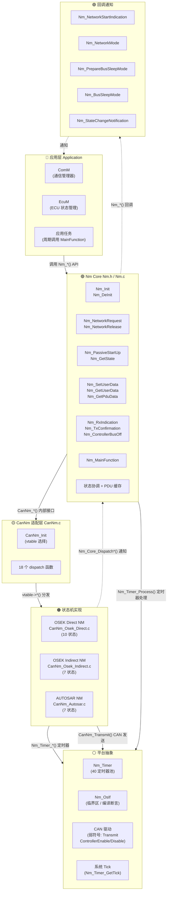
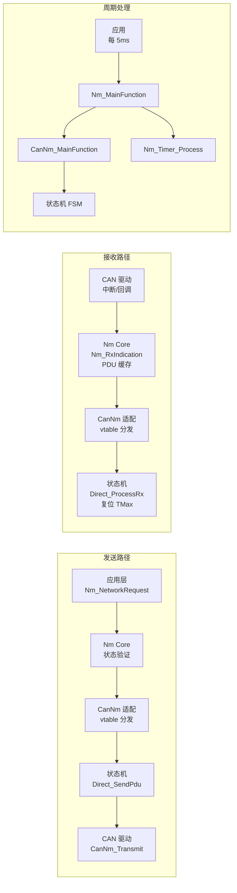

# 模块架构全景图

> 属于 [[../00_MOC_总索引|MOC 总索引]] > **01_概述**

---

## 4 层架构总图

---

## 数据流概览

---

## 文件到层级的映射

| 文件 | 属于层级 | 行数 |
|------|----------|:---:|
| `Nm.h` | Nm Core (接口) | 316 |
| `Nm.c` | Nm Core (实现) | 626 |
| `Nm_ConfigTypes.h` | Nm Core (类型) | 301 |
| `Nm_Cbk.h` | 回调 (接口) | 132 |
| `Nm_Internal.h` | Nm Core (内部) | 90 |
| `CanNm/CanNm.h` | CanNm 适配 (接口) | 299 |
| `CanNm/CanNm.c` | CanNm 适配 (实现) | 369 |
| `CanNm/CanNm_Osek_Direct.c` | 状态机 - Direct | 372 |
| `CanNm/CanNm_Osek_Indirect.c` | 状态机 - Indirect | 212 |
| `CanNm/CanNm_Autosar.c` | 状态机 - AUTOSAR | 758 |
| `Nm_Timer/Nm_Timer.h` | 平台 - Timer 接口 | 161 |
| `Nm_Timer/Nm_Timer.c` | 平台 - Timer 实现 | 182 |
| `OsIf/Nm_OsIf.h` | 平台 - OS 抽象 | 64 |
| `test/test_nm_state.c` | 测试 | 431 |

---

> 下一步: 阅读 [[../02_架构详解/分层架构设计|分层架构设计]]
