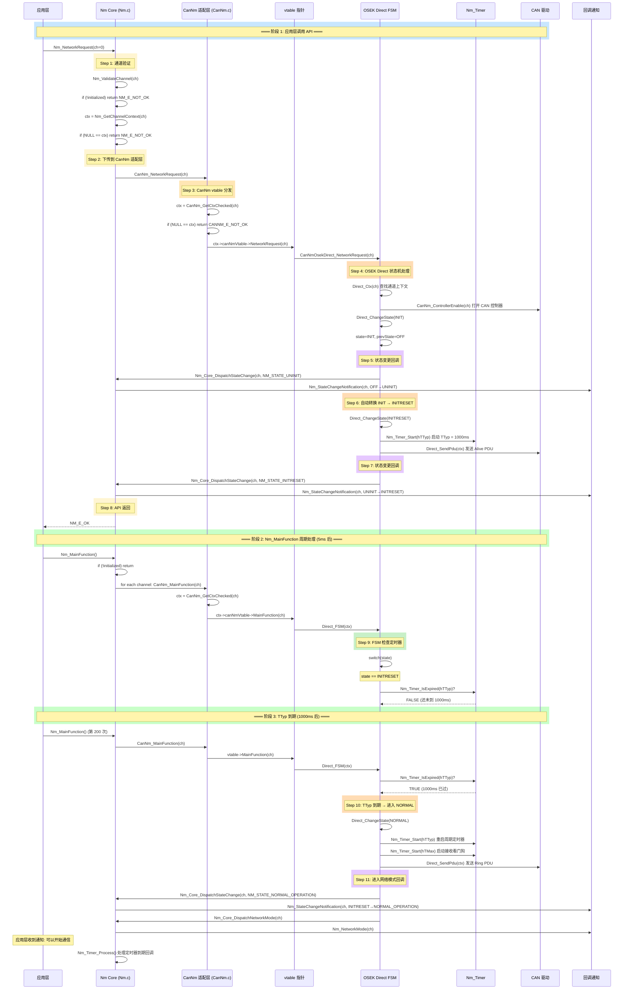

# API 请求处理全链路 (端到端走读)

> 属于 [[../00_MOC_总索引|MOC 总索引]] > **02_架构详解**

> **宣讲定位**: 用一张序列图 + 步进解说，回答"调用 `Nm_NetworkRequest()` 后到底发生了什么"。
> 覆盖范围：一次 API 调用 + 一次 `Nm_MainFunction` 周期 = 完整闭环。

---

## 全链路序列图 (OSEK Direct, 主动唤醒)



---

## 步进解说

### Step 1-2: 通道验证 (Nm.c:107-116 → Nm.c:206-217)

```c
/* Nm.c */
static Nm_ReturnType Nm_ValidateChannel(NetworkHandleType channel)
{
    if (0U == Nm_Core.initialized) { return NM_E_NOT_OK; }    /* 模块未初始化? */
    if (NULL == Nm_GetChannelContext(channel)) { return NM_E_NOT_OK; } /* 通道不存在? */
    return NM_E_OK;
}

Nm_ReturnType Nm_NetworkRequest(NetworkHandleType nmChannelHandle)
{
    CanNm_ReturnType result;

    if (NM_E_OK != Nm_ValidateChannel(nmChannelHandle)) {
        return NM_E_NOT_OK;
    }
    result = CanNm_NetworkRequest(nmChannelHandle);
    return (CANNM_E_OK == result) ? NM_E_OK : NM_E_NOT_OK;
}
```

**关键**: `Nm_ValidateChannel` 是几乎所有 API 的第一道关卡，防止未初始化或无效通道的调用。

### Step 3: vtable 分发 (CanNm.c:240-245)

```c
/* CanNm.c */
CanNm_ReturnType CanNm_NetworkRequest(NetworkHandleType channel)
{
    Nm_ChannelContextType* ctx = CanNm_GetCtxChecked(channel);
    if (NULL == ctx) { return CANNM_E_NOT_OK; }
    return ctx->canNmVtable->NetworkRequest(channel);
    /* ↑ 运行时根据 nmMode 跳转到:
     *   Direct → CanNmOsekDirect_NetworkRequest
     *   Indirect → CanNmOsekIndirect_NetworkRequest
     *   AUTOSAR → CanNmAutosar_NetworkRequest
     */
}
```

**关键**: `CanNm_GetCtxChecked` 不仅检查 ctx 非空，还检查 `canNmVtable` 已分配。
18 个 dispatch 函数都是这个模式——2 行代码，零分支。

### Step 4-7: 状态机处理 (CanNm_Osek_Direct.c:285-292 → 74-100)

```c
/* CanNm_Osek_Direct.c */
CanNm_ReturnType CanNmOsekDirect_NetworkRequest(NetworkHandleType ch)
{
    CanNmOsekDirect_ChannelType* ctx = Direct_Ctx(ch);
    if (NULL == ctx) { return CANNM_E_NOT_OK; }
    Direct_ChangeState(ctx, CANNM_STATE_INIT);    /* 状态转换: OFF → INIT */
    CanNm_ControllerEnable(ch);                     /* 打开 CAN 控制器 */
    return CANNM_E_OK;
}

/* Direct_ChangeState 在 INIT 转换中不做额外动作 */
/* 真正的转换在 Direct_FSM 的 INIT case 里发生 */

/* Direct_FSM — INIT case */
case CANNM_STATE_INIT:
    Direct_ChangeState(ctx, CANNM_STATE_INITRESET);   /* 立即: INIT → INITRESET */
    Direct_SendPdu(ctx);                               /* 发送 Alive PDU */
    break;

/* Direct_FSM — INITRESET case */
case CANNM_STATE_INITRESET:
    if (Nm_Timer_IsExpired(ctx->hTTyp)) {
        Direct_ChangeState(ctx, CANNM_STATE_NORMAL);  /* TTyp 到期 → NORMAL */
        Nm_Timer_Start(ctx->hTTyp);                   /* 重启周期 */
        Nm_Timer_Start(ctx->hTMax);                   /* 启动看门狗 */
        Direct_SendPdu(ctx);                          /* 发送 Ring */
    }
    break;
```

**关键时间线**:
- `N etworkRequest` 调用瞬间: OFF → INIT → INITRESET (同步完成)
- API 返回时: 状态已是 INITRESET，TTyp 正在跑
- 1000ms 后 MainFunction 中 TTyp 到期: INITRESET → NORMAL
- NORMAL 进入时: 触发 `Nm_NetworkMode` 回调

### Step 8: API 返回

`N m_NetworkRequest` 返回 `NM_E_OK` 只需 3 个条件:
1. 模块已初始化
2. 通道存在
3. CanNm 层操作成功 (vtable->NetworkRequest 返回 CANNM_E_OK)

**API 返回 ≠ 进入 NORMAL 状态**。API 返回时状态是 INITRESET，NORMAL 要到 TTyp 到期后才进入。

### Step 9-11: Nm_MainFunction 周期处理 (Nm.c:497-516)

```c
/* Nm.c */
void Nm_MainFunction(void)
{
    uint8 i;
    if (0U == Nm_Core.initialized) { return; }

    /* 先处理状态机 (使用 pre-restart 的定时器到期状态) */
    for (i = 0; i < Nm_Core.config->numChannels && i < NM_MAX_CHANNELS; i++) {
        if (Nm_Core.channels[i].config != NULL) {
            CanNm_MainFunction(Nm_Core.channels[i].handle);
        }
    }

    /* 再处理定时器 (重启 PERIODIC 定时器，触发到期回调) */
    Nm_Timer_Process();
}
```

**关键**: 状态机处理在 `Nm_Timer_Process` 之前。这样 FSM 检查到的 `IsExpired` 状态
是由上一次 MainFunction 中 Timer_Process 设置的，避免同一个周期内定时器"立即到期"。

---

## 与其他 NM 模式的差异

| 步骤 | OSEK Direct | OSEK Indirect | AUTOSAR NM |
|------|-------------|---------------|------------|
| API 调用后状态 | INIT → INITRESET | INIT → AWAKE | BUS_SLEEP → REPEAT_MESSAGE |
| 是否发送 PDU | 是 (Alive → Ring) | **否** | 是 (CBV 广播) |
| 进入 NORMAL 条件 | TTyp 到期 | 收到应用消息 | RepeatMsgTimer 到期 |
| MainFunction 中的关键检查 | TTyp / TMax | hToB | hNmTimeout / hNmRepeatMsg |

---

## 宣讲备忘

> **FAQ**: "调用 NetworkRequest 之后，Bus-Sleep 到网络模式需要多久？"
>
> **答**: API 返回是瞬时的（几微秒）。但真正进入 NORMAL_OPERATION（触发 `Nm_NetworkMode` 回调）
> 需要等到 TTyp 到期（默认 1000ms）。这 1000ms 内 NM 在 INITRESET 状态，已经发送了 Alive PDU。

> **FAQ**: "Nm_MainFunction 为什么要先 FSM 再 Timer_Process？"
>
> **答**: 防止同一周期内 PERIODIC 定时器被重启后立即再次到期。
> FSM 先读取"上一周期已到期"的状态做决策，
> Timer_Process 再重启 PERIODIC 定时器为下一周期准备。

---

> 相关文档:
> - [[../02_架构详解/vtable多态分发机制|vtable 多态分发机制]] — vtable 选择与 dispatch 细节
> - [[../02_架构详解/回调通知机制|回调通知机制]] — DispatchStateChange / DispatchNetworkMode 详解
> - [[../03_状态机详解/OSEK_Direct_状态机|OSEK Direct 状态机]] — INIT / INITRESET / NORMAL 转换源码
> - [[../05_源码导读/Nm_Core源码导读|Nm Core 源码导读]] — Nm_MainFunction 完整实现
> - [[../05_源码导读/CanNm适配层源码导读|CanNm 适配层源码导读]] — 18 个 dispatch 函数
