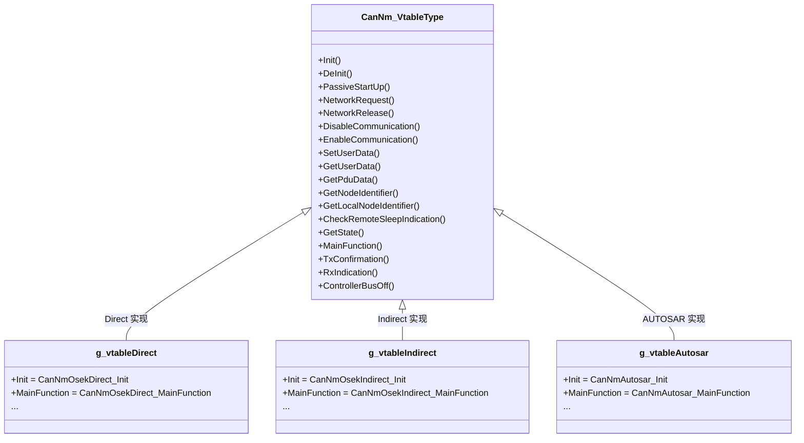
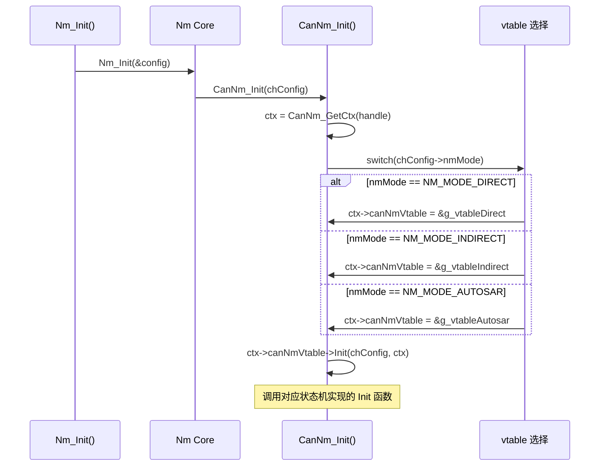
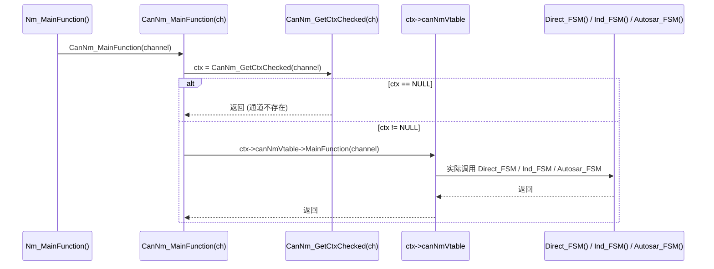

# vtable 多态分发机制

> 属于 [[../00_MOC_总索引|MOC 总索引]] > **02_架构详解**

vtable（虚函数表）是 NM 模块实现多态的核心机制。每种 NM 模式 (Direct/Indirect/AUTOSAR) 提供 18 个函数实现，
运行时通过一个函数指针表选择对应实现，**完全消除 `if/else` 或 `switch` 分支**。

---

## CanNm_VtableType 定义 (18 个函数指针)

```c
/* 来自 CanNm/CanNm.h */
typedef struct CanNm_VtableType {
    void             (*Init)(const Nm_ChannelConfigType* config, Nm_ChannelContextType* ctx);
    void             (*DeInit)(NetworkHandleType channel);
    CanNm_ReturnType (*PassiveStartUp)(NetworkHandleType channel);
    CanNm_ReturnType (*NetworkRequest)(NetworkHandleType channel);
    CanNm_ReturnType (*NetworkRelease)(NetworkHandleType channel);
    void             (*DisableCommunication)(NetworkHandleType channel);
    void             (*EnableCommunication)(NetworkHandleType channel);
    void             (*SetUserData)(NetworkHandleType channel, const uint8* data, uint8 length);
    void             (*GetUserData)(NetworkHandleType channel, uint8* data, uint8* nodeId);
    void             (*GetPduData)(NetworkHandleType channel, uint8* pdu);
    uint8            (*GetNodeIdentifier)(NetworkHandleType channel);
    uint8            (*GetLocalNodeIdentifier)(NetworkHandleType channel);
    boolean          (*CheckRemoteSleepIndication)(NetworkHandleType channel);
    void             (*GetState)(NetworkHandleType channel, Nm_StateType* state, Nm_ModeType* mode);
    void             (*MainFunction)(NetworkHandleType channel);
    void             (*TxConfirmation)(NetworkHandleType channel);
    void             (*RxIndication)(NetworkHandleType channel, const uint8* pduData, uint8 pduLength);
    void             (*ControllerBusOff)(NetworkHandleType channel);
} CanNm_VtableType;
```

---

## vtable 实例化 (CanNm.c 中)



三个 vtable 实例为 `static const`，编译时确定，存储在 ROM 中。

---

## vtable 选择流程 (CanNm_Init)



---

## Dispatch 模式 (以 CanNm_MainFunction 为例)



**所有 18 个 CanNm_*() 函数都遵循此 dispatch 模式**。

---

## 三种实现的关键差异

| vtable 函数 | Direct | Indirect | AUTOSAR |
|-------------|:------:|:--------:|:-------:|
| `Init` | 分配 5 个定时器 | 分配 2 个定时器 | 分配 3 个定时器, 设置 CBV 默认值 |
| `PassiveStartUp` | → INITRESET | → AWAKE | → REPEAT_MESSAGE (不设 ActiveWakeup) |
| `NetworkRequest` | → INIT | → AWAKE | 按当前状态决定转换 |
| `NetworkRelease` | → NORMALPREPSLEEP | → WAITBUSSLEEP | 协调器→SYNCHRONIZE, 非协调器→READY_SLEEP |
| `SetUserData` | 复制到 txUserData | **空函数 (不发送)** | 复制到 txUserData + 设置 cbvUserDataLen |
| `TxConfirmation` | 清除 txPending | **空函数** | 空函数 (或流控) |
| `ControllerBusOff` | → LIMPHOME | → LIMPHOME | **直接 → BUS_SLEEP** |

---

## 为什么用 vtable？

| 对比项 | if/else 分支 | vtable 多态 |
|--------|:-----------:|:-----------:|
| 新增 NM 类型 | 修改所有 CanNm_*() 函数 | 新增一个 .c 文件 + vtable 实例 |
| 运行时开销 | N 路分支判断 | 一次间接跳转 |
| 代码行数 | 每个函数内部膨胀 | 每个函数 2-3 行 |
| 编译优化 | 难以优化 | 编译器可内联常量化 vtable |
| 可测试性 | 需覆盖所有分支 | 每种 NM 模式独立测试 |

---

> 下一步: 阅读 [[../02_架构详解/回调通知机制|回调通知机制]]
