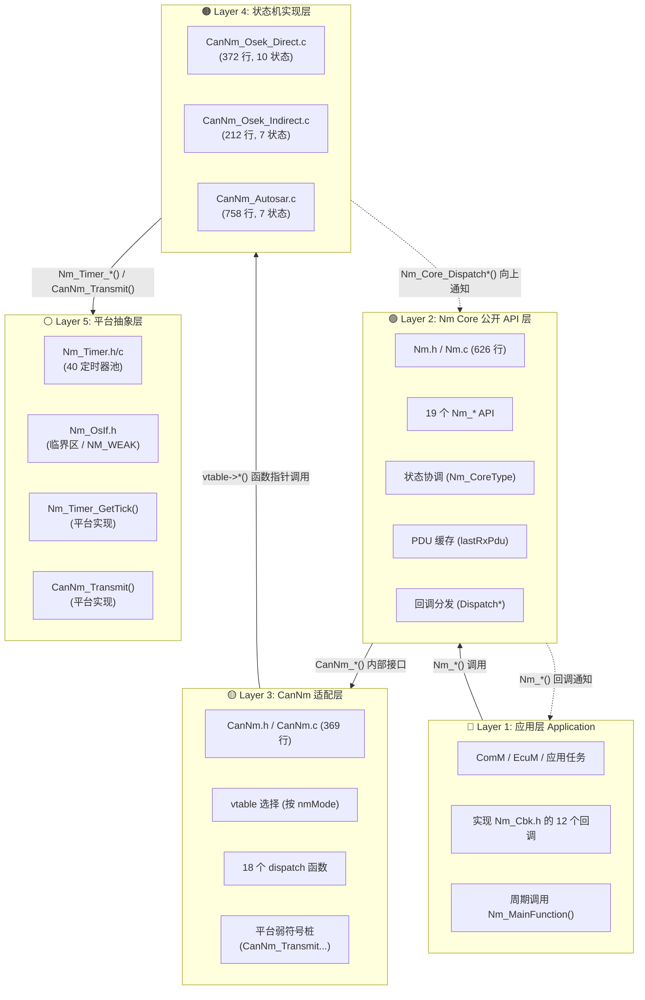

# 分层架构设计

> 属于 [[../00_MOC_总索引|MOC 总索引]] > **02_架构详解**

NM 模块采用 **5 层分层架构**，每层职责单一，层间通过明确的接口通信。

---

## 架构总图



---

## 各层详解

### Layer 1: 应用层

**职责**: 使用 NM 模块，响应 NM 事件。

**关键动作**:
- 调用 `Nm_Init(&config)` 初始化
- 调用 `Nm_NetworkRequest(ch)` / `Nm_NetworkRelease(ch)` 控制网络
- 周期调用 `Nm_MainFunction()` (通常每 5ms)
- 在 CAN 中断中调用 `Nm_RxIndication()` / `Nm_TxConfirmation()`

**关键实现**:
- 实现 `Nm_Cbk.h` 中的 12 个回调函数（至少空函数体）
- 提供 3 个平台适配函数 (`Nm_Timer_GetTick`, `CanNm_Transmit`, `CanNm_ControllerEnable/Disable`)

### Layer 2: Nm Core 层

**职责**: 对外提供统一接口，对内协调状态。

**关键数据**: `Nm_Core` 全局单例

```c
typedef struct {
    uint8                   initialized;
    const Nm_ConfigType*    config;
    Nm_ChannelContextType   channels[NM_MAX_CHANNELS];  /* 8 通道 */
} Nm_CoreType;
```

**关键功能**:
| 功能 | 实现位置 | 说明 |
|------|----------|------|
| Init/DeInit | `Nm.c:121` / `Nm.c:172` | 分配通道，初始化 CanNm |
| MainFunction | `Nm.c:497` | 先状态机 → 后定时器处理 |
| RxIndication | `Nm.c:544` | 缓存 PDU → 分发到 CanNm |
| TxConfirmation | `Nm.c:534` | 分发到 CanNm 状态机 |
| Dispatch* | `Nm.c:578-625` | 接收 CanNm 通知 → 触发回调 |

**状态验证**: 每次 API 调用先通过 `Nm_ValidateChannel()` 验证初始化状态和通道有效性。

### Layer 3: CanNm 适配层

**职责**: vtable 多态分发，消除 `if/else` 分支。

**关键机制**:

```c
/* Init 时根据 nmMode 选择 vtable */
switch (channelConfig->nmMode) {
    case NM_MODE_DIRECT:   ctx->canNmVtable = &g_vtableDirect;   break;
    case NM_MODE_INDIRECT: ctx->canNmVtable = &g_vtableIndirect; break;
    case NM_MODE_AUTOSAR:  ctx->canNmVtable = &g_vtableAutosar;  break;
}
```

**18 个 dispatch 函数**: 每个 `CanNm_Xxx(channel)` 函数内部只有两行:
```c
ctx = CanNm_GetCtxChecked(channel);
if (NULL != ctx) { ctx->canNmVtable->Xxx(channel); }
```

### Layer 4: 状态机实现层

**职责**: 三种 NM 协议的独立状态机。

**3 个文件**:
| 文件 | NM 模式 | 状态数 | 定时器 |
|------|---------|:-----:|--------|
| `CanNm_Osek_Direct.c` | Direct | 10 | hTTyp, hTMax, hTError, hTWbs, hTTx |
| `CanNm_Osek_Indirect.c` | Indirect | 7 | hToB, hTWbs |
| `CanNm_Autosar.c` | AUTOSAR | 7 | hNmTimeout, hNmRepeatMsg, hNmWaitBusSleep |

**每个文件都实现 18 个 vtable 函数指针**。

### Layer 5: 平台抽象层

**职责**: 隔离硬件/RTOS 依赖，实现零平台绑定。

**仅需 3 样东西**:
1. `Nm_Timer_GetTick()` — 毫秒级 tick
2. `CanNm_Transmit()` — CAN 帧发送
3. `CanNm_ControllerEnable/Disable()` — CAN 控制器控制

---

## 层间通信模式

| 方向 | 方式 | 示例 |
|------|------|------|
| 上层 → 下层 | 直接函数调用 | `Nm_NetworkRequest()` → `CanNm_NetworkRequest()` → `vtable->NetworkRequest()` |
| 下层 → 上层 | Dispatch 通知 | `Direct_ChangeState()` → `Nm_Core_DispatchStateChange()` → `Nm_StateChangeNotification()` |
| 下层 → 平台 | 函数调用 (弱符号) | `Direct_SendPdu()` → `CanNm_Transmit()` |
| 平台 → 下层 | 回调 | CAN 中断 → `Nm_RxIndication()` → `CanNm_RxIndication()` |

---

> 下一步: 阅读 [[../02_架构详解/模块依赖关系总图|模块依赖关系总图]]
