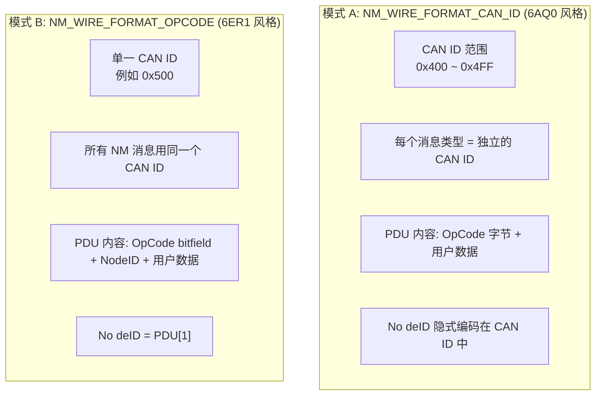

# 双线缆协议设计

> 属于 [[../00_MOC_总索引|MOC 总索引]] > **02_架构详解**

NM 标准化模块支持两种互斥的 PDU 线缆协议格式，通过 `Nm_WireFormatConfigType.wireFormat` 字段在配置时选择。

---

## 两种线缆协议对比



---

## CAN ID 模式 (NM_WIRE_FORMAT_CAN_ID)

### PDU 格式

| 字节 | 内容 | 说明 |
|:---:|------|------|
| Byte 0 | `OpCode` | 消息类型: `NM_OPCODE_ALIVE` (0x01) / `NM_OPCODE_RING` (0x02) / `NM_OPCODE_LIMPHOME` (0x04) |
| Byte 1~7 | 用户数据 | 可选，最多 7 字节 |

### 消息类型 OpCode 定义

| OpCode | 名称 | 说明 |
|:------:|------|------|
| 0x01 | `NM_OPCODE_ALIVE` | Alive 消息 |
| 0x02 | `NM_OPCODE_RING` | Ring 消息 |
| 0x04 | `NM_OPCODE_LIMPHOME` | LimpHome 消息 |
| 0x11 | `NM_OPCODE_ALIVE_IND` | Alive 指示 |
| 0x31 | `NM_OPCODE_ALIVE_IND_ACK` | Alive 指示确认 |
| 0x12 | `NM_OPCODE_RING_IND` | Ring 指示 |
| 0x32 | `NM_OPCODE_RING_IND_ACK` | Ring 指示确认 |
| 0x22 | `NM_OPCODE_RING_ACK` | Ring 确认 |
| 0x14 | `NM_OPCODE_LIMPHOME_IND` | LimpHome 指示 |
| 0x34 | `NM_OPCODE_LIMPHOME_IND_ACK` | LimpHome 指示确认 |

### 配置示例

```c
.wireConfig = {
    .wireFormat    = NM_WIRE_FORMAT_CAN_ID,
    .canIdBase     = 0x400,        /* NM 消息起始 CAN ID */
    .canIdMax      = 0x4FF,        /* NM 消息最大 CAN ID */
    .pduOpCodeAlive   = 0x01,
    .pduOpCodeRing    = 0x02,
    .pduOpCodeLimpHome = 0x04,
}
```

### 发送逻辑 (Direct_SendPdu)

```c
if (NM_WIRE_FORMAT_CAN_ID == ctx->config->wireConfig.wireFormat) {
    if (ctx->state == CANNM_STATE_NORMAL || ctx->state == CANNM_STATE_TWBS_NORMAL) {
        pdu[0] = ctx->config->wireConfig.pduOpCodeRing;
    } else if (ctx->state >= CANNM_STATE_LIMPHOME) {
        pdu[0] = ctx->config->wireConfig.pduOpCodeLimpHome;
    } else {
        pdu[0] = ctx->config->wireConfig.pduOpCodeAlive;
    }
}
```

---

## OpCode 模式 (NM_WIRE_FORMAT_OPCODE)

### PDU 格式

| 字节 | 内容 | 说明 |
|:---:|------|------|
| Byte 0 | `OpCode Bitfield` | 按位编码: Alive / Ring / LimpHome / SleepAck / RepeatMsg / Active |
| Byte 1 | `NodeID` | 发送节点的标识符 |
| Byte 2~7 | 用户数据 | 可选，最多 6 字节 |

### OpCode bitfield 定义

| Bit | 名称 | 宏 | 说明 |
|:---:|------|------|------|
| 0 | Alive | `NM_OP_ALIVE_BIT` (0x01) | 表示此消息是 Alive 类型 |
| 1 | Ring | `NM_OP_RING_BIT` (0x02) | 表示此消息是 Ring 类型 |
| 2 | LimpHome | `NM_OP_LIMPHOME_BIT` (0x04) | 表示此消息是 LimpHome 类型 |
| 3 | SleepAck | `NM_OP_SLEEP_ACK_BIT` (0x08) | 休眠确认 |
| 4 | SleepInd | `NM_OP_SLEEP_IND_BIT` (0x10) | 休眠指示 |
| 5 | RepeatMsg | `NM_OP_REPEAT_MSG_BIT` (0x20) | 重复消息请求 |
| 6 | Active | `NM_OP_ACTIVE_BIT` (0x40) | 活跃节点标记 |
| 7 | Reserved | `NM_OP_RESERVED_BIT` (0x80) | 保留 |

### 配置示例

```c
.wireConfig = {
    .wireFormat     = NM_WIRE_FORMAT_OPCODE,
    .singleCanId    = 0x500,        /* 所有 NM 消息使用此 CAN ID */
    .pduOpCodeAlive    = 0x01,      /* OpCode 模式不使用这些字段，但须初始化 */
    .pduOpCodeRing     = 0x02,
    .pduOpCodeLimpHome = 0x04,
}
```

### 发送逻辑 (Direct_SendPdu)

```c
/* OpCode 模式 */
if (ctx->state == CANNM_STATE_NORMAL || ctx->state == CANNM_STATE_TWBS_NORMAL) {
    pdu[0] = NM_OP_RING_BIT;
    if (ctx->repeatMsgRequested) { pdu[0] |= NM_OP_REPEAT_MSG_BIT; }
} else if (ctx->state >= CANNM_STATE_LIMPHOME) {
    pdu[0] = NM_OP_LIMPHOME_BIT;
} else {
    pdu[0] = NM_OP_ALIVE_BIT;
}
pdu[0] |= NM_OP_ACTIVE_BIT;   /* 总是设置 Active 位 */
pdu[1] = ctx->config->nodeId;  /* No deID 放在 Byte 1 */
```

---

## 两种模式的完整对比

| 维度 | CAN ID 模式 | OpCode 模式 |
|------|-------------|-------------|
| CAN ID 数量 | 多个 (基地址 + 偏移) | 1 个 |
| No deID 位置 | CAN ID 隐式编码 | PDU[1] 显式编码 |
| OpCode 编码 | Byte 0 = 独立 OpCode | Byte 0 = Bitfield 组合 |
| 同时支持多种消息 | 同一帧仅一种 | 同一帧可组合多个 bit |
| Receive 匹配 | CAN 硬件滤波器 (ID 范围) | 软件检查 PDU[0] bit |
| 原始项目来源 | 6AQ0 | 6ER1 |
| 硬件资源 | 多个 CAN 滤波器 | 1 个 CAN 滤波器 |

---

## PDU 整体结构 (N m_PduType)

```c
typedef struct {
    uint8 data[NM_PDU_MAX_LENGTH];   /* NM_PDU_MAX_LENGTH = 8 */
    uint8 length;
} Nm_PduType;
```

PDU 固定为 8 字节，编译时由 `NM_STATIC_ASSERT(NM_PDU_MAX_LENGTH == 8, NmPduLengthMustBe8)` 检查。

---

> 下一步: 阅读 [[../03_状态机详解/OSEK_Direct_状态机|OSEK Direct 状态机]]
