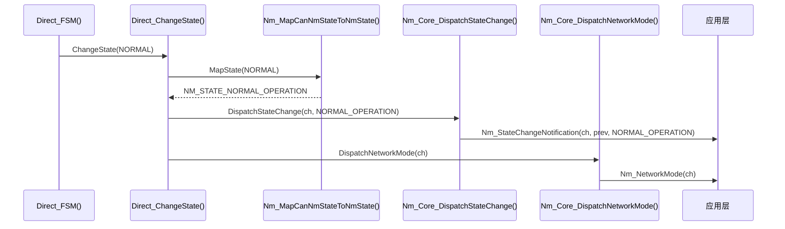

# 回调通知机制

> 属于 [[../00_MOC_总索引|MOC 总索引]] > **02_架构详解**

NM 模块通过 **12 个回调函数**向应用层通知状态变化和事件。回调声明在 `Nm_Cbk.h`，
应用层实现，NM Core 通过 5 个 `Nm_Core_Dispatch*()` 函数触发。

---

## 回调全景图

```mermaid
graph TD
    subgraph FSM["状态机层 触发源"]
        S1["ChangeState(NORMAL)"]
        S2["ChangeState(NORMALPREPSLEEP)"]
        S3["ChangeState(BUSSLEEP)"]
        S4["收到 NM PDU (Bus-Sleep)"]
        S5["任意状态变更"]
        S6["PDU 接收"]
        S7["远程睡眠指示"]
        S8["远程睡眠取消"]
        S9["Tx 超时"]
        S10["LimpHome 进入"]
        S11["总线同步"]
        S12["协调器就绪"]
    end

    subgraph Dispatch["Nm Core 分发层"]
        D1["Nm_Core_DispatchNetworkMode()"]
        D2["Nm_Core_DispatchPrepareBusSleep()"]
        D3["Nm_Core_DispatchBusSleep()"]
        D4["Nm_Core_DispatchNetworkStart()"]
        D5["Nm_Core_DispatchStateChange()"]
    end

    subgraph Callbacks["应用层回调 (Nm_Cbk.h)"]
        C1["Nm_NetworkMode()"]
        C2["Nm_PrepareBusSleepMode()"]
        C3["Nm_BusSleepMode()"]
        C4["Nm_NetworkStartIndication()"]
        C5["Nm_StateChangeNotification()"]
        C6["Nm_PduRxIndication()"]
        C7["Nm_RemoteSleepIndication()"]
        C8["Nm_RemoteSleepCancellation()"]
        C9["Nm_TxTimeoutException()"]
        C10["Nm_LimpHomeIndication()"]
        C11["Nm_RestartIndication()"]
        C12["Nm_CoordReadyToSleep()"]
    end

    S1 --> D1 --> C1
    S2 --> D2 --> C2
    S3 --> D3 --> C3
    S4 --> D4 --> C4
    S5 --> D5 --> C5

    S6 -.-> C6
    S7 -.-> C7
    S8 -.-> C8
    S9 -.-> C9
    S10 -.-> C10
    S11 -.-> C11
    S12 -.-> C12
```



---

## 回调详细说明

### 状态通知回调 (5 个)

| 回调 | 触发时机 | Direct | Indirect | AUTOSAR | 编译开关 |
|------|----------|:------:|:--------:|:-------:|----------|
| `Nm_NetworkStartIndication` | Bus-Sleep 中收到 NM PDU 唤醒 | INITRESET | AWAKE | REPEAT_MESSAGE | 默认 |
| `Nm_NetworkMode` | 进入网络模式 (NORMAL / NORMAL_OPERATION) | NORMAL | NORMAL | NORMAL_OPERATION | 默认 |
| `Nm_PrepareBusSleepMode` | 进入准备休眠状态 | NORMALPREPSLEEP | WAITBUSSLEEP | PREPARE_BUS_SLEEP | 默认 |
| `Nm_BusSleepMode` | 进入总线休眠状态 | BUSSLEEP | BUSSLEEP | BUS_SLEEP | 默认 |
| `Nm_StateChangeNotification` | 任意状态变更 | 全部 | 全部 | 全部 | `NM_STATE_CHANGE_IND_ENABLED` |

### 数据通知回调 (4 个)

| 回调 | 触发时机 | 编译开关 |
|------|----------|----------|
| `Nm_PduRxIndication` | 收到 NM PDU | `NM_PDU_RX_INDICATION_ENABLED` |
| `Nm_RemoteSleepIndication` | 远程节点指示就绪休眠 | `NM_REMOTE_SLEEP_IND_ENABLED` |
| `Nm_RemoteSleepCancellation` | 远程节点取消休眠指示 | `NM_REMOTE_SLEEP_IND_ENABLED` |
| `Nm_RestartIndication` | 协调器请求重启 | `NM_BUS_SYNCHRONIZATION_ENABLED` |

### 错误通知回调 (3 个)

| 回调 | 触发时机 | Direct | Indirect | AUTOSAR |
|------|----------|:------:|:--------:|:-------:|
| `Nm_TxTimeoutException` | NM PDU 发送超时 | TTx 超时 | N/A | 发送失败 |
| `Nm_LimpHomeIndication` | 进入 LimpHome 状态 | TMax 超时 | TMax 超时 | N/A |
| `Nm_CoordReadyToSleep` | 协调器判定所有节点就绪 | N/A | N/A | SYNCHRONIZE 完成 |

---

## 回调调用链 (以 OSEK Direct 进入 NORMAL 为例)



**关键设计**: 状态变更回调触发时，`ctx->state` 已经更新为新状态，而 `ctx->mode` 尚未更新。
这保证了回调中查询状态和模式的一致性。

---

## Dispatch* 函数实现 (Nm.c:578-625)

```c
void Nm_Core_DispatchStateChange(NetworkHandleType channel, Nm_StateType newState)
{
    Nm_ChannelContextType* ctx = Nm_GetChannelContext(channel);
    Nm_StateType prevState;
    if (NULL == ctx) { return; }

    prevState  = ctx->state;     /* 保存旧状态 */
    ctx->state = newState;       /* 以新状态更新 channel 状态 */

#if (NM_STATE_CHANGE_IND_ENABLED == STD_ON)
    Nm_StateChangeNotification(channel, prevState, newState);   /* 通知应用层 */
#endif
}

void Nm_Core_DispatchNetworkMode(NetworkHandleType channel)
{
    Nm_ChannelContextType* ctx = Nm_GetChannelContext(channel);
    if (NULL == ctx) { return; }
    ctx->mode = NM_MODE_NETWORK;   /* 更新模式 */
    Nm_NetworkMode(channel);       /* 通知应用层 */
}
```

模式回调（`Nm_NetworkMode` 等）直接调用，不检查编译开关——因为它们是所有 NM 模式都必需的。
`Nm_StateChangeNotification` 受 `NM_STATE_CHANGE_IND_ENABLED` 控制。

---

## 应用层必须实现哪些回调？

| 优先级 | 回调 | 原因 |
|:------:|------|------|
| **必须** | `Nm_NetworkMode` | 进入网络模式 → 允许应用层通信 |
| **必须** | `Nm_PrepareBusSleepMode` | 准备休眠 → 应用层停止发送 |
| **必须** | `Nm_BusSleepMode` | 进入休眠 → 关闭外围设备 |
| **必须** | `Nm_NetworkStartIndication` | 系统唤醒信号 |
| **必须** | `Nm_TxTimeoutException` | 发送超时 → 记录日志 |
| **必须** | `Nm_LimpHomeIndication` | 降级模式 → 上报 DTC |
| **推荐** | `Nm_StateChangeNotification` | 完整状态追踪 |
| **可选** | 其他回调 | 取决于编译开关 |

> **至少需要空函数体声明**，否则链接时报 `undefined reference`。

---

> 下一步: 阅读 [[../02_架构详解/状态映射与模式管理|状态映射与模式管理]]
