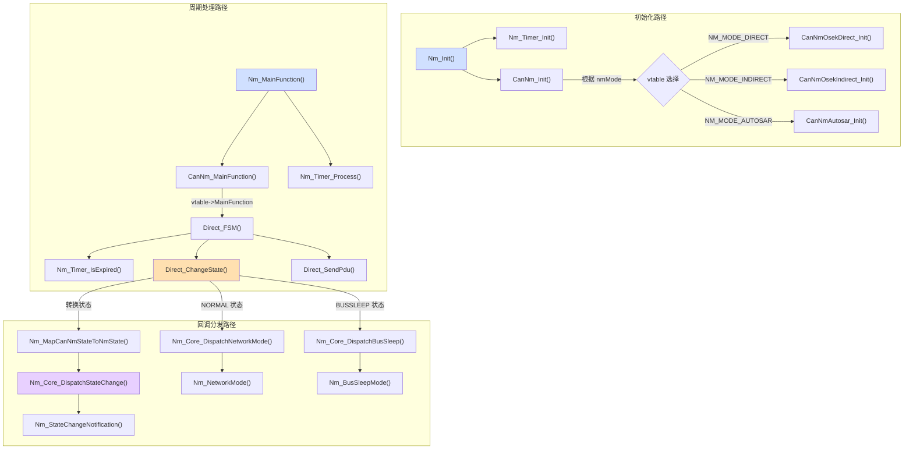
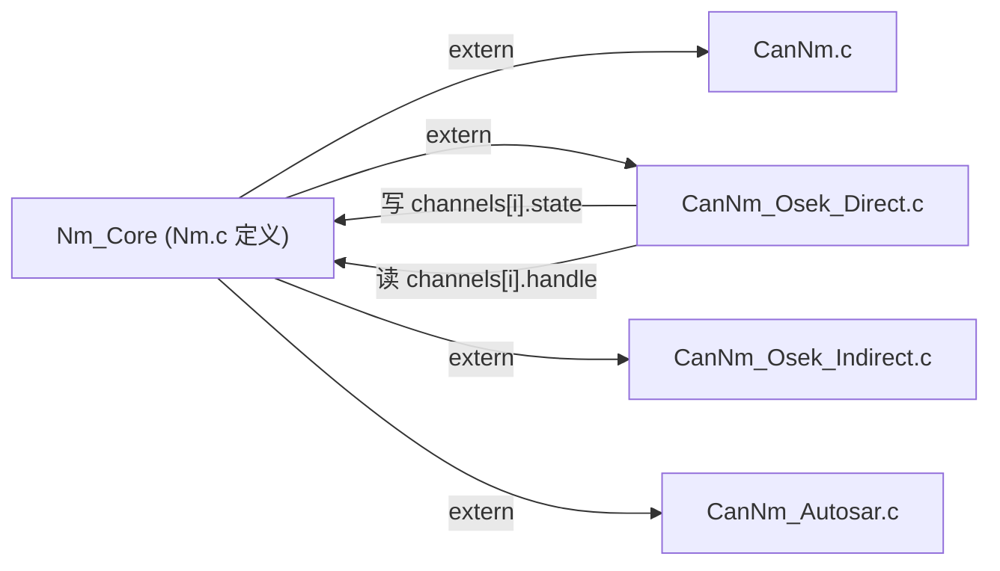

# 模块依赖关系总图

> 属于 [[../00_MOC_总索引|MOC 总索引]] > **02_架构详解**

---

## 编译期依赖 (`#include` 关系)

```mermaid
graph TD
    Nm_h["Nm.h"] --> Nm_ConfigTypes_h["Nm_ConfigTypes.h"]
    Nm_h --> Nm_OsIf_h["OsIf/Nm_OsIf.h"]

    Nm_Internal_h["Nm_Internal.h"] --> Nm_ConfigTypes_h
    Nm_Internal_h --> Nm_OsIf_h
    Nm_Internal_h --> CanNm_h["CanNm/CanNm.h"]

    Nm_c["Nm.c"] --> Nm_h
    Nm_c --> Nm_Internal_h
    Nm_c --> Nm_Timer_h["Nm_Timer/Nm_Timer.h"]
    Nm_c --> Nm_Cbk_h["Nm_Cbk.h"]

    CanNm_c["CanNm/CanNm.c"] --> CanNm_h
    CanNm_c --> Nm_Internal_h
    CanNm_c --> Nm_OsIf_h

    CanNm_Osek_Direct_c["CanNm/CanNm_Osek_Direct.c"] --> CanNm_h
    CanNm_Osek_Direct_c --> Nm_Internal_h
    CanNm_Osek_Direct_c --> Nm_OsIf_h
    CanNm_Osek_Direct_c --> Nm_Cbk_h
    CanNm_Osek_Direct_c --> Nm_Timer_h

    CanNm_Osek_Indirect_c["CanNm/CanNm_Osek_Indirect.c"] --> CanNm_h
    CanNm_Osek_Indirect_c --> Nm_Internal_h
    CanNm_Osek_Indirect_c --> Nm_OsIf_h
    CanNm_Osek_Indirect_c --> Nm_Cbk_h
    CanNm_Osek_Indirect_c --> Nm_Timer_h

    CanNm_Autosar_c["CanNm/CanNm_Autosar.c"] --> CanNm_h
    CanNm_Autosar_c --> Nm_Internal_h
    CanNm_Autosar_c --> Nm_OsIf_h
    CanNm_Autosar_c --> Nm_Cbk_h
    CanNm_Autosar_c --> Nm_Timer_h

    Nm_Timer_c["Nm_Timer/Nm_Timer.c"] --> Nm_Timer_h
    Nm_Timer_c --> Nm_OsIf_h

    Nm_Cbk_h --> Nm_ConfigTypes_h
    Nm_Timer_h --> Nm_ConfigTypes_h

    style Nm_ConfigTypes_h fill:#ffe0e0
    style Nm_OsIf_h fill:#e0e0e0
    style CanNm_h fill:#fff3cd
    style Nm_h fill:#d0e0ff
    style Nm_Internal_h fill:#e0ffe0
    style Nm_Cbk_h fill:#e8d0ff
    style Nm_Timer_h fill:#d0ffe0
```



---

## 运行时调用依赖 (核心函数链)



---

## 数据依赖 (全局状态访问)



`Nm_Core` 全局变量在 `Nm.c` 中定义，通过 `Nm_Internal.h` 中的 `extern` 声明
被所有 CanNm 文件访问。状态机更新状态 → Nm Core 读取 → 回调分发。

---

## 依赖层级 (不允许反向依赖)

```
Layer 5 (平台抽象): Nm_Timer, Nm_OsIf
      ↑
Layer 4 (状态机): CanNm_Osek_Direct, CanNm_Osek_Indirect, CanNm_Autosar
      ↑
Layer 3 (适配): CanNm.h/c
      ↑
Layer 2 (Core): Nm.h/c, Nm_Internal.h, Nm_Cbk.h, Nm_ConfigTypes.h
      ↑
Layer 1 (应用): 用户代码

规则: 上层可以调用下层，下层通过 Dispatch 或回调通知上层。
     不允许 Layer N 直接 include 或调用 Layer N+2。
```

---

## 关键约束

| 规则 | 说明 |
|------|------|
| 应用层不 include `Nm_Internal.h` | 仅 Nm Core 和 CanNm 使用 |
| 应用层不 include `CanNm.h` | 所有 NM 操作走 `Nm.h` API |
| 状态机文件之间互相独立 | 不存在 Direct 调用 Indirect 或反之 |
| 定时器仅通过 `Nm_Timer.h` 接口 | 状态机不直接读 tick 寄存器 |
| CAN 驱动仅通过弱符号桩 | `CanNm_Transmit` 等由项目提供强定义 |

---

> 下一步: 阅读 [[../02_架构详解/vtable多态分发机制|vtable 多态分发机制]]
