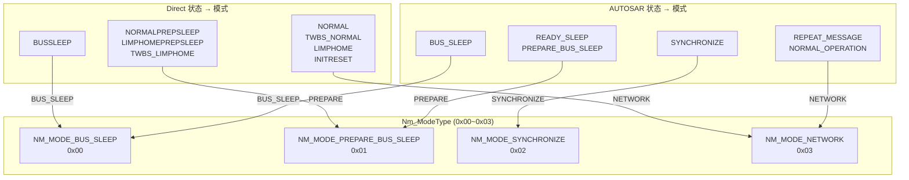

# 状态映射与模式管理

> 属于 [[../00_MOC_总索引|MOC 总索引]] > **02_架构详解**

NM 模块有两个状态体系：
1. **CanNm 内部状态** (`CanNm_StateType`) — 总线相关的状态机内部表示
2. **NM 公开状态** (`Nm_StateType`) — 向应用层暴露的统一状态

它们的双向映射函数在 `Nm.c` 中实现。

---

## 状态映射关系图


---

## 映射规则详解

### Nm_MapCanNmStateToNmState (CanNm → Nm, Nm.c:34-70)

| CanNm 状态 (输入) | Nm 状态 (输出) | 来源 |
|-------------------|----------------|------|
| `CANNM_STATE_OFF` | `NM_STATE_UNINIT` | Direct |
| `CANNM_STATE_INIT` | `NM_STATE_UNINIT` | Direct |
| `CANNM_STATE_INITRESET` | `NM_STATE_INITRESET` | Direct |
| `CANNM_STATE_NORMAL` | `NM_STATE_NORMAL_OPERATION` | Direct |
| `CANNM_STATE_NORMALPREPSLEEP` | `NM_STATE_PREPARE_BUS_SLEEP` | Direct |
| `CANNM_STATE_TWBS_NORMAL` | `NM_STATE_TWBS_NORMAL` | Direct |
| `CANNM_STATE_BUSSLEEP` | `NM_STATE_BUS_SLEEP` | Direct |
| `CANNM_STATE_LIMPHOME` | `NM_STATE_LIMPHOME` | Direct |
| `CANNM_STATE_LIMPHOMEPREPSLEEP` | `NM_STATE_LIMPHOME_PREPSLEEP` | Direct |
| `CANNM_STATE_TWBS_LIMPHOME` | `NM_STATE_TWBS_LIMPHOME` | Direct |
| `CANNM_STATE_ON` | `NM_STATE_ON` | Direct |
| `CANNM_IND_STATE_INIT` | `NM_STATE_UNINIT` | Indirect |
| `CANNM_IND_STATE_AWAKE` | `NM_STATE_NORMAL_OPERATION` | Indirect |
| `CANNM_IND_STATE_BUSSLEEP` | `NM_STATE_BUS_SLEEP` | Indirect |
| `CANNM_IND_STATE_NORMAL` | `NM_STATE_NORMAL_OPERATION` | Indirect |
| `CANNM_IND_STATE_WAITBUSSLEEP` | `NM_STATE_PREPARE_BUS_SLEEP` | Indirect |
| `CANNM_IND_STATE_LIMPHOME` | `NM_STATE_LIMPHOME` | Indirect |
| `CANNM_IND_STATE_ON` | `NM_STATE_ON` | Indirect |
| `CANNM_AUTOSAR_STATE_UNINIT` | `NM_STATE_UNINIT` | AUTOSAR |
| `CANNM_AUTOSAR_STATE_BUS_SLEEP` | `NM_STATE_BUS_SLEEP` | AUTOSAR |
| `CANNM_AUTOSAR_STATE_REPEAT_MESSAGE` | `NM_STATE_REPEAT_MESSAGE` | AUTOSAR |
| `CANNM_AUTOSAR_STATE_NORMAL_OPERATION` | `NM_STATE_NORMAL_OPERATION` | AUTOSAR |
| `CANNM_AUTOSAR_STATE_READY_SLEEP` | `NM_STATE_READY_SLEEP` | AUTOSAR |
| `CANNM_AUTOSAR_STATE_PREPARE_BUS_SLEEP` | `NM_STATE_PREPARE_BUS_SLEEP` | AUTOSAR |
| `CANNM_AUTOSAR_STATE_SYNCHRONIZE` | `NM_STATE_SYNCHRONIZE` | AUTOSAR |

### Nm_MapNmStateToCanNmState (Nm → CanNm, Nm.c:72-91)

| Nm 状态 (输入) | CanNm 状态 (输出) |
|----------------|-------------------|
| `NM_STATE_UNINIT` | `CANNM_STATE_OFF` |
| `NM_STATE_INITRESET` | `CANNM_STATE_INITRESET` |
| `NM_STATE_NORMAL_OPERATION` | `CANNM_STATE_NORMAL` |
| `NM_STATE_REPEAT_MESSAGE` | `CANNM_AUTOSAR_STATE_REPEAT_MESSAGE` |
| `NM_STATE_PREPARE_BUS_SLEEP` | `CANNM_STATE_NORMALPREPSLEEP` |
| `NM_STATE_TWBS_NORMAL` | `CANNM_STATE_TWBS_NORMAL` |
| `NM_STATE_BUS_SLEEP` | `CANNM_STATE_BUSSLEEP` |
| `NM_STATE_SYNCHRONIZE` | `CANNM_AUTOSAR_STATE_SYNCHRONIZE` |
| `NM_STATE_LIMPHOME` | `CANNM_STATE_LIMPHOME` |
| `NM_STATE_LIMPHOME_PREPSLEEP` | `CANNM_STATE_LIMPHOMEPREPSLEEP` |
| `NM_STATE_TWBS_LIMPHOME` | `CANNM_STATE_TWBS_LIMPHOME` |
| `NM_STATE_ON` | `CANNM_STATE_ON` |
| `NM_STATE_READY_SLEEP` | `CANNM_AUTOSAR_STATE_READY_SLEEP` |

---

## Nm_ModeType 管理

NM 模式 (`Nm_ModeType`) 是对状态的高级抽象，为应用层提供更简单的视角。



---

## 应用层如何查询状态

```c
Nm_StateType state;
Nm_ModeType  mode;

if (NM_E_OK == Nm_GetState(channel, &state, &mode)) {
    if (NM_MODE_NETWORK == mode) {
        /* 网络模式：允许应用层通信 */
    } else if (NM_MODE_PREPARE_BUS_SLEEP == mode) {
        /* 准备休眠：应用层停止发送 */
    }
}
```

---

> 下一步: 阅读 [[../02_架构详解/双线缆协议设计|双线缆协议设计]]
