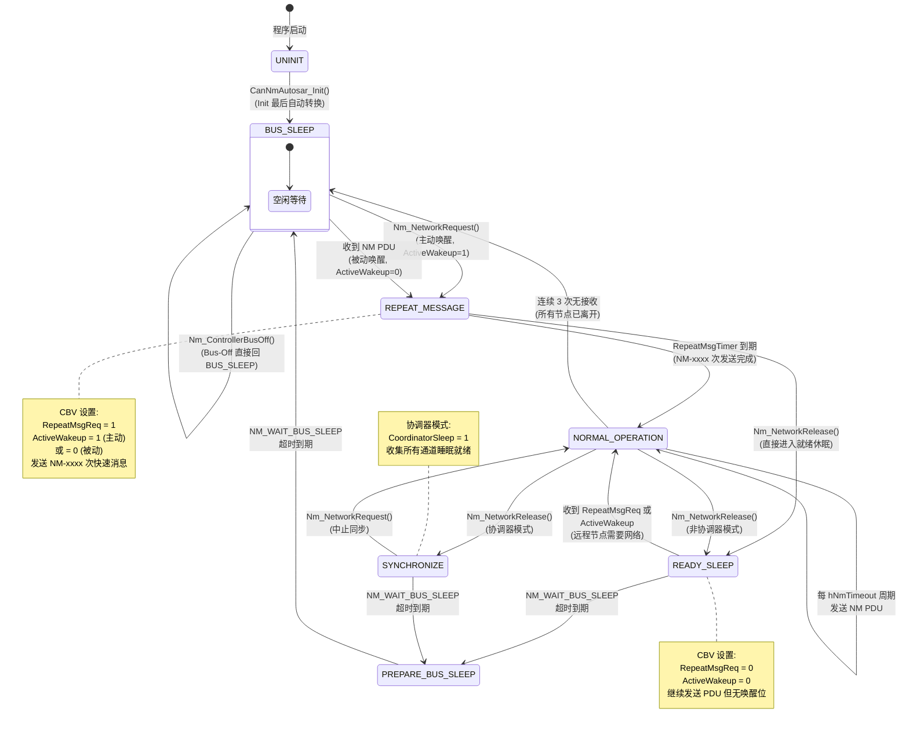
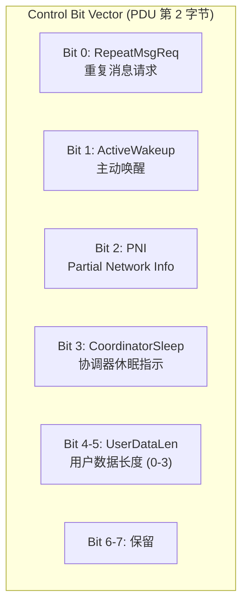

# AUTOSAR NM 状态机 (7 状态)

> 属于 [[../00_MOC_总索引|MOC 总索引]] > **03_状态机详解**

AUTOSAR NM 与 OSEK 有本质区别：无逻辑环，所有节点广播 NM PDU，
通过 Control Bit Vector (CBV) 协调休眠与唤醒。
源代码: `CanNm_Autosar.c` (758 行)，当前为骨架实现。

---

## 完整状态转移图

---

## 状态详解

### 1. UNINIT (CANNM_AUTOSAR_STATE_UNINIT = 0x20)

| 属性 | 值 |
|------|-----|
| 进入条件 | `CanNmAutosar_Init()` 初始状态 |
| 行为 | Init 结束时自动转换到 BUS_SLEEP |
| 退出条件 | 自动转换 |

### 2. BUS_SLEEP (CANNM_AUTOSAR_STATE_BUS_SLEEP = 0x21)

| 属性 | 值 |
|------|-----|
| 进入条件 | Init 结束 / PREPARE_BUS_SLEEP 超时 / NORMAL_OPERATION 3 次无 RX |
| 行为 | 关闭 CAN 控制器，等待唤醒 |
| 退出条件 | NetworkRequest / 收到 NM PDU |
| 触发回调 | `Nm_Core_DispatchBusSleep()` → `Nm_BusSleepMode()` |

### 3. REPEAT_MESSAGE (CANNM_AUTOSAR_STATE_REPEAT_MESSAGE = 0x22)

| 属性 | 值 |
|------|-----|
| 进入条件 | 从 BUS_SLEEP 或 PREPARE_BUS_SLEEP 唤醒 |
| 行为 | 快速发送 NM-xxxx 次 PDU (RepeatMsgReq=1)，hNmTimeout 周期发送 |
| 退出条件 | hNmRepeatMsg 到期 → NORMAL_OPERATION / NetworkRelease → READY_SLEEP |
| 触发回调 | `Nm_Core_DispatchNetworkStart()` → `Nm_NetworkStartIndication()` |

### 4. NORMAL_OPERATION (CANNM_AUTOSAR_STATE_NORMAL_OPERATION = 0x23)

| 属性 | 值 |
|------|-----|
| 进入条件 | RepeatMsgTimer 到期 / 从 READY_SLEEP 或 SYNCHRONIZE 回退 |
| 行为 | 每 hNmTimeout 周期发送 NM PDU (ActiveWakeup=1) |
| 退出条件 | NetworkRelease (协调器→SYNCHRONIZE, 非协调器→READY_SLEEP) / 3 次无 RX→BUS_SLEEP |
| 触发回调 | `Nm_Core_DispatchNetworkMode()` → `Nm_NetworkMode()` |

### 5. READY_SLEEP (CANNM_AUTOSAR_STATE_READY_SLEEP = 0x24)

| 属性 | 值 |
|------|-----|
| 进入条件 | NetworkRelease (非协调器) |
| 行为 | 发送 NM PDU，无 ActiveWakeup/RepeatMsgReq，等待所有节点就绪 |
| 退出条件 | 收到远程唤醒请求 → NORMAL_OPERATION / hNmWaitBusSleep 到期 → PREPARE_BUS_SLEEP |

### 6. PREPARE_BUS_SLEEP (CANNM_AUTOSAR_STATE_PREPARE_BUS_SLEEP = 0x25)

| 属性 | 值 |
|------|-----|
| 进入条件 | READY_SLEEP 中 hNmWaitBusSleep 到期 / SYNCHRONIZE 完成 |
| 行为 | 发送最后几次 NM PDU (无唤醒位)，等待 hNmWaitBusSleep |
| 退出条件 | hNmWaitBusSleep 到期 → BUS_SLEEP |
| 触发回调 | `Nm_Core_DispatchPrepareBusSleep()` → `Nm_PrepareBusSleepMode()` |

### 7. SYNCHRONIZE (CANNM_AUTOSAR_STATE_SYNCHRONIZE = 0x26)

| 属性 | 值 |
|------|-----|
| 进入条件 | NetworkRelease (协调器模式) |
| 行为 | 发送 PDU 带 CoordinatorSleep=1，等待所有通道就绪 |
| 退出条件 | NetworkRequest → NORMAL_OPERATION / hNmWaitBusSleep 到期 → PREPARE_BUS_SLEEP |

---

## CBV (Control Bit Vector) 详解

CBV 位于 AUTOSAR NM PDU 的 Byte 1，用于在节点间传递控制信息。

| Bit | 宏 | 含义 | 何时设为 1 |
|:---:|------|------|------------|
| 0 | `CBV_REPEAT_MSG_REQ` (0x01) | 要求所有节点继续发送 Repeat Message | 从 BUS_SLEEP 被动唤醒时 |
| 1 | `CBV_ACTIVE_WAKEUP` (0x02) | 表示本节点主动请求网络 | NetworkRequest 时 |
| 2 | `CBV_PNI` (0x04) | Partial Network Info 存在 | 使用 PN 功能时 |
| 3 | `CBV_COORDINATOR_SLEEP` (0x08) | 协调器判断可以休眠 | SYNCHRONIZE 状态 |
| 4-5 | `CBV_USER_DATA_LEN_MASK` (0x30) | 用户数据长度编码 | 设置 User Data 时 |

---

## 定时器配置

| 定时器句柄 | 名称 | 配置值 | 模式 | 用途 |
|-----------|------|--------|------|------|
| `hNmTimeout` | NM_TIMEOUT_TIMER | `timerNmMsgCycle` 或 `timerTyp` | PERIODIC | NM PDU 发送周期 |
| `hNmRepeatMsg` | NM_REPEAT_MESSAGE_TIMER | `repeatMsgCount × timerNmMsgCycle` | ONESHOT | Repeat Message 总时长 |
| `hNmWaitBusSleep` | NM_WAIT_BUS_SLEEP_TIMER | `timerWaitBusSleep` | ONESHOT | 等待总线休眠超时 |

---

## 与 OSEK Direct 的关键差异

| 维度 | OSEK Direct | AUTOSAR NM |
|------|-------------|------------|
| 协调机制 | 逻辑环 (Alive/Ring) | 广播 + CBV |
| LimpHome | 有 (TMax 超时 → LimpHome) | **无 (直接 BUS_SLEEP)** |
| ControllerBusOff | → LIMPHOME | → BUS_SLEEP |
| 休眠前等待 | NORMALPREPSLEEP → TWBS_NORMAL → BUSSLEEP | READY_SLEEP → PREPARE_BUS_SLEEP → BUS_SLEEP |
| 快速广播 | 无 (固定周期) | Repeat Message (NM-xxxx) |
| 协调器角色 | 无 (所有节点对等) | 可选 (isCoordinator 配置) |
| PDU Byte 0 | OpCode | Source Node ID |
| PDU Byte 1 | NodeID | CBV |
| User Data | Byte 2-7 | Byte 2-7 |

---

> 下一步: 阅读 [[../03_状态机详解/OSEK逻辑环协议详解|OSEK 逻辑环协议详解]]
