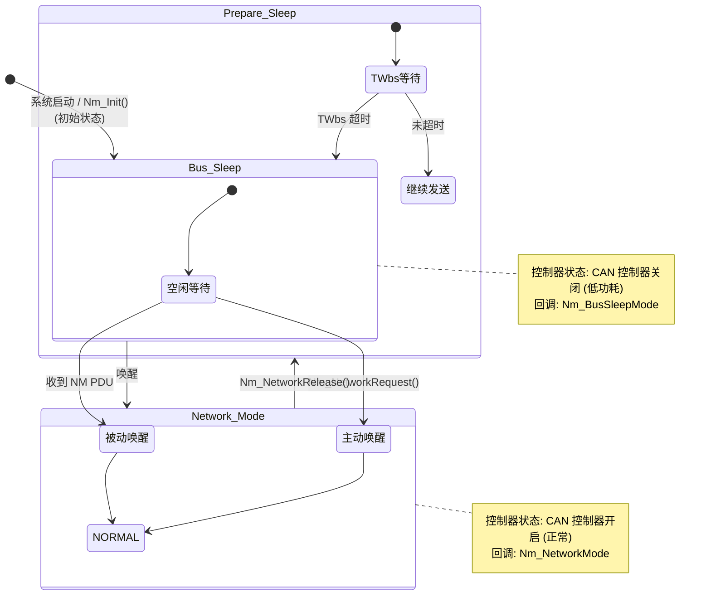
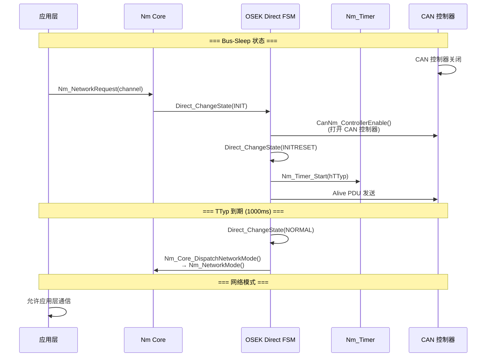
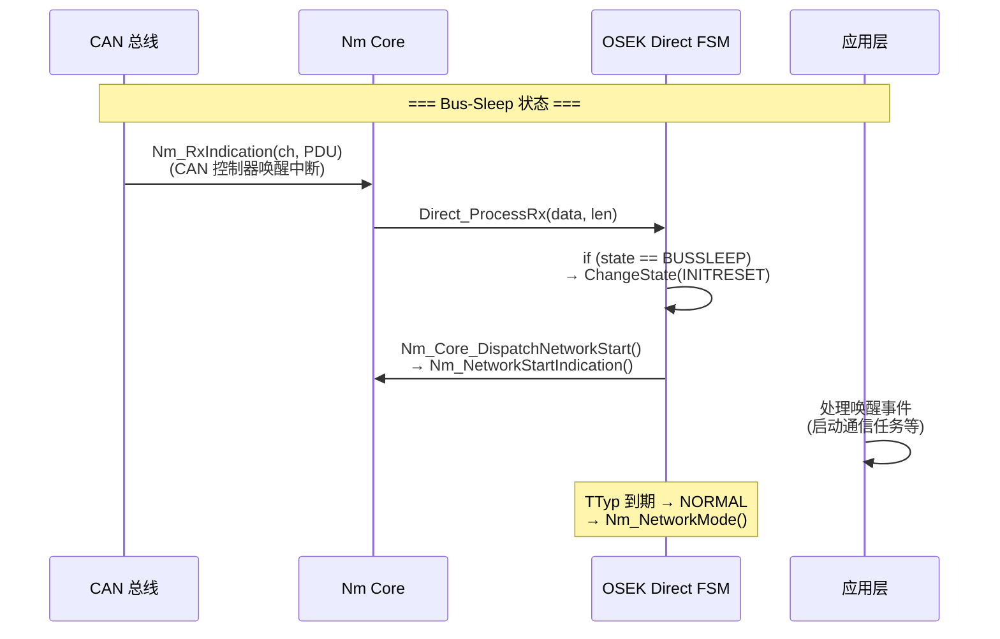
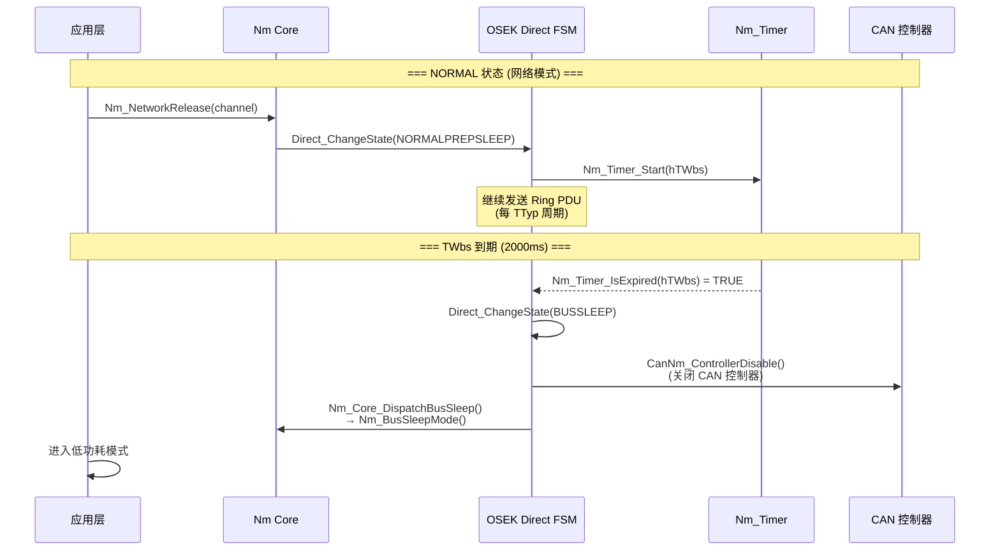
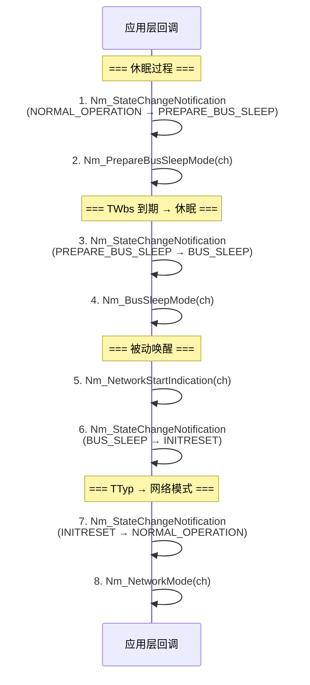

# Bus-Sleep 休眠与唤醒全流程

> 属于 [[../00_MOC_总索引|MOC 总索引]] > **03_状态机详解**

Bus-Sleep 是 NM 模块的核心目标：协调所有节点安全地进入低功耗模式。
唤醒过程则确保在需要通信时快速恢复网络。

---

## 完整生命周期流程图

---

## 主动唤醒流程 (NetworkRequest)

---

## 被动唤醒流程 (收到 NM PDU)

---

## 主动休眠流程 (NetworkRelease)

---

## 三种 NM 模式的休眠/唤醒差异

| 步骤 | OSEK Direct | OSEK Indirect | AUTOSAR NM |
|------|-------------|---------------|------------|
| **初始状态** | BUSSLEEP | OFF | BUS_SLEEP |
| **主动唤醒入口** | NetworkRequest → INIT | NetworkRequest → AWAKE | NetworkRequest → REPEAT_MESSAGE |
| **被动唤醒入口** | 收到 NM PDU → INITRESET | 收到应用消息 → AWAKE | 收到 NM PDU → REPEAT_MESSAGE |
| **网络模式** | NORMAL (Ring 循环) | NORMAL (监听) | NORMAL_OPERATION (广播) |
| **休眠触发** | NetworkRelease → NORMALPREPSLEEP | NetworkRelease → WAITBUSSLEEP | NetworkRelease → READY_SLEEP 或 SYNCHRONIZE |
| **休眠等待** | TWbs (继续发 Ring) | TWbs (继续监听) | hNmWaitBusSleep (继续广播) |
| **最终休眠** | TWbs → BUSSLEEP | TWbs → BUSSLEEP | TWbs → BUS_SLEEP |
| **回调** | Nm_NetworkMode / Nm_BusSleepMode 等 | 同 Direct | Nm_NetworkStartIndication / NetworkMode / BusSleepMode |

---

## 回调触发顺序 (完整一次休眠→唤醒)

应用层按此顺序接收回调，可以根据模式切换执行相应的系统级操作。

---

## 关键设计要点

1. **休眠前必须停止通信**: `Nm_PrepareBusSleepMode` 回调时，ComM 应阻止正常通信
2. **TWbs 期间继续发送**: 让其他节点知道本节点即将休眠
3. **CanNm_ControllerDisable**: 进入 Bus-Sleep 后关闭 CAN 控制器以省电
4. **被动唤醒依赖 CAN 硬件唤醒**: CAN 控制器需配置为支持总线唤醒 (Wake-on-CAN)

---

> 下一步: 阅读 [[../04_API参考/Nm_Public_API_19个函数|Nm Public API 19 个函数]]
