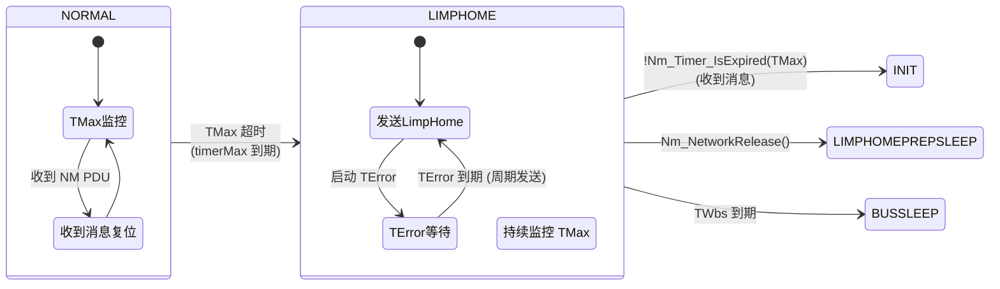
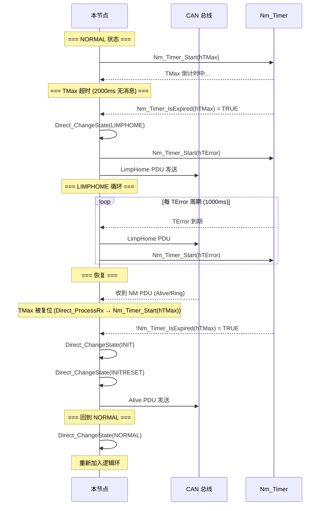

# LimpHome 降级与恢复

> 属于 [[../00_MOC_总索引|MOC 总索引]] > **03_状态机详解**

LimpHome 是 OSEK NM 的降级保护机制。当节点收不到任何 NM 消息超过 TMax 时间，
进入 LimpHome 状态，以独立模式继续发送，保持最低限度的网络可见性。

---

## LimpHome 触发与恢复流程



---

## 源码级分析

### 进入 LimpHome (Direct_FSM)

```c
case CANNM_STATE_NORMAL:
case CANNM_STATE_TWBS_NORMAL:
    if (Nm_Timer_IsExpired(ctx->hTMax)) {
        /* TMax 超时 — 2000ms 内未收到任何 NM 消息 */
        Direct_ChangeState(ctx, CANNM_STATE_LIMPHOME);
        Nm_Timer_Start(ctx->hTError);     /* 启动 LimpHome 发送周期 */
        Direct_SendPdu(ctx);              /* 立即发送一条 LimpHome */
        break;
    }
```

### LimpHome 期间的行为 (Direct_FSM)

```c
case CANNM_STATE_LIMPHOME:
case CANNM_STATE_LIMPHOMEPREPSLEEP:
case CANNM_STATE_TWBS_LIMPHOME:
    if (Nm_Timer_IsExpired(ctx->hTError)) {
        Nm_Timer_Start(ctx->hTError);     /* 每 TError 周期发送 LimpHome */
        Direct_SendPdu(ctx);              /* 发送 LimpHome PDU */
    }
    /* 关键恢复逻辑 */
    if (!Nm_Timer_IsExpired(ctx->hTMax)) {
        /* TMax 未过期 = 收到了 NM 消息 */
        Direct_ChangeState(ctx, CANNM_STATE_INIT);  /* 回到 INIT，恢复正常 */
    }
    break;
```

### LimpHome 下的消息发送 (Direct_SendPdu)

```c
if (ctx->state >= CANNM_STATE_LIMPHOME) {
    pdu[0] = ctx->config->wireConfig.pduOpCodeLimpHome;  /* LimpHome OpCode */
    /* 或 OpCode 模式: NM_OP_LIMPHOME_BIT */
}
```

---

## 触发条件汇总

| NM 模式 | 触发条件 | 行为 |
|---------|----------|------|
| OSEK Direct | NORMAL 中 TMax 超时 (2000ms 未收到 NM PDU) | 进入 LIMPHOME，每 TError 发送 LimpHome |
| OSEK Direct | ControllerBusOff 调用 | 直接进入 LIMPHOME，启动 TError |
| OSEK Indirect | ControllerBusOff 调用 | 进入 LimpHome，等待应用消息恢复 |
| AUTOSAR NM | N/A | 无 LimpHome 概念，Bus-Off 直接 → BUS_SLEEP |

---

## 恢复条件汇总

| NM 模式 | 恢复条件 | 恢复目标 |
|---------|----------|----------|
| OSEK Direct | 收到任何 NM PDU (TMax 未过期) | INIT → INITRESET → NORMAL |
| OSEK Direct | LimpHome 状态中 NetworkRelease | LIMPHOMEPREPSLEEP → BUSSLEEP |

---

## 完整 LimpHome 生命周期



---

## 应用层处理建议

当收到 `Nm_LimpHomeIndication` 回调时，应用层应：

1. **记录 DTC** (Diagnostic Trouble Code) — LimpHome 表示通信故障
2. **切换应用层策略** — 可能降低通信速率或进入安全模式
3. **通知驾驶员** — 在仪表盘上显示通信异常警告
4. **开启诊断会话** — 收集故障数据

```c
void Nm_LimpHomeIndication(NetworkHandleType nmChannelHandle)
{
    /* 记录诊断故障码 */
    Dem_SetEventStatus(DemEvent_NmLimpHome, DEM_EVENT_STATUS_FAILED);

    /* 通知 ComM 通信降级 */
    ComM_Nm_LimpHomeIndication(nmChannelHandle);

    /* 日志记录 */
    Log_Error("NM channel %d entered LimpHome", nmChannelHandle);
}
```

---

> 下一步: 阅读 [[../03_状态机详解/BusSleep休眠与唤醒全流程|BusSleep 休眠与唤醒全流程]]
