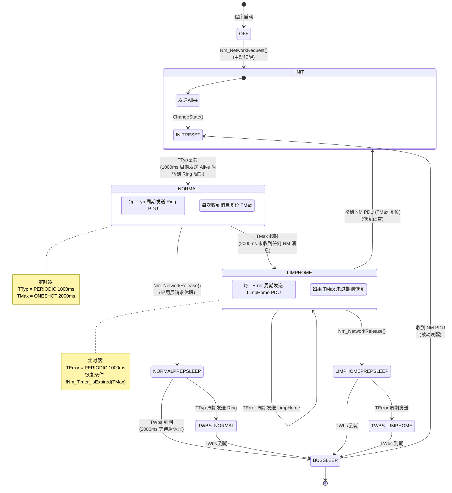

# OSEK Direct NM 状态机 (10 状态)

> 属于 [[../00_MOC_总索引|MOC 总索引]] > **03_状态机详解**

OSEK Direct NM 是最核心的状态机，实现 Alive / Ring / LimpHome 逻辑环协议。
源代码: `CanNm_Osek_Direct.c` (372 行)

---

## 完整状态转移图



---

## 状态详解

### 1. OFF (CANNM_STATE_OFF = 0x00)

| 属性 | 值 |
|------|-----|
| 进入条件 | `CanNmOsekDirect_Init()` 初始化后 |
| 行为 | 空闲，等待 NetworkRequest 或 PassiveStartUp |
| 退出条件 | `Nm_NetworkRequest()` → INIT / `Nm_PassiveStartUp()` → INITRESET |
| 对应 Nm 状态 | `NM_STATE_UNINIT` |

### 2. INIT (CANNM_STATE_INIT = 0x01)

| 属性 | 值 |
|------|-----|
| 进入条件 | NetworkRequest 调用 `Direct_ChangeState(INIT)` |
| 行为 | 立即转换到 INITRESET，发送 Alive PDU |
| 退出条件 | 同一个 FSM 周期内自动转到 INITRESET |
| 对应 Nm 状态 | `NM_STATE_UNINIT` (过渡状态) |

### 3. INITRESET (CANNM_STATE_INITRESET = 0x02)

| 属性 | 值 |
|------|-----|
| 进入条件 | INIT 自动转换 / PassiveStartUp / Bus-Sleep 被动唤醒 |
| 行为 | 启动 TTyp 定时器 (PERIODIC, 1000ms)，发送 Alive PDU |
| 退出条件 | TTyp 到期 → NORMAL |
| 对应 Nm 状态 | `NM_STATE_INITRESET` |

### 4. NORMAL (CANNM_STATE_NORMAL = 0x03)

| 属性 | 值 |
|------|-----|
| 进入条件 | INITRESET 中 TTyp 到期 |
| 行为 | 每 TTyp (1000ms) 发送 Ring PDU，每次收到 NM PDU 复位 TMax |
| 退出条件 | TMax 超时 → LIMPHOME / NetworkRelease → NORMALPREPSLEEP |
| 对应 Nm 状态 | `NM_STATE_NORMAL_OPERATION` |
| 对应 Nm 模式 | `NM_MODE_NETWORK` |
| 触发回调 | `Nm_Core_DispatchNetworkMode()` → `Nm_NetworkMode()` |

### 5. NORMALPREPSLEEP (CANNM_STATE_NORMALPREPSLEEP = 0x04)

| 属性 | 值 |
|------|-----|
| 进入条件 | `Nm_NetworkRelease()` 在 NORMAL 状态下调用 |
| 行为 | 启动 TWbs 定时器 (ONESHOT, 2000ms)，发送 Ring PDU |
| 退出条件 | TWbs 到期 → BUSSLEEP / TWBS_NORMAL (TTyp 周期发送) |
| 对应 Nm 状态 | `NM_STATE_PREPARE_BUS_SLEEP` |
| 对应 Nm 模式 | `NM_MODE_PREPARE_BUS_SLEEP` |
| 触发回调 | `Nm_Core_DispatchPrepareBusSleep()` → `Nm_PrepareBusSleepMode()` |

### 6. TWBS_NORMAL (CANNM_STATE_TWBS_NORMAL = 0x05)

| 属性 | 值 |
|------|-----|
| 进入条件 | NORMALPREPSLEEP 中 TTyp 周期发送 Ring |
| 行为 | 继续发送 Ring PDU，等待 TWbs 到期 |
| 退出条件 | TWbs 到期 → BUSSLEEP |
| 对应 Nm 状态 | `NM_STATE_TWBS_NORMAL` |

### 7. BUSSLEEP (CANNM_STATE_BUSSLEEP = 0x06)

| 属性 | 值 |
|------|-----|
| 进入条件 | TWbs 到期 |
| 行为 | 空闲，关闭 CAN 控制器，等待唤醒 |
| 退出条件 | 收到 NM PDU → INITRESET |
| 对应 Nm 状态 | `NM_STATE_BUS_SLEEP` |
| 对应 Nm 模式 | `NM_MODE_BUS_SLEEP` |
| 触发回调 | `Nm_Core_DispatchBusSleep()` → `Nm_BusSleepMode()` |

### 8. LIMPHOME (CANNM_STATE_LIMPHOME = 0x07)

| 属性 | 值 |
|------|-----|
| 进入条件 | NORMAL 状态下 TMax 超时 (2000ms 未收到任何消息) |
| 行为 | 每 TError 周期发送 LimpHome PDU，持续监控 TMax |
| 退出条件 | 收到 NM PDU (TMax 未过期) → INIT (恢复) / NetworkRelease → LIMPHOMEPREPSLEEP |
| 对应 Nm 状态 | `NM_STATE_LIMPHOME` |
| 对应 Nm 模式 | `NM_MODE_NETWORK` |

### 9. LIMPHOMEPREPSLEEP (CANNM_STATE_LIMPHOMEPREPSLEEP = 0x08)

| 属性 | 值 |
|------|-----|
| 进入条件 | `Nm_NetworkRelease()` 在 LIMPHOME 状态下调用 |
| 行为 | 启动 TWbs，发送 LimpHome PDU |
| 退出条件 | TWbs 到期 → BUSSLEEP |
| 对应 Nm 状态 | `NM_STATE_LIMPHOME_PREPSLEEP` |
| 对应 Nm 模式 | `NM_MODE_PREPARE_BUS_SLEEP` |

### 10. TWBS_LIMPHOME (CANNM_STATE_TWBS_LIMPHOME = 0x09)

| 属性 | 值 |
|------|-----|
| 进入条件 | LIMPHOMEPREPSLEEP 中 TError 周期发送 |
| 行为 | 继续发送 LimpHome，等待 TWbs 到期 |
| 退出条件 | TWbs 到期 → BUSSLEEP |
| 对应 Nm 状态 | `NM_STATE_TWBS_LIMPHOME` |

---

## 定时器配置

| 定时器句柄 | 名称 | 配置值 | 模式 | 用途 |
|-----------|------|--------|------|------|
| `hTTyp` | TTyp | `timerTyp` (1000ms) | PERIODIC | Ring 消息发送周期 |
| `hTMax` | TMax | `timerMax` (2000ms) | ONESHOT | 接收消息超时看门狗 |
| `hTError` | TError | `timerError` (1000ms) | PERIODIC | LimpHome 消息发送周期 |
| `hTWbs` | TWbs | `timerWaitBusSleep` (2000ms) | ONESHOT | 等待总线休眠超时 |
| `hTTx` | TTx | `timerTx` (100ms) | ONESHOT | 发送重试间隔 |

---

## FSM 处理逻辑 (Direct_FSM, CanNm_Osek_Direct.c:168-230)

```c
static void Direct_FSM(CanNmOsekDirect_ChannelType* ctx)
{
    switch (ctx->state) {
        case CANNM_STATE_OFF:        break;
        case CANNM_STATE_INIT:
            Direct_ChangeState(ctx, CANNM_STATE_INITRESET);   /* 自动转换 */
            Direct_SendPdu(ctx);                              /* 发送 Alive */
            break;
        case CANNM_STATE_INITRESET:
            if (Nm_Timer_IsExpired(ctx->hTTyp)) {
                Direct_ChangeState(ctx, CANNM_STATE_NORMAL);  /* TTyp 到期 → NORMAL */
                Nm_Timer_Start(ctx->hTTyp);                   /* 重启周期定时器 */
                Nm_Timer_Start(ctx->hTMax);                   /* 启动接收看门狗 */
                Direct_SendPdu(ctx);                          /* 发送 Ring */
            }
            break;
        case CANNM_STATE_NORMAL:
        case CANNM_STATE_TWBS_NORMAL:
            if (Nm_Timer_IsExpired(ctx->hTMax)) {
                Direct_ChangeState(ctx, CANNM_STATE_LIMPHOME); /* TMax 超时 → LimpHome */
                Nm_Timer_Start(ctx->hTError);
                Direct_SendPdu(ctx);
                break;
            }
            if (Nm_Timer_IsExpired(ctx->hTTyp)) {
                Nm_Timer_Start(ctx->hTTyp);                   /* 每周期发送 Ring */
                Direct_SendPdu(ctx);
            }
            break;
        case CANNM_STATE_LIMPHOME:
        case CANNM_STATE_LIMPHOMEPREPSLEEP:
        case CANNM_STATE_TWBS_LIMPHOME:
            if (Nm_Timer_IsExpired(ctx->hTError)) {
                Nm_Timer_Start(ctx->hTError);                 /* 周期发送 LimpHome */
                Direct_SendPdu(ctx);
            }
            if (!Nm_Timer_IsExpired(ctx->hTMax)) {
                Direct_ChangeState(ctx, CANNM_STATE_INIT);    /* 收到消息 → 恢复 */
            }
            break;
    }
}
```

---

> 下一步: 阅读 [[../03_状态机详解/OSEK_Indirect_状态机|OSEK Indirect 状态机]]
