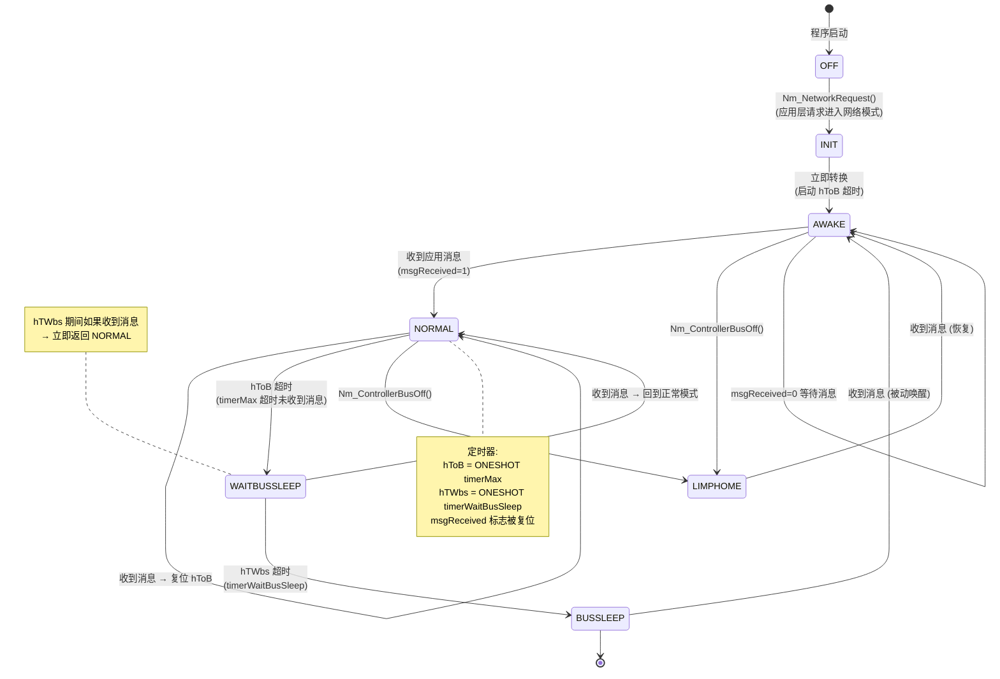

# OSEK Indirect NM 状态机 (7 状态)

> 属于 [[../00_MOC_总索引|MOC 总索引]] > **03_状态机详解**

OSEK Indirect NM 的特点是**不发送任何 NM PDU**，完全静默监听。
通过监控应用层 CAN 消息判定总线是否活跃。
源代码: `CanNm_Osek_Indirect.c` (212 行)

---

## 完整状态转移图



---

## 状态详解

### 1. OFF (CANNM_IND_STATE_OFF = 0x00)

| 属性 | 值 |
|------|-----|
| 进入条件 | `CanNmOsekIndirect_Init()` 初始化后 |
| 行为 | 空闲 |
| 退出条件 | `Nm_NetworkRequest()` → AWAKE / `Nm_PassiveStartUp()` → AWAKE |

### 2. INIT (CANNM_IND_STATE_INIT = 0x10)

| 属性 | 值 |
|------|-----|
| 进入条件 | `Nm_NetworkRequest()` |
| 行为 | 立即转换到 AWAKE，启动 hToB 超时 |
| 退出条件 | 同一 FSM 周期自动转到 AWAKE |

### 3. AWAKE (CANNM_IND_STATE_AWAKE = 0x11)

| 属性 | 值 |
|------|-----|
| 进入条件 | INIT 自动转换 / PassiveStartUp / Bus-Sleep 收到消息 / LimpHome 恢复 |
| 行为 | 等待应用消息 (msgReceived) |
| 退出条件 | msgReceived=1 → NORMAL / hToB 超时 → WAITBUSSLEEP |
| 对应 Nm 模式 | `NM_MODE_NETWORK` |

### 4. NORMAL (CANNM_IND_STATE_NORMAL = 0x13)

| 属性 | 值 |
|------|-----|
| 进入条件 | AWAKE 中收到应用消息 |
| 行为 | 持续接收消息，每收到一条就复位 hToB |
| 退出条件 | hToB 超时 → WAITBUSSLEEP |
| 对应 Nm 状态 | `NM_STATE_NORMAL_OPERATION` |
| 对应 Nm 模式 | `NM_MODE_NETWORK` |
| 触发回调 | `Nm_Core_DispatchNetworkMode()` → `Nm_NetworkMode()` |

### 5. WAITBUSSLEEP (CANNM_IND_STATE_WAITBUSSLEEP = 0x14)

| 属性 | 值 |
|------|-----|
| 进入条件 | NORMAL 中 hToB 超时，`Nm_NetworkRelease()` |
| 行为 | 启动 hTWbs 等待，可能被新消息打断 |
| 退出条件 | 收到消息 → NORMAL / hTWbs 到期 → BUSSLEEP |
| 对应 Nm 状态 | `NM_STATE_PREPARE_BUS_SLEEP` |
| 对应 Nm 模式 | `NM_MODE_PREPARE_BUS_SLEEP` |
| 触发回调 | `Nm_Core_DispatchPrepareBusSleep()` → `Nm_PrepareBusSleepMode()` |

### 6. BUSSLEEP (CANNM_IND_STATE_BUSSLEEP = 0x12)

| 属性 | 值 |
|------|-----|
| 进入条件 | hTWbs 到期 |
| 行为 | 空闲，等待应用消息唤醒 |
| 退出条件 | 收到应用消息 → AWAKE |
| 对应 Nm 状态 | `NM_STATE_BUS_SLEEP` |
| 对应 Nm 模式 | `NM_MODE_BUS_SLEEP` |
| 触发回调 | `Nm_Core_DispatchBusSleep()` → `Nm_BusSleepMode()` |

### 7. LIMPHOME (CANNM_IND_STATE_LIMPHOME = 0x15)

| 属性 | 值 |
|------|-----|
| 进入条件 | `Nm_ControllerBusOff()` |
| 行为 | 等待应用消息恢复 |
| 退出条件 | 收到应用消息 → AWAKE |
| 对应 Nm 状态 | `NM_STATE_LIMPHOME` |

---

## 定时器配置 (仅 2 个!)

| 定时器句柄 | 名称 | 配置值 | 模式 | 用途 |
|-----------|------|--------|------|------|
| `hToB` | Timeout for Bus | `timerMax` | ONESHOT | 应用消息超时 |
| `hTWbs` | Wait Bus Sleep | `timerWaitBusSleep` | ONESHOT | 等待总线休眠 |

> Indirect NM 比 Direct NM 少了 3 个定时器 (TTyp / TError / TTx)，因为不发 NM PDU。

---

## FSM 处理逻辑 (Ind_FSM, CanNm_Osek_Indirect.c:76-121)

```c
static void Ind_FSM(CanNmOsekIndirect_ChannelType* ctx)
{
    switch (ctx->state) {
        case CANNM_IND_STATE_OFF:   break;
        case CANNM_IND_STATE_INIT:
            Ind_ChangeState(ctx, CANNM_IND_STATE_AWAKE);   /* 立即转换 */
            Nm_Timer_Start(ctx->hToB);
            break;
        case CANNM_IND_STATE_AWAKE:
            if (ctx->msgReceived) {
                Ind_ChangeState(ctx, CANNM_IND_STATE_NORMAL);  /* 收到消息 → NORMAL */
                Nm_Timer_Start(ctx->hToB);
                ctx->msgReceived = 0U;
            }
            break;
        case CANNM_IND_STATE_NORMAL:
            if (ctx->msgReceived) {
                Nm_Timer_Start(ctx->hToB);                     /* 复位超时 */
                ctx->msgReceived = 0U;
            } else if (Nm_Timer_IsExpired(ctx->hToB)) {
                Ind_ChangeState(ctx, CANNM_IND_STATE_WAITBUSSLEEP); /* 超时 → 等待休眠 */
                Nm_Timer_Start(ctx->hTWbs);
            }
            break;
        case CANNM_IND_STATE_WAITBUSSLEEP:
            if (ctx->msgReceived) {
                Ind_ChangeState(ctx, CANNM_IND_STATE_NORMAL);   /* 消息打断 → 回 NORMAL */
                Nm_Timer_Start(ctx->hToB);
                ctx->msgReceived = 0U;
            } else if (Nm_Timer_IsExpired(ctx->hTWbs)) {
                Ind_ChangeState(ctx, CANNM_IND_STATE_BUSSLEEP); /* TWbs 到期 → 休眠 */
            }
            break;
        case CANNM_IND_STATE_LIMPHOME:
            if (ctx->msgReceived) {
                Ind_ChangeState(ctx, CANNM_IND_STATE_AWAKE);    /* 消息恢复 */
                Nm_Timer_Start(ctx->hToB);
                ctx->msgReceived = 0U;
            }
            break;
    }
}
```

---

## 与 Direct NM 的关键差异

| 维度 | Direct NM | Indirect NM |
|------|-----------|-------------|
| 发送 NM PDU | 是 (Alive/Ring/LimpHome) | **否** |
| 判定活跃 | 收到 NM PDU | 收到**任何**应用层 CAN 消息 |
| vtable 空闲函数 | 全部实现 | `SetUserData` / `TxConfirmation` 为空函数 |
| 定时器数量 | 5 | 2 |
| `Nm_SetUserData` 作用 | 复制用户数据到 txUserData 缓冲区 | **空函数 (无意义)** |
| 逻辑环 | 参与 | 不参与 (纯监听) |

---

> 下一步: 阅读 [[../03_状态机详解/AUTOSAR_NM_状态机|AUTOSAR NM 状态机]]
