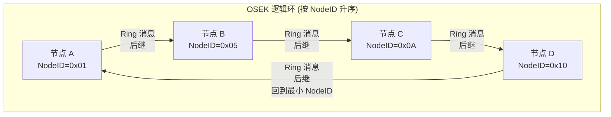
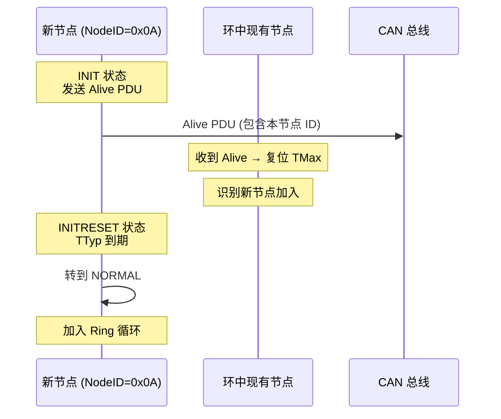
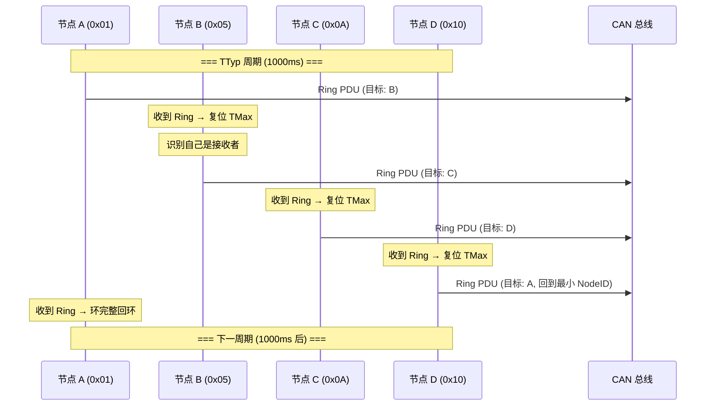
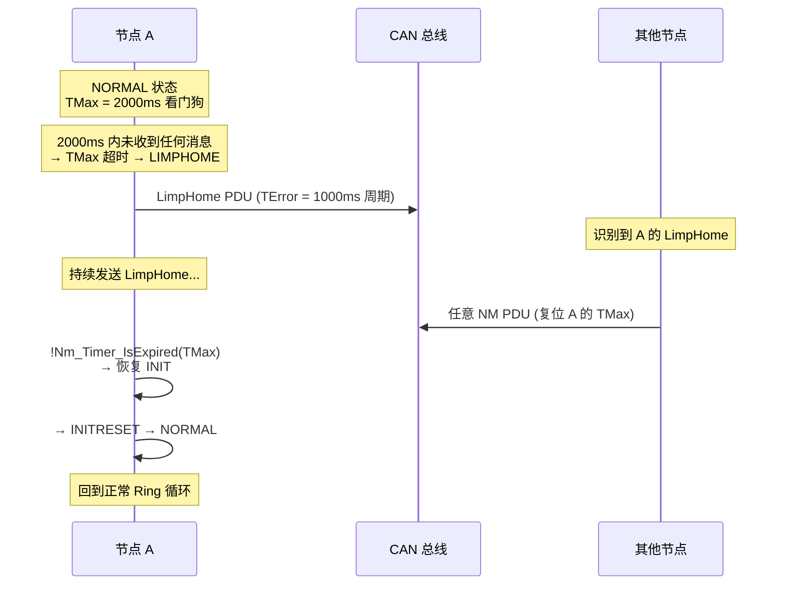
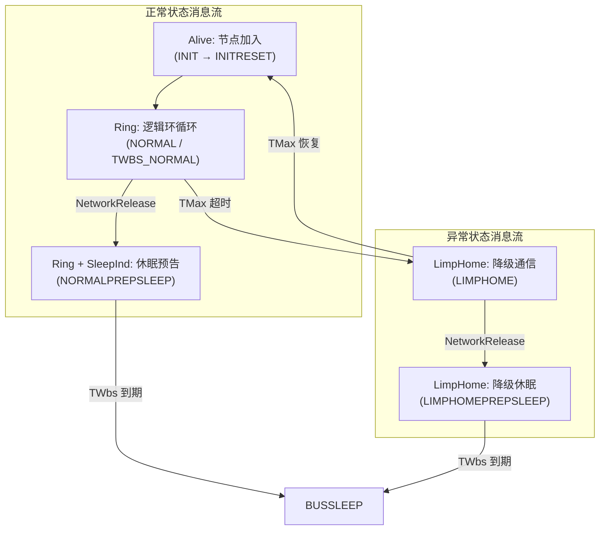

# OSEK 逻辑环协议详解

> 属于 [[../00_MOC_总索引|MOC 总索引]] > **03_状态机详解**

OSEK Direct NM 的核心是**逻辑环 (Logical Ring)** 协议。
节点按照 NodeID 排序形成环状结构，通过 Alive → Ring → LimpHome 三种消息协调网络。

---

## 逻辑环结构

- 每个节点知道自己的**前任** (NodeID 比自己小的最大节点) 和**后继** (NodeID 比自己大的最小节点)
- Ring 消息沿着环传递，每经一个节点就复位该节点的 TMax
- 最大 NodeID 的节点发送 Ring 到最小 NodeID，完成闭环

---

## Alive 消息：节点加入网络

**Alive 消息作用**:
1. 宣告本节点存在
2. 通知环中其他节点更新前任/后继关系
3. 复位所有节点的 TMax

---

## Ring 消息：逻辑环循环

**Ring 消息作用**:
1. 复位接收者的 TMax (证明总线正常)
2. 维持逻辑环循环
3. 可携带 sleep.ind / sleep.ack 指示休眠意愿

---

## LimpHome 消息：降级通信

**LimpHome 消息作用**:
- 当节点收不到任何消息时，降级到独立发送模式
- 持续发出"我还在线"信号
- 收到任何 NM PDU 后立即恢复

---

## 完整消息时序总结

---

## 定时器与消息的关系

| 定时器 | 关联的消息 | 说明 |
|--------|-----------|------|
| TTyp | Ring | 在 NORMAL 状态下，每 TTyp 周期发送一次 Ring |
| TMax | 所有 NM PDU | 每次收到任何 NM PDU 都复位 TMax |
| TError | LimpHome | 在 LIMPHOME 状态下，每 TError 周期发送一次 LimpHome |
| TWbs | Ring / LimpHome | 休眠前等待周期，期间继续发送消息 |
| TTx | 重发 | 发送失败时的重试间隔 |

---

## 消息格式 (以 OpCode 模式为例)

| 字节 | Alive | Ring | LimpHome |
|:---:|-------|------|----------|
| Byte 0 | `0x41` (Alive bit + Active bit) | `0x42` (Ring bit + Active bit) | `0x44` (LimpHome bit + Active bit) |
| Byte 1 | NodeID | NodeID | NodeID |
| Byte 2-7 | 用户数据 (可选) | 用户数据 (可选) | 用户数据 (可选) |

Active 位 (`0x40`) 始终设置，表示本节点处于活跃状态。

---

> 下一步: 阅读 [[../03_状态机详解/LimpHome降级与恢复|LimpHome 降级与恢复]]
