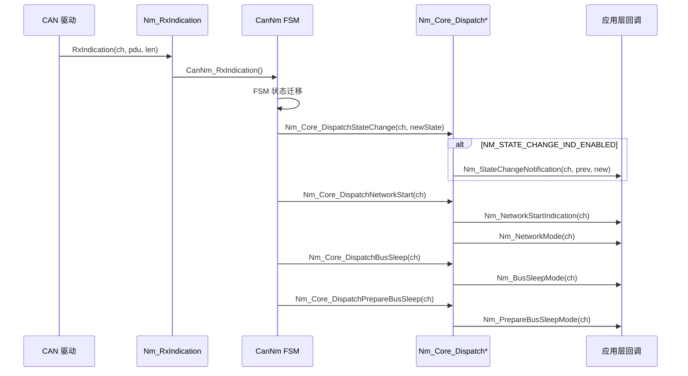
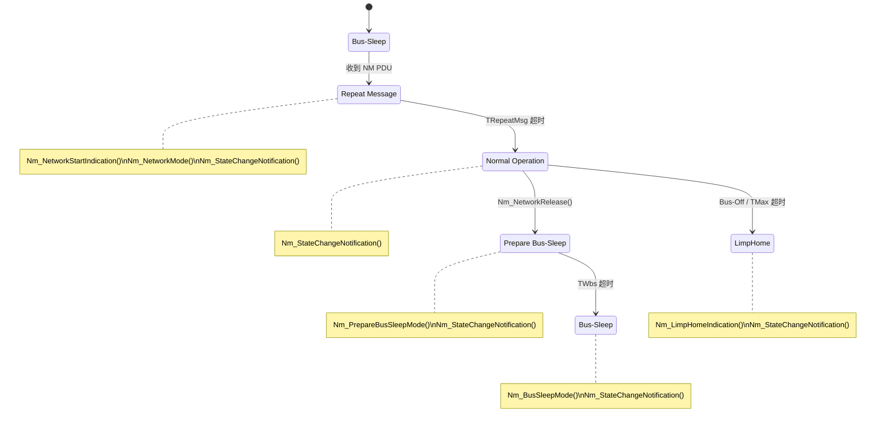

# Nm_Cbk — 回调函数 12 个

> 属于 [[../00_MOC_总索引|MOC 总索引]] > **04_API参考**

NM 模块定义 **12 个回调函数**，由应用层（ComM / EcuM / 模式管理器）实现，NM Core 在状态变化和事件发生时调用。
回调函数全部声明在 `Nm_Cbk.h` 中，通过 `extern` 链接——应用层必须提供实现。

按功能分为三组：**状态通知**、**数据通知**、**错误通知**。

---

## 回调触发链概览



---

## 一、状态通知回调 (5个)

### 1. Nm_NetworkStartIndication

```c
void Nm_NetworkStartIndication(NetworkHandleType nmChannelHandle);
```

| 项目 | 内容 |
|------|------|
| **编译开关** | 无条件（始终可用） |
| **触发条件** | Bus-Sleep 状态下收到 NM PDU（被动唤醒事件） |
| **参数** | `nmChannelHandle` — 被唤醒的通道句柄 |
| **状态变化** | 通道 → `NM_STATE_REPEAT_MESSAGE`，mode → `NM_MODE_NETWORK` |
| **应用层动作** | 通知 ComM 开始监视总线活动，准备进入网络模式 |

实现示例:

```c
void Nm_NetworkStartIndication(NetworkHandleType nmChannelHandle)
{
    (void)nmChannelHandle;
    /* 通知 ComM: 检测到网络活动 */
    ComM_Nm_NetworkStartIndication(nmChannelHandle);
}
```

### 2. Nm_NetworkMode

```c
void Nm_NetworkMode(NetworkHandleType nmChannelHandle);
```

| 项目 | 内容 |
|------|------|
| **编译开关** | 无条件 |
| **触发条件** | NM 进入网络模式（Normal Operation 或 Repeat Message） |
| **参数** | `nmChannelHandle` |
| **状态变化** | mode → `NM_MODE_NETWORK` |
| **应用层动作** | 通知 ComM 可以发送应用报文了（NM 通路上线） |

实现示例:

```c
void Nm_NetworkMode(NetworkHandleType nmChannelHandle)
{
    (void)nmChannelHandle;
    ComM_Nm_NetworkMode(nmChannelHandle);
}
```

### 3. Nm_PrepareBusSleepMode

```c
void Nm_PrepareBusSleepMode(NetworkHandleType nmChannelHandle);
```

| 项目 | 内容 |
|------|------|
| **编译开关** | 无条件 |
| **触发条件** | NM 进入 Prepare Bus-Sleep（网络释放进行中） |
| **参数** | `nmChannelHandle` |
| **状态变化** | mode → `NM_MODE_PREPARE_BUS_SLEEP` |
| **应用层动作** | 通知 ComM 停止发送应用报文，准备休眠 |

实现示例:

```c
void Nm_PrepareBusSleepMode(NetworkHandleType nmChannelHandle)
{
    (void)nmChannelHandle;
    ComM_Nm_PrepareBusSleepMode(nmChannelHandle);
}
```

### 4. Nm_BusSleepMode

```c
void Nm_BusSleepMode(NetworkHandleType nmChannelHandle);
```

| 项目 | 内容 |
|------|------|
| **编译开关** | 无条件 |
| **触发条件** | NM 进入 Bus-Sleep（总线已休眠） |
| **参数** | `nmChannelHandle` |
| **状态变化** | state → `NM_STATE_BUS_SLEEP`, mode → `NM_MODE_BUS_SLEEP` |
| **应用层动作** | 通知 ComM 可安全关闭 CAN 收发器 |

实现示例:

```c
void Nm_BusSleepMode(NetworkHandleType nmChannelHandle)
{
    (void)nmChannelHandle;
    ComM_Nm_BusSleepMode(nmChannelHandle);
    /* 可以关闭 CAN 收发器以节能 */
    CanTrcv_SetOpMode(nmChannelHandle, CANTRCV_OP_MODE_STANDBY);
}
```

### 5. Nm_StateChangeNotification

```c
/* 编译开关: NM_STATE_CHANGE_IND_ENABLED == STD_ON */
void Nm_StateChangeNotification(
    NetworkHandleType nmChannelHandle,
    Nm_StateType previousState,
    Nm_StateType newState
);
```

| 项目 | 内容 |
|------|------|
| **编译开关** | `NM_STATE_CHANGE_IND_ENABLED` (默认 STD_ON) |
| **触发条件** | **任何** NM 状态变化时立即触发（比模式回调更细粒度） |
| **参数** | `nmChannelHandle` — 通道; `previousState` — 变更前状态; `newState` — 变更后状态 |
| **应用层动作** | 日志记录、调试跟踪、状态机同步 |

实现示例:

```c
#if (NM_STATE_CHANGE_IND_ENABLED == STD_ON)
void Nm_StateChangeNotification(
    NetworkHandleType nmChannelHandle,
    Nm_StateType previousState,
    Nm_StateType newState)
{
    (void)nmChannelHandle;
    /* 记录状态迁移日志 */
    if (previousState != newState) {
        Det_ReportRuntimeError(NM_MODULE_ID, 0U, 0U,
            NM_STATE_CHANGE_EVENT);
    }
}
#endif
```

---

## 二、数据通知回调 (4个)

### 6. Nm_PduRxIndication

```c
/* 编译开关: NM_PDU_RX_INDICATION_ENABLED == STD_ON */
void Nm_PduRxIndication(NetworkHandleType nmChannelHandle);
```

| 项目 | 内容 |
|------|------|
| **编译开关** | `NM_PDU_RX_INDICATION_ENABLED` (默认 STD_ON) |
| **触发条件** | 收到 NM PDU 后，FSM 处理完成时 |
| **参数** | `nmChannelHandle` |
| **应用层动作** | 检查最近收到的 PDU 数据（调用 `Nm_GetPduData` 或 `Nm_GetUserData`） |

实现示例:

```c
#if (NM_PDU_RX_INDICATION_ENABLED == STD_ON)
void Nm_PduRxIndication(NetworkHandleType nmChannelHandle)
{
    uint8 pduData[NM_PDU_MAX_LENGTH];
    if (NM_E_OK == Nm_GetPduData(nmChannelHandle, pduData)) {
        /* 分析收到的 NM PDU */
        if (pduData[0] == 0x04U) {
            /* LimpHome 消息 */
        }
    }
}
#endif
```

### 7. Nm_RemoteSleepIndication

```c
/* 编译开关: NM_REMOTE_SLEEP_IND_ENABLED == STD_ON */
void Nm_RemoteSleepIndication(NetworkHandleType nmChannelHandle);
```

| 项目 | 内容 |
|------|------|
| **编译开关** | `NM_REMOTE_SLEEP_IND_ENABLED` (默认 STD_ON) |
| **触发条件** | 远程节点发送 Sleep Indication（休眠就绪标志） |
| **参数** | `nmChannelHandle` |
| **应用层动作** | 记录远程节点已就绪休眠（协调模式下用于判断全网络可否休眠） |

### 8. Nm_RemoteSleepCancellation

```c
/* 编译开关: NM_REMOTE_SLEEP_IND_ENABLED == STD_ON */
void Nm_RemoteSleepCancellation(NetworkHandleType nmChannelHandle);
```

| 项目 | 内容 |
|------|------|
| **编译开关** | `NM_REMOTE_SLEEP_IND_ENABLED` (默认 STD_ON) |
| **触发条件** | 之前已发送 Sleep Indication 的远程节点取消了休眠请求 |
| **参数** | `nmChannelHandle` |
| **应用层动作** | 清除该节点的休眠标志，可能阻止全网休眠 |

### 9. Nm_CoordReadyToSleep

```c
/* 编译开关: NM_BUS_SYNCHRONIZATION_ENABLED == STD_ON */
void Nm_CoordReadyToSleep(NetworkHandleType nmChannelHandle);
```

| 项目 | 内容 |
|------|------|
| **编译开关** | `NM_BUS_SYNCHRONIZATION_ENABLED` (默认 STD_OFF) |
| **触发条件** | 协调器判定所有节点已就绪休眠 |
| **参数** | `nmChannelHandle` |
| **应用层动作** | 协调器通告全网可以进入休眠 |

### 10. Nm_RestartIndication

```c
/* 编译开关: NM_BUS_SYNCHRONIZATION_ENABLED == STD_ON */
void Nm_RestartIndication(NetworkHandleType nmChannelHandle);
```

| 项目 | 内容 |
|------|------|
| **编译开关** | `NM_BUS_SYNCHRONIZATION_ENABLED` (默认 STD_OFF) |
| **触发条件** | 协调器请求全网重启 |
| **参数** | `nmChannelHandle` |

---

## 三、错误通知回调 (2个)

### 11. Nm_TxTimeoutException

```c
void Nm_TxTimeoutException(NetworkHandleType nmChannelHandle);
```

| 项目 | 内容 |
|------|------|
| **编译开关** | 无条件 |
| **触发条件** | NM PDU 发送超时（`TTx` 时间内未收到 `Nm_TxConfirmation`） |
| **参数** | `nmChannelHandle` |
| **应用层动作** | 记录 DTC、降级处理 |

实现示例:

```c
void Nm_TxTimeoutException(NetworkHandleType nmChannelHandle)
{
    (void)nmChannelHandle;
    /* 记录 DTC: NM 发送超时 */
    Dem_SetEventStatus(NM_TX_TIMEOUT_DTC, DEM_EVENT_STATUS_FAILED);
}
```

### 12. Nm_LimpHomeIndication

```c
void Nm_LimpHomeIndication(NetworkHandleType nmChannelHandle);
```

| 项目 | 内容 |
|------|------|
| **编译开关** | 无条件 |
| **触发条件** | NM 进入 LimpHome 状态（总线错误：TMax 超时/Bus-Off） |
| **参数** | `nmChannelHandle` |
| **状态变化** | state → `NM_STATE_LIMPHOME` |
| **应用层动作** | 记录 DTC、尝试网络恢复 |

实现示例:

```c
void Nm_LimpHomeIndication(NetworkHandleType nmChannelHandle)
{
    (void)nmChannelHandle;
    /* 记录 DTC: NM 进入跛行模式 */
    Dem_SetEventStatus(NM_LIMPHOME_DTC, DEM_EVENT_STATUS_FAILED);
    /* 通知 ComM: 网络异常 */
    ComM_Nm_LimpHomeIndication(nmChannelHandle);
}
```

---

## 回调函数依赖的应用层模块

| 回调函数 | 典型接收方 |
|----------|-----------|
| `Nm_NetworkStartIndication` | ComM (Communication Manager) |
| `Nm_NetworkMode` | ComM |
| `Nm_PrepareBusSleepMode` | ComM |
| `Nm_BusSleepMode` | ComM, EcuM |
| `Nm_StateChangeNotification` | Det, Dem (调试/诊断) |
| `Nm_PduRxIndication` | 应用层 SWC |
| `Nm_RemoteSleepIndication` | ComM, 协调器逻辑 |
| `Nm_RemoteSleepCancellation` | ComM, 协调器逻辑 |
| `Nm_CoordReadyToSleep` | ComM (协调器) |
| `Nm_RestartIndication` | EcuM |
| `Nm_TxTimeoutException` | Dem (Diagnostic Event Manager) |
| `Nm_LimpHomeIndication` | Dem, ComM |

---

## 回调编译开关依赖矩阵

| 回调 | NM_BUS_SYNCHRONIZATION | NM_STATE_CHANGE_IND | NM_PDU_RX_INDICATION | NM_REMOTE_SLEEP_IND |
|------|:---:|:---:|:---:|:---:|
| `Nm_NetworkStartIndication` | | | | |
| `Nm_NetworkMode` | | | | |
| `Nm_PrepareBusSleepMode` | | | | |
| `Nm_BusSleepMode` | | | | |
| `Nm_StateChangeNotification` | | ● | | |
| `Nm_PduRxIndication` | | | ● | |
| `Nm_RemoteSleepIndication` | | | | ● |
| `Nm_RemoteSleepCancellation` | | | | ● |
| `Nm_CoordReadyToSleep` | ● | | | |
| `Nm_RestartIndication` | ● | | | |
| `Nm_TxTimeoutException` | | | | |
| `Nm_LimpHomeIndication` | | | | |

---

## 状态迁移触发的回调序列



---

## 相关文件

- [[Nm_Public_API_19个函数|Nm_Public_API 19 个函数]] — 触发这些回调的 API 详细说明
- [[../02_架构详解/回调通知机制|回调通知机制]] — 回调的架构设计
- [[编译开关与功能裁剪|编译开关与功能裁剪]] — 哪些开关控制回调可用性
