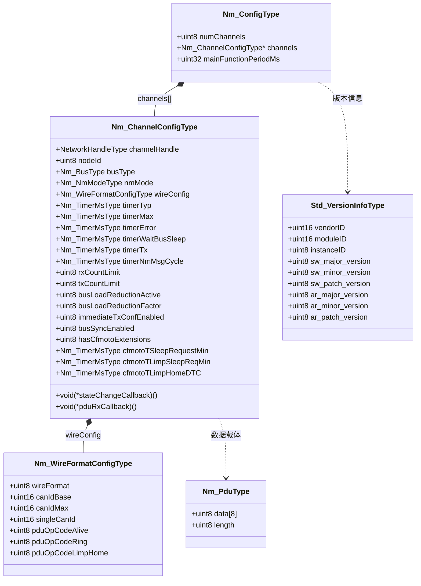

# Nm_ConfigTypes — 配置类型详解

> 属于 [[../00_MOC_总索引|MOC 总索引]] > **04_API参考**

NM 模块的全部配置集中定义在 `Nm_ConfigTypes.h`（301 行）中。
配置被组织为层级结构：顶层 `Nm_ConfigType` → 通道级 `Nm_ChannelConfigType` → 线缆格式 `Nm_WireFormatConfigType`。
所有配置实例在 ROM 中静态分配，通过 `Nm_Init(&config)` 一次性传入。

---

## 关键常量

| 常量 | 值 | 说明 |
|------|:-:|------|
| `NM_MAX_CHANNELS` | 8U | 最大通道数（数组尺寸） |
| `NM_MAX_NODES` | 32U | 每通道最大网络节点数 |
| `NM_PDU_MAX_LENGTH` | 8U | PDU 最大长度（CAN FD 兼容预留） |
| `NM_USER_DATA_MAX` | 6U | 用户数据最大长度（8 - OpCode(1) - NodeID(1)） |
| `NM_INVALID_HANDLE` | 0xFFU | 无效通道句柄标记 |
| `NM_INVALID_NODE_ID` | 0xFFU | 无效节点 ID 标记 |

---

## 一、结构体层级关系



---

## 二、Nm_WireFormatConfigType (线缆格式配置)

定义 NM PDU 在 CAN 总线上的编码方式。两种互斥模式：

| 字段 | 类型 | 取值范围 | 含义 |
|------|------|----------|------|
| `wireFormat` | `uint8` | `NM_WIRE_FORMAT_CAN_ID` (0x01) 或 `NM_WIRE_FORMAT_OPCODE` (0x02) | 选择 PDU 编码模式 |
| `canIdBase` | `uint16` | 0x0000-0x07FF (CAN 2.0A) | CAN ID 模式: 基础 CAN ID (如 0x400) |
| `canIdMax` | `uint16` | 0x0000-0x07FF | CAN ID 模式: 最大 CAN ID (如 0x4FF) |
| `singleCanId` | `uint16` | 0x0000-0x07FF | OpCode 模式: 所有 NM 消息共用一个 CAN ID |
| `pduOpCodeAlive` | `uint8` | 取决于 wireFormat | Alive 消息的操作码 |
| `pduOpCodeRing` | `uint8` | 取决于 wireFormat | Ring 消息的操作码 |
| `pduOpCodeLimpHome` | `uint8` | 取决于 wireFormat | LimpHome 消息的操作码 |

### CAN ID 模式 (wireFormat = 0x01)

- 来源于 6AQ0 项目 (iSOFT OsekNm 2.5.3)
- 每种消息类型映射到唯一 CAN ID
- 典型的 OpCode 值: Alive=0x01, Ring=0x02, LimpHome=0x04
- CAN ID 范围: `canIdBase` ~ `canIdMax`，每个节点占一个 ID

### OpCode 模式 (wireFormat = 0x02)

- 来源于 6ER1 项目 (Arctic Core OSEK NM 4.2.2)
- 所有 NM 消息共享一个 `singleCanId`
- 第一个字节为 OpCode 位域:
  - Bit 0: Alive (0x01)
  - Bit 1: Ring (0x02)
  - Bit 2: LimpHome (0x04)
  - Bit 3: Sleep Ack (0x08)
  - Bit 4: Sleep Ind (0x10)
  - Bit 5: Repeat Msg (0x20)
  - Bit 6: Active (0x40)
  - Bit 7: Reserved (0x80)

---

## 三、Nm_ChannelConfigType (通道配置)

每个通道一个实例，包含 20+ 个字段。

### 3.1 身份识别

| 字段 | 类型 | 取值范围 | 含义 |
|------|------|----------|------|
| `channelHandle` | `NetworkHandleType` | 0 ~ `NM_MAX_CHANNELS`-1 | 通道唯一句柄 |
| `nodeId` | `uint8` | 0 ~ `NM_MAX_NODES`-1 | 本节点在该通道上的 ID |
| `busType` | `Nm_BusType` | `NM_BUS_CAN`(0x00) / `NM_BUS_LIN`(0x01) / `NM_BUS_FR`(0x02) | 总线类型 |
| `nmMode` | `Nm_NmModeType` | `NM_MODE_DIRECT`(0x00) / `NM_MODE_INDIRECT`(0x01) / `NM_MODE_AUTOSAR`(0x02) | NM 模式 |

### 3.2 线缆格式

| 字段 | 类型 | 含义 |
|------|------|------|
| `wireConfig` | `Nm_WireFormatConfigType` | 嵌入的线缆格式配置 |

### 3.3 定时参数 (单位: 毫秒)

| 字段 | 类型 | 典型值 | 含义 |
|------|------|--------|------|
| `timerTyp` | `uint32` | 1000 | 典型消息周期 (TTyp) |
| `timerMax` | `uint32` | 1500 | 最大接收超时 (TMax) |
| `timerError` | `uint32` | 1000 | LimpHome 错误超时 (TError) |
| `timerWaitBusSleep` | `uint32` | 1500 | 等待总线休眠 (TWbs) |
| `timerTx` | `uint32` | 100 | 发送重试间隔 (TTx) |
| `timerNmMsgCycle` | `uint32` | 0 | NM 消息周期偏移 (用于防冲突) |

配置建议:

- **高速 CAN (500 kbps)**: TTyp=500ms, TMax=750ms, TError=500ms
- **低速 CAN (125 kbps)**: TTyp=1000ms, TMax=1500ms, TError=1000ms
- **调试模式**: 所有值乘以 10（便于分析仪观察）

### 3.4 重试限制

| 字段 | 类型 | 典型值 | 含义 |
|------|------|--------|------|
| `rxCountLimit` | `uint8` | 3 | Rx 超时前的最大允许丢失次数 |
| `txCountLimit` | `uint8` | 3 | Tx 超时前的最大重试次数 |

### 3.5 总线负载削减

| 字段 | 类型 | 取值范围 | 默认值 | 含义 |
|------|------|----------|--------|------|
| `busLoadReductionActive` | `uint8` | TRUE/FALSE | FALSE | 启用消息周期倍增 |
| `busLoadReductionFactor` | `uint8` | 2~10 | 2 | TTyp 乘以此因子 |

当 `busLoadReductionActive == TRUE` 时，实际发送周期 = `timerTyp * busLoadReductionFactor`。
用于高密度网络（> 20 个节点）降低总线负载。参考: [[../02_架构详解/分层架构设计|分层架构设计]]

### 3.6 即时发送确认

| 字段 | 类型 | 取值范围 | 默认值 | 含义 |
|------|------|----------|--------|------|
| `immediateTxConfEnabled` | `uint8` | TRUE/FALSE | FALSE | 发送后立即确认还是等待 CAN ACK |

### 3.7 总线同步

| 字段 | 类型 | 取值范围 | 默认值 | 含义 |
|------|------|----------|--------|------|
| `busSyncEnabled` | `uint8` | TRUE/FALSE | FALSE | 启用协调器总线同步 |

### 3.8 CFMOTO 扩展定时器 (6ER1 项目特有)

| 字段 | 类型 | 典型值 | 含义 |
|------|------|--------|------|
| `hasCfmotoExtensions` | `uint8` | TRUE/FALSE | 是否启用 CFMOTO 扩展 |
| `cfmotoTSleepRequestMin` | `uint32` | 2000 | 最短休眠请求持续时间 |
| `cfmotoTLimpSleepReqMin` | `uint32` | 500 | LimpHome 下最短休眠请求 |
| `cfmotoTLimpHomeDTC` | `uint32` | 5000 | LimpHome DTC 记录超时 |

### 3.9 回调函数指针

| 字段 | 签名 | 含义 |
|------|------|------|
| `stateChangeCallback` | `void (*)(NetworkHandleType, Nm_StateType)` | 直接状态变化回调（通道级，绕过 Core 层） |
| `pduRxCallback` | `void (*)(NetworkHandleType, const Nm_PduType*)` | 直接 PDU 接收回调（通道级） |

> 注意: 这两个指针对应 CanNm 层直接调用的回调，与 `Nm_Cbk.h` 中的应用层回调是不同层级。
> 应用层应实现 `Nm_Cbk.h` 中的回调，而非直接使用这两个指针。

---

## 四、Nm_ConfigType (全局配置)

| 字段 | 类型 | 含义 | 配置建议 |
|------|------|------|----------|
| `numChannels` | `uint8` | 激活的通道数量 (≤ `NM_MAX_CHANNELS`) | 量产固件通常 1~2，调试固件可 1 |
| `channels` | `const Nm_ChannelConfigType*` | 指向通道配置数组（静态 ROM） | 必须 static const |
| `mainFunctionPeriodMs` | `uint32` | `Nm_MainFunction()` 调用周期 | 默认 5ms，值越小定时器精度越高 |

---

## 五、Nm_PduType (PDU 类型)

```c
typedef struct {
    uint8 data[NM_PDU_MAX_LENGTH];   /* 原始 PDU 字节 (固定 8 字节) */
    uint8 length;                    /* 有效数据长度 */
} Nm_PduType;
```

用于缓存最近接收/即将发送的 NM PDU。`length` 指 `data[]` 中的有效字节数。

---

## 六、Std_VersionInfoType (版本信息)

```c
typedef struct {
    uint16 vendorID;           /* 厂商 ID = 60U */
    uint16 moduleID;           /* 模块 ID = 29U */
    uint8  instanceID;         /* 实例 ID = 1U */
    uint8  sw_major_version;   /* SW 主版本 = 1U */
    uint8  sw_minor_version;   /* SW 次版本 = 0U */
    uint8  sw_patch_version;   /* SW 补丁版本 = 0U */
    uint8  ar_major_version;   /* AUTOSAR 主版本 = 4U */
    uint8  ar_minor_version;   /* AUTOSAR 次版本 = 2U */
    uint8  ar_patch_version;   /* AUTOSAR 补丁版本 = 2U */
} Std_VersionInfoType;
```

N 值: `vendorID=60U, moduleID=29U, instanceID=1U, SW=1.0.0, AR=4.2.2`

---

## 七、三种 NM 模式配置差异示例

### Direct 模式 (OSEK Direct, 6AQ0 项目)

```c
static const Nm_ChannelConfigType g_ch0 = {
    .channelHandle       = 0U,
    .nodeId              = 0x01U,
    .busType             = NM_BUS_CAN,
    .nmMode              = NM_MODE_DIRECT,
    .wireConfig = {
        .wireFormat      = NM_WIRE_FORMAT_CAN_ID,
        .canIdBase       = 0x400U,
        .canIdMax        = 0x4FFU,
        .pduOpCodeAlive  = 0x01U,
        .pduOpCodeRing   = 0x02U,
        .pduOpCodeLimpHome = 0x04U,
    },
    .timerTyp            = 1000U,
    .timerMax            = 1500U,
    .timerError          = 1000U,
    .timerWaitBusSleep   = 1500U,
    .timerTx             = 100U,
    .timerNmMsgCycle     = 0U,
    .rxCountLimit        = 3U,
    .txCountLimit        = 3U,
    .busLoadReductionActive = FALSE,
    .busSyncEnabled      = FALSE,
    .stateChangeCallback = NULL,
    .pduRxCallback       = NULL,
};
```

### Indirect 模式 (OSEK Indirect, 监听模式)

```c
static const Nm_ChannelConfigType g_ch0 = {
    /* ... 基本字段同 Direct ... */
    .nmMode              = NM_MODE_INDIRECT,
    /* Indirect 模式下 SetUserData 为空函数，不发送 NM 消息 */
    /* 仅监听总线上的 Alive/Ring 消息判断网络状态 */
};
```

### AUTOSAR 模式 (骨架, 开发中)

```c
static const Nm_ChannelConfigType g_ch0 = {
    /* ... 基本字段同上 ... */
    .nmMode              = NM_MODE_AUTOSAR,
    .busSyncEnabled      = TRUE,             /* AUTOSAR 通常需要协调 */
    .busLoadReductionActive = TRUE,          /* AUTOSAR 支持 CBV 负载管理 */
    .busLoadReductionFactor = 4U,
};
```

---

## 八、类型别名一览

| 别名 | 底层类型 | 说明 |
|------|----------|------|
| `NetworkHandleType` | `uint8` | 通道句柄 |
| `Nm_ReturnType` | `uint8` | API 返回值 |
| `Nm_StateType` | `uint8` | NM 状态枚举 |
| `Nm_ModeType` | `uint8` | NM 模式枚举 |
| `Nm_BusType` | `uint8` | 总线类型 |
| `Nm_NmModeType` | `uint8` | NM 子模式 |
| `Nm_TimerMsType` | `uint32` | 毫秒定时器值 |
| `NodeIdType` | `uint8` | 节点 ID |
| `NetIdType` | `uint8` | 网络 ID |

---

## 相关文件

- [[Nm_Public_API_19个函数|Nm_Public_API 19 个函数]] — 使用这些配置结构的 API
- [[编译开关与功能裁剪|编译开关与功能裁剪]] — 配置编译开关如何影响结构体和 API 可用性
- [[../02_架构详解/双线缆协议设计|双线缆协议设计]] — CAN ID vs OpCode 模式的详细设计
- [[../02_架构详解/分层架构设计|分层架构设计]] — 配置在分层架构中的位置
