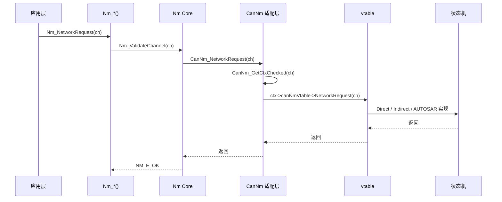

# Nm_Public_API — 20 个函数

> 属于 [[../00_MOC_总索引|MOC 总索引]] > **04_API参考**

NM 模块对外暴露 **20 个公用函数**（19 个 `Nm_*()` API + 2 个 CAN 驱动回调接口），所有应用层代码通过 `Nm.h` 接口与 NM 交互。
API 按功能分为七组：初始化、网络控制、通信控制、用户数据、节点信息、状态获取、运行时。

---

## 关键常数速览

| 常量 | 值 | 说明 |
|------|:-:|------|
| `NM_MODULE_ID` | 29U | AUTOSAR 模块 ID |
| `NM_VENDOR_ID` | 60U | 厂商 ID |
| `NM_MAX_CHANNELS` | 8U | 最大通道数 |
| `NM_PDU_MAX_LENGTH` | 8U | PDU 最大字节数 |
| `NM_USER_DATA_MAX` | 6U | 用户数据最大字节数 |
| `NM_MAX_NODES` | 32U | 每通道最大节点数 |
| `NM_INVALID_HANDLE` | 0xFFU | 无效通道句柄 |
| `NM_INVALID_NODE_ID` | 0xFFU | 无效节点 ID |

**返回值统一枚举:**

| 值 | 含义 |
|----|------|
| `NM_E_OK` (0x00U) | 操作成功 |
| `NM_E_NOT_OK` (0x01U) | 操作失败 |
| `NM_E_NOT_EXECUTED` (0x02U) | 操作未执行 |

---

## 一、初始化函数

### 1. Nm_Init

```c
void Nm_Init(const Nm_ConfigType* configPtr);
```

| 项目 | 内容 |
|------|------|
| **Service ID** | 0x00 |
| **参数** | `configPtr` — 指向 `Nm_ConfigType` 的只读配置（必须为 static/ROM 生命周期） |
| **返回值** | void |
| **前置条件** | 无（模块可未初始化） |
| **调用时机** | 系统启动时，一次调用，所有通道同步初始化 |
| **副作用** | 初始化 `Nm_Core` 全局状态、`Nm_Timer`、遍历所有通道并调用 `CanNm_Init()` |

代码示例:

```c
#include "Nm.h"

static const Nm_ConfigType g_nmConfig = {
    .numChannels = 2U,
    .channels = g_nmChannels,
    .mainFunctionPeriodMs = 5U
};

void EcuM_Init(void)
{
    Nm_Init(&g_nmConfig);
}
```

### 2. Nm_DeInit

```c
/* 编译开关: NM_DEINIT_API == STD_ON */
void Nm_DeInit(void);
```

| 项目 | 内容 |
|------|------|
| **Service ID** | 0x11 |
| **参数** | void |
| **返回值** | void |
| **前置条件** | `Nm_Init()` 已完成 |
| **调用时机** | 系统关机 / 软件复位前 |
| **副作用** | 遍历所有通道调用 `CanNm_DeInit()`，清零 `Nm_Core.initialized` |

代码示例:

```c
#if (NM_DEINIT_API == STD_ON)
void EcuM_Shutdown(void)
{
    Nm_DeInit();
}
#endif
```

---

## 二、网络控制函数

### 3. Nm_PassiveStartUp

```c
Nm_ReturnType Nm_PassiveStartUp(NetworkHandleType nmChannelHandle);
```

| 项目 | 内容 |
|------|------|
| **Service ID** | 0x01 |
| **参数** | `nmChannelHandle` — 通道句柄 |
| **返回值** | `NM_E_OK` 或 `NM_E_NOT_OK` |
| **前置条件** | NM 已初始化，通道处于 Bus-Sleep 状态 |
| **调用时机** | 收到外部 NM PDU 后被唤醒（被动唤醒） |
| **副作用** | 通道从 Bus-Sleep 进入 INITRESET (Direct) / AWAKE (Indirect) / REPEAT_MESSAGE (AUTOSAR) |

代码示例:

```c
void CanIf_RxIndication(uint32 canId, const uint8* data, uint8 dlc)
{
    if (canId >= 0x400U && canId <= 0x4FFU) {
        /* 收到 NM PDU, 被动唤醒 */
        Nm_PassiveStartUp(0U);
    }
}
```

### 4. Nm_NetworkRequest

```c
Nm_ReturnType Nm_NetworkRequest(NetworkHandleType nmChannelHandle);
```

| 项目 | 内容 |
|------|------|
| **Service ID** | 0x02 |
| **参数** | `nmChannelHandle` — 通道句柄 |
| **返回值** | `NM_E_OK` 或 `NM_E_NOT_OK` |
| **前置条件** | NM 已初始化 |
| **调用时机** | 应用层需要主动建立网络通信（主动唤醒） |
| **副作用** | 通道进入 INIT (Direct) / AWAKE (Indirect) / 按当前状态决定转换 (AUTOSAR) |

代码示例:

```c
void ComM_RequestComMode(void)
{
    Nm_NetworkRequest(0U);
}
```

### 5. Nm_NetworkRelease

```c
Nm_ReturnType Nm_NetworkRelease(NetworkHandleType nmChannelHandle);
```

| 项目 | 内容 |
|------|------|
| **Service ID** | 0x03 |
| **参数** | `nmChannelHandle` — 通道句柄 |
| **返回值** | `NM_E_OK` 或 `NM_E_NOT_OK` |
| **前置条件** | NM 已初始化，通道处于网络模式 |
| **调用时机** | 应用层无需再通信，准备休眠 |
| **副作用** | 通道进入 NORMALPREPSLEEP (Direct) / WAITBUSSLEEP (Indirect) / READY_SLEEP 或 SYNCHRONIZE (AUTOSAR) |

代码示例:

```c
void ComM_ReleaseComMode(void)
{
    Nm_NetworkRelease(0U);
}
```

---

## 三、通信控制函数

### 6. Nm_DisableCommunication

```c
/* 编译开关: NM_COM_CONTROL_ENABLED == STD_ON */
Nm_ReturnType Nm_DisableCommunication(NetworkHandleType nmChannelHandle);
```

| 项目 | 内容 |
|------|------|
| **Service ID** | 0x04 |
| **参数** | `nmChannelHandle` — 通道句柄 |
| **返回值** | `NM_E_OK` 或 `NM_E_NOT_OK` |
| **前置条件** | NM 已初始化，通道有效 |
| **调用时机** | 需要禁止本节点 NM PDU 发送（诊断/静默） |
| **副作用** | `ctx->commEnabled = 0U`，调用 `CanNm_DisableCommunication()` |

代码示例:

```c
/* 诊断会话激活时禁止 NM 发送 */
void Dcm_EnterDiagnosticSession(void)
{
    Nm_DisableCommunication(0U);
}
```

### 7. Nm_EnableCommunication

```c
/* 编译开关: NM_COM_CONTROL_ENABLED == STD_ON */
Nm_ReturnType Nm_EnableCommunication(NetworkHandleType nmChannelHandle);
```

| 项目 | 内容 |
|------|------|
| **Service ID** | 0x05 |
| **参数** | `nmChannelHandle` — 通道句柄 |
| **返回值** | `NM_E_OK` 或 `NM_E_NOT_OK` |
| **前置条件** | NM 已初始化，通道有效 |
| **调用时机** | 诊断会话退出后恢复 NM 通信 |
| **副作用** | `ctx->commEnabled = 1U`，调用 `CanNm_EnableCommunication()` |

代码示例:

```c
void Dcm_ExitDiagnosticSession(void)
{
    Nm_EnableCommunication(0U);
}
```

---

## 四、用户数据函数

### 8. Nm_SetUserData

```c
/* 编译开关: NM_USER_DATA_ENABLED == STD_ON */
Nm_ReturnType Nm_SetUserData(
    NetworkHandleType nmChannelHandle,
    const uint8* nmUserDataPtr,
    uint8 nmUserDataLength
);
```

| 项目 | 内容 |
|------|------|
| **Service ID** | 0x06 |
| **参数** | `nmChannelHandle` — 通道句柄; `nmUserDataPtr` — 用户数据缓冲区; `nmUserDataLength` — 字节数 (≤ `NM_USER_DATA_MAX`) |
| **返回值** | `NM_E_OK` 或 `NM_E_NOT_OK` |
| **前置条件** | NM 已初始化，`nmUserDataPtr` 非 NULL，`nmUserDataLength` ≤ 6 |
| **调用时机** | 在 `Nm_NetworkRequest()` 之后，设置要在 Alive/Ring 消息中携带的用户数据 |

代码示例:

```c
void App_SetNMSleepRequest(void)
{
    uint8 data[1] = { 0x01U }; /* bit0 = 请求休眠 */
    Nm_SetUserData(0U, data, 1U);
}
```

### 9. Nm_GetUserData

```c
/* 编译开关: NM_USER_DATA_ENABLED == STD_ON */
Nm_ReturnType Nm_GetUserData(
    NetworkHandleType nmChannelHandle,
    uint8* nmUserDataPtr,
    uint8* nmNodeIdPtr
);
```

| 项目 | 内容 |
|------|------|
| **Service ID** | 0x07 |
| **参数** | `nmChannelHandle` — 通道句柄; `nmUserDataPtr` — [out] 用户数据缓冲区; `nmNodeIdPtr` — [out] 源节点 ID |
| **返回值** | `NM_E_OK` 或 `NM_E_NOT_OK` |
| **前置条件** | NM 已初始化，且至少收到过一个 NM PDU (`rxPduAvailable != 0U`) |

### 10. Nm_GetPduData

```c
/* 编译开关: NM_USER_DATA_ENABLED || NM_NODE_ID_ENABLED || NM_NODE_DETECTION_ENABLED */
Nm_ReturnType Nm_GetPduData(
    NetworkHandleType nmChannelHandle,
    uint8* nmPduData
);
```

| 项目 | 内容 |
|------|------|
| **Service ID** | 0x08 |
| **参数** | `nmChannelHandle` — 通道句柄; `nmPduData` — [out] 完整 PDU 数据 (≤ 8 字节) |
| **返回值** | `NM_E_OK` 或 `NM_E_NOT_OK` |
| **前置条件** | NM 已初始化，且 `rxPduAvailable != 0U` |

---

## 五、节点信息函数

### 11. Nm_RepeatMessageRequest

```c
/* 编译开关: NM_NODE_DETECTION_ENABLED == STD_ON */
Nm_ReturnType Nm_RepeatMessageRequest(NetworkHandleType nmChannelHandle);
```

| 项目 | 内容 |
|------|------|
| **Service ID** | 0x09 |
| **参数** | `nmChannelHandle` — 通道句柄 |
| **返回值** | `NM_E_OK` 或 `NM_E_NOT_OK` |
| **前置条件** | NM 已初始化 |
| **调用时机** | 节点在线检测（Node Detection）需要目标节点回复时 |
| **副作用** | 设置 `ctx->repeatMsgRequested = 1U`，下一条 NM 消息带 Repeat Message Request 位 |

### 12. Nm_GetNodeIdentifier

```c
/* 编译开关: NM_NODE_ID_ENABLED == STD_ON */
Nm_ReturnType Nm_GetNodeIdentifier(
    NetworkHandleType nmChannelHandle,
    uint8* nmNodeIdPtr
);
```

| 项目 | 内容 |
|------|------|
| **Service ID** | 0x0A |
| **参数** | `nmChannelHandle` — 通道句柄; `nmNodeIdPtr` — [out] 最近收到的 NM PDU 的源节点 ID |
| **返回值** | `NM_E_OK` 或 `NM_E_NOT_OK` |

### 13. Nm_GetLocalNodeIdentifier

```c
/* 编译开关: NM_NODE_ID_ENABLED == STD_ON */
Nm_ReturnType Nm_GetLocalNodeIdentifier(
    NetworkHandleType nmChannelHandle,
    uint8* nmNodeIdPtr
);
```

| 项目 | 内容 |
|------|------|
| **Service ID** | 0x0B |
| **参数** | `nmChannelHandle` — 通道句柄; `nmNodeIdPtr` — [out] 本节点 ID |
| **返回值** | `NM_E_OK` 或 `NM_E_NOT_OK` |

---

## 六、状态获取函数

### 14. Nm_CheckRemoteSleepIndication

```c
/* 编译开关: NM_REMOTE_SLEEP_IND_ENABLED == STD_ON */
Nm_ReturnType Nm_CheckRemoteSleepIndication(
    NetworkHandleType nmChannelHandle,
    boolean* nmRemoteSleepIndPtr
);
```

| 项目 | 内容 |
|------|------|
| **Service ID** | 0x0D |
| **参数** | `nmChannelHandle` — 通道句柄; `nmRemoteSleepIndPtr` — [out] TRUE = 所有远程节点就绪休眠 |
| **返回值** | `NM_E_OK` 或 `NM_E_NOT_OK` |

### 15. Nm_GetState

```c
Nm_ReturnType Nm_GetState(
    NetworkHandleType nmChannelHandle,
    Nm_StateType* nmStatePtr,
    Nm_ModeType* nmModePtr
);
```

| 项目 | 内容 |
|------|------|
| **Service ID** | 0x0E |
| **参数** | `nmChannelHandle` — 通道句柄; `nmStatePtr` — [out] 当前 `Nm_StateType`; `nmModePtr` — [out] 当前 `Nm_ModeType` |
| **返回值** | `NM_E_OK` 或 `NM_E_NOT_OK` |
| **前置条件** | NM 已初始化，指针非 NULL |
| **典型值** | state: `NM_STATE_NORMAL_OPERATION` (0x04), mode: `NM_MODE_NETWORK` (0x03) |

`Nm_StateType` 全部值:

| 宏 | 值 | 说明 |
|----|:-:|------|
| `NM_STATE_UNINIT` | 0x00 | 未初始化 |
| `NM_STATE_BUS_SLEEP` | 0x01 | 总线休眠 |
| `NM_STATE_PREPARE_BUS_SLEEP` | 0x02 | 准备休眠 |
| `NM_STATE_READY_SLEEP` | 0x03 | 就绪休眠 (AUTOSAR) |
| `NM_STATE_NORMAL_OPERATION` | 0x04 | 正常运行 |
| `NM_STATE_REPEAT_MESSAGE` | 0x05 | 重复消息 (wake-up) |
| `NM_STATE_SYNCHRONIZE` | 0x06 | 同步 (AUTOSAR) |
| `NM_STATE_LIMPHOME` | 0x07 | 跛行模式 |
| `NM_STATE_LIMPHOME_PREPSLEEP` | 0x08 | LimpHome 准备休眠 |
| `NM_STATE_TWBS_LIMPHOME` | 0x09 | TWbs LimpHome |
| `NM_STATE_INITRESET` | 0x0A | 初始化复位 |
| `NM_STATE_TWBS_NORMAL` | 0x0B | TWbs Normal |
| `NM_STATE_ON` | 0x0C | 在线 |

`Nm_ModeType` 全部值:

| 宏 | 值 | 说明 |
|----|:-:|------|
| `NM_MODE_BUS_SLEEP` | 0x00 | 总线休眠模式 |
| `NM_MODE_PREPARE_BUS_SLEEP` | 0x01 | 准备休眠模式 |
| `NM_MODE_SYNCHRONIZE` | 0x02 | 同步模式 (AUTOSAR) |
| `NM_MODE_NETWORK` | 0x03 | 网络模式 |

### 16. Nm_GetVersionInfo

```c
/* 编译开关: NM_VERSION_INFO_API == STD_ON */
void Nm_GetVersionInfo(Std_VersionInfoType* versionInfo);
```

| 项目 | 内容 |
|------|------|
| **Service ID** | 0x0F |
| **参数** | `versionInfo` — [out] 版本信息结构体 |
| **返回值** | void |
| **典型值** | `vendorID=60U, moduleID=29U, AR=4.2.2, SW=1.0.0` |

---

## 七、运行时函数

### 17. Nm_MainFunction

```c
void Nm_MainFunction(void);
```

| 项目 | 内容 |
|------|------|
| **Service ID** | 0x10 |
| **参数** | void |
| **返回值** | void |
| **前置条件** | NM 已初始化 |
| **调用时机** | 周期性调用（建议 5ms），由 BSW 调度器驱动 |
| **副作用** | 遍历所有激活通道，依次调用 `CanNm_MainFunction()` + `Nm_Timer_Process()` |
| **重要** | **不可在中断上下文中调用** |

代码示例:

```c
/* BSW 调度器 5ms 任务 */
void SchM_Main_5ms(void)
{
    Nm_MainFunction();
}
```

### 18. Nm_ControllerBusOff

```c
void Nm_ControllerBusOff(NetworkHandleType nmChannelHandle);
```

| 项目 | 内容 |
|------|------|
| **Service ID** | 0x12 |
| **参数** | `nmChannelHandle` — 通道句柄 |
| **返回值** | void |
| **前置条件** | NM 已初始化 |
| **调用时机** | CAN 控制器检测到 Bus-Off 时，由 CanIf 层通知 |
| **副作用** | 设置 `ctx->busOffActive = 1U`，通道 → LIMPHOME 状态 |

代码示例:

```c
void CanIf_ControllerBusOff(uint8 controllerId)
{
    Nm_ControllerBusOff(controllerId);
    Nm_LimpHomeIndication(controllerId); /* 通知应用层 */
}
```

### 19. Nm_RxIndication

```c
void Nm_RxIndication(
    NetworkHandleType nmChannelHandle,
    const uint8* nmPduData,
    uint8 nmPduLength
);
```

| 项目 | 内容 |
|------|------|
| **参数** | `nmChannelHandle` — 通道句柄; `nmPduData` — 原始 PDU 字节; `nmPduLength` — PDU 长度 (≤ 8) |
| **返回值** | void |
| **前置条件** | NM 已初始化，PDU 长度 ∈ [1, 8] |
| **调用时机** | CAN 驱动收到 NM 相关 CAN ID 的帧后，由 CanIf 层调用 |
| **副作用** | 缓存 `lastRxPdu`、`lastRxNodeId`，转发至 `CanNm_RxIndication()` |
| **注意** | 调用链: `CanIf_RxIndication` → `Nm_RxIndication` → `CanNm_RxIndication` → vtable → FSM |

### 20. Nm_TxConfirmation

```c
void Nm_TxConfirmation(NetworkHandleType nmChannelHandle);
```

| 项目 | 内容 |
|------|------|
| **参数** | `nmChannelHandle` — 通道句柄 |
| **返回值** | void |
| **前置条件** | NM 已初始化 |
| **调用时机** | CAN 驱动发送完成中断/Task 中，帧成功发送到总线上 |
| **副作用** | 转发至 `CanNm_TxConfirmation()` → vtable → FSM (清除 txPending) |

代码示例:

```c
void CanIf_TxConfirmation(PduIdType txPduId)
{
    if (txPduId == NM_TX_PDU_ID) {
        Nm_TxConfirmation(0U);
    }
}
```

---

## API → vtable 映射全表

所有 API 在 `Nm.c` 中实现，通过 `Nm_GetChannelContext()` 获取通道上下文，再调用 `CanNm_*()` 适配层函数。
适配层通过 [[../02_架构详解/vtable多态分发机制|vtable多态分发机制]] 间接调用不同 NM 模式的状态机实现。



---

## 相关文件

- [[../02_架构详解/vtable多态分发机制|vtable多态分发机制]] — API 如何路由到不同 NM 模式实现
- [[Nm_Cbk_回调函数_12个|Nm_Cbk_回调函数 12 个]] — API 触发后如何回调通知应用层
- [[Nm_ConfigTypes_配置类型详解|Nm_ConfigTypes 配置类型详解]] — `Nm_ConfigType` 等结构体定义
- [[编译开关与功能裁剪|编译开关与功能裁剪]] — 哪些 API 受编译开关控制
