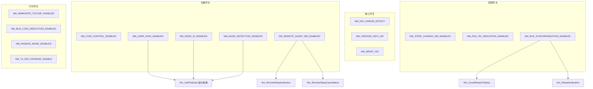

# 编译开关与功能裁剪

> 属于 [[../00_MOC_总索引|MOC 总索引]] > **04_API参考**

NM 模块定义 **15 个编译开关**（定义在 `Nm_ConfigTypes.h` 第 38-100 行），全部采用 `#ifndef` 保护，集成项目可在 `app_cfg.h` 中覆盖。
通过这些开关，同一套源码可以裁剪为**量产固件**、**调试固件**或 **PC 测试固件**。

---

## 一、全部 15 个编译开关

### 1. NM_DEV_ERROR_DETECT

| 属性 | 值 |
|------|-----|
| **定义位置** | `Nm_ConfigTypes.h:42` |
| **默认值** | `STD_OFF` |
| **影响范围** | 开发错误检测 (DET) |
| **ON 时启用** | `NM_E_UNINIT` / `NM_E_HANDLE_UNDEF` / `NM_E_PARAM_POINTER` / `NM_E_INVALID_CHANNEL` 错误码, `Det_ReportRuntimeError()` 调用, Service ID 宏定义 |
| **代码影响** | `#if (NM_DEV_ERROR_DETECT == STD_ON)` 保护所有 DET 报告逻辑 |

### 2. NM_VERSION_INFO_API

| 属性 | 值 |
|------|-----|
| **定义位置** | `Nm_ConfigTypes.h:46` |
| **默认值** | `STD_ON` |
| **影响范围** | `Nm_GetVersionInfo()` API |
| **ON 时启用** | 版本信息查询函数 |

### 3. NM_DEINIT_API

| 属性 | 值 |
|------|-----|
| **定义位置** | `Nm_ConfigTypes.h:50` |
| **默认值** | `STD_OFF` |
| **影响范围** | `Nm_DeInit()` API |
| **依赖** | 无 |
| **裁剪建议** | 量产固件可 OFF（不需要反初始化） |

### 4. NM_COM_CONTROL_ENABLED

| 属性 | 值 |
|------|-----|
| **定义位置** | `Nm_ConfigTypes.h:54` |
| **默认值** | `STD_ON` |
| **影响范围** | `Nm_DisableCommunication()` / `Nm_EnableCommunication()` API |
| **依赖** | 无 |
| **裁剪建议** | 如果不需要诊断静默功能可以 OFF |

### 5. NM_USER_DATA_ENABLED

| 属性 | 值 |
|------|-----|
| **定义位置** | `Nm_ConfigTypes.h:58` |
| **默认值** | `STD_ON` |
| **影响范围** | `Nm_SetUserData()` / `Nm_GetUserData()` API, `Nm_GetPduData()` 部分依赖 |
| **依赖** | 无 |
| **裁剪建议** | 如果 NM 消息不需要携带应用层数据可以 OFF |

### 6. NM_NODE_ID_ENABLED

| 属性 | 值 |
|------|-----|
| **定义位置** | `Nm_ConfigTypes.h:62` |
| **默认值** | `STD_ON` |
| **影响范围** | `Nm_GetNodeIdentifier()` / `Nm_GetLocalNodeIdentifier()` API, `Nm_GetPduData()` 部分依赖 |
| **依赖** | 无 |

### 7. NM_NODE_DETECTION_ENABLED

| 属性 | 值 |
|------|-----|
| **定义位置** | `Nm_ConfigTypes.h:66` |
| **默认值** | `STD_ON` |
| **影响范围** | `Nm_RepeatMessageRequest()` API, `Nm_GetPduData()` 部分依赖 |
| **依赖** | 无 |

### 8. NM_REMOTE_SLEEP_IND_ENABLED

| 属性 | 值 |
|------|-----|
| **定义位置** | `Nm_ConfigTypes.h:70` |
| **默认值** | `STD_ON` |
| **影响范围** | `Nm_CheckRemoteSleepIndication()` API, `Nm_RemoteSleepIndication()` / `Nm_RemoteSleepCancellation()` 回调 |

### 9. NM_STATE_CHANGE_IND_ENABLED

| 属性 | 值 |
|------|-----|
| **定义位置** | `Nm_ConfigTypes.h:74` |
| **默认值** | `STD_ON` |
| **影响范围** | `Nm_StateChangeNotification()` 回调 |
| **依赖** | 无 |
| **裁剪建议** | 量产固件可 OFF（仅保留模式级回调） |

### 10. NM_PDU_RX_INDICATION_ENABLED

| 属性 | 值 |
|------|-----|
| **定义位置** | `Nm_ConfigTypes.h:78` |
| **默认值** | `STD_ON` |
| **影响范围** | `Nm_PduRxIndication()` 回调 |
| **依赖** | 无 |

### 11. NM_BUS_SYNCHRONIZATION_ENABLED

| 属性 | 值 |
|------|-----|
| **定义位置** | `Nm_ConfigTypes.h:82` |
| **默认值** | `STD_OFF` |
| **影响范围** | `Nm_CoordReadyToSleep()` / `Nm_RestartIndication()` 回调, 总线协调逻辑 |
| **依赖** | AUTOSAR NM 模式 |
| **裁剪建议** | 仅 AUTOSAR 协调器模式需要 |

### 12. NM_IMMEDIATE_TXCONF_ENABLED

| 属性 | 值 |
|------|-----|
| **定义位置** | `Nm_ConfigTypes.h:86` |
| **默认值** | `STD_OFF` |
| **影响范围** | `Nm_TxConfirmation()` 行为 — ON 时立即确认发送，OFF 时等待 CAN 硬件 ACK |
| **裁剪建议** | 对实时性要求高的场景开启 |

### 13. NM_BUS_LOAD_REDUCTION_ENABLED

| 属性 | 值 |
|------|-----|
| **定义位置** | `Nm_ConfigTypes.h:90` |
| **默认值** | `STD_ON` |
| **影响范围** | 消息周期倍增逻辑（`timerTyp * busLoadReductionFactor`） |
| **依赖** | 无 |

### 14. NM_PASSIVE_MODE_ENABLED

| 属性 | 值 |
|------|-----|
| **定义位置** | `Nm_ConfigTypes.h:94` |
| **默认值** | `STD_OFF` |
| **影响范围** | 被动模式 — ON 时节点只监听不主动发送 NM 消息 |
| **依赖** | 无 |
| **裁剪建议** | 纯监听节点开启 |

### 15. NM_TX_PDU_PENDING_ENABLE

| 属性 | 值 |
|------|-----|
| **定义位置** | `Nm_ConfigTypes.h:98` |
| **默认值** | `STD_ON` |
| **影响范围** | 发送待处理队列 — ON 时保留待发送 PDU 状态跟踪 |
| **依赖** | 无 |

---

## 二、开关与 API / 回调关系矩阵

| 编译开关 | 受影响的 API | 受影响的回调 |
|----------|-------------|-------------|
| `NM_DEV_ERROR_DETECT` | DET 错误码 + Service ID | — |
| `NM_VERSION_INFO_API` | `Nm_GetVersionInfo()` | — |
| `NM_DEINIT_API` | `Nm_DeInit()` | — |
| `NM_COM_CONTROL_ENABLED` | `Nm_DisableCommunication()` `Nm_EnableCommunication()` | — |
| `NM_USER_DATA_ENABLED` | `Nm_SetUserData()` `Nm_GetUserData()` `Nm_GetPduData()` (部分) | — |
| `NM_NODE_ID_ENABLED` | `Nm_GetNodeIdentifier()` `Nm_GetLocalNodeIdentifier()` `Nm_GetPduData()` (部分) | — |
| `NM_NODE_DETECTION_ENABLED` | `Nm_RepeatMessageRequest()` `Nm_GetPduData()` (部分) | — |
| `NM_REMOTE_SLEEP_IND_ENABLED` | `Nm_CheckRemoteSleepIndication()` | `Nm_RemoteSleepIndication()` `Nm_RemoteSleepCancellation()` |
| `NM_STATE_CHANGE_IND_ENABLED` | — | `Nm_StateChangeNotification()` |
| `NM_PDU_RX_INDICATION_ENABLED` | — | `Nm_PduRxIndication()` |
| `NM_BUS_SYNCHRONIZATION_ENABLED` | — | `Nm_CoordReadyToSleep()` `Nm_RestartIndication()` |
| `NM_IMMEDIATE_TXCONF_ENABLED` | 影响 `Nm_TxConfirmation()` 行为 | — |
| `NM_BUS_LOAD_REDUCTION_ENABLED` | 影响消息周期 | — |
| `NM_PASSIVE_MODE_ENABLED` | 影响 NM 发送行为 | — |
| `NM_TX_PDU_PENDING_ENABLE` | 影响发送队列 | — |

---

## 三、三种裁剪场景

### 场景 1: 量产固件（最小 ROM/RAM）

目标: 只保留必要的 NM 功能，极致裁剪。

```c
/* app_cfg.h — 量产固件 */
#define NM_DEV_ERROR_DETECT              STD_OFF   /* 无需 DET */
#define NM_VERSION_INFO_API              STD_OFF   /* 无需版本查询 */
#define NM_DEINIT_API                    STD_OFF   /* 不反初始化 */
#define NM_COM_CONTROL_ENABLED           STD_ON    /* 保留诊断静默 */
#define NM_USER_DATA_ENABLED             STD_ON    /* 需要携数据 */
#define NM_NODE_ID_ENABLED               STD_ON    /* 需要节点 ID */
#define NM_NODE_DETECTION_ENABLED        STD_OFF   /* 不需要节点检测 */
#define NM_REMOTE_SLEEP_IND_ENABLED      STD_ON    /* 需要协商休眠 */
#define NM_STATE_CHANGE_IND_ENABLED      STD_OFF   /* 仅模式回调即可 */
#define NM_PDU_RX_INDICATION_ENABLED     STD_OFF   /* 不逐帧通知 */
#define NM_BUS_SYNCHRONIZATION_ENABLED   STD_OFF   /* OSEK 不需要协调 */
#define NM_IMMEDIATE_TXCONF_ENABLED      STD_OFF   /* 等待 CAN ACK */
#define NM_BUS_LOAD_REDUCTION_ENABLED    STD_ON    /* 保留负载控制 */
#define NM_PASSIVE_MODE_ENABLED          STD_OFF   /* 主动模式 */
#define NM_TX_PDU_PENDING_ENABLE         STD_ON    /* 保留发送队列 */
```

**裁剪效果**: 关闭 5 个开关，减少 ~500 字节 ROM。

### 场景 2: 调试固件（全功能）

目标: 保留所有功能，便于开发调试。

```c
/* app_cfg.h — 调试固件 */
#define NM_DEV_ERROR_DETECT              STD_ON    /* 启用 DET 断言 */
#define NM_VERSION_INFO_API              STD_ON    /* 可查询版本 */
#define NM_DEINIT_API                    STD_ON    /* 可重复初始化 */
#define NM_COM_CONTROL_ENABLED           STD_ON    /* 诊断控制 */
#define NM_USER_DATA_ENABLED             STD_ON
#define NM_NODE_ID_ENABLED               STD_ON
#define NM_NODE_DETECTION_ENABLED        STD_ON    /* 节点检测 */
#define NM_REMOTE_SLEEP_IND_ENABLED      STD_ON
#define NM_STATE_CHANGE_IND_ENABLED      STD_ON    /* 逐状态跟踪 */
#define NM_PDU_RX_INDICATION_ENABLED     STD_ON    /* 每帧回调 */
#define NM_BUS_SYNCHRONIZATION_ENABLED   STD_ON    /* 支持 AUTOSAR */
#define NM_IMMEDIATE_TXCONF_ENABLED      STD_OFF
#define NM_BUS_LOAD_REDUCTION_ENABLED    STD_ON
#define NM_PASSIVE_MODE_ENABLED          STD_OFF
#define NM_TX_PDU_PENDING_ENABLE         STD_ON
```

**裁剪效果**: 全开，ROM ~5KB，方便单步调试和逻辑分析仪观察。

### 场景 3: PC 测试（Host Test）

目标: 在 PC 上运行单元测试，无硬件依赖。

```c
/* 测试框架通过命令行 -D 传入: */
/* gcc -DNM_HOST_TEST -DNM_DEV_ERROR_DETECT=0 ... */

/* 或等效的开关设置: */
#define NM_DEV_ERROR_DETECT              STD_OFF   /* 无 DET 模块 */
#define NM_VERSION_INFO_API              STD_ON
#define NM_DEINIT_API                    STD_ON    /* 测试需要重复 Init */
#define NM_COM_CONTROL_ENABLED           STD_ON
#define NM_USER_DATA_ENABLED             STD_ON
#define NM_NODE_ID_ENABLED               STD_ON
#define NM_NODE_DETECTION_ENABLED        STD_ON
#define NM_REMOTE_SLEEP_IND_ENABLED      STD_ON
#define NM_STATE_CHANGE_IND_ENABLED      STD_ON    /* 验证状态迁移 */
#define NM_PDU_RX_INDICATION_ENABLED     STD_ON
#define NM_BUS_SYNCHRONIZATION_ENABLED   STD_OFF   /* 测试不含协调器 */
#define NM_IMMEDIATE_TXCONF_ENABLED      STD_OFF
#define NM_BUS_LOAD_REDUCTION_ENABLED    STD_OFF   /* 简化定时器 */
#define NM_PASSIVE_MODE_ENABLED          STD_OFF
#define NM_TX_PDU_PENDING_ENABLE         STD_ON
```

**测试命令**:

```bash
gcc -std=c11 -DNM_HOST_TEST -I.. -I../OsIf \
    test_nm_state.c ../Nm.c ../CanNm/CanNm.c \
    ../CanNm/CanNm_Osek_Direct.c ../CanNm/CanNm_Osek_Indirect.c \
    ../CanNm/CanNm_Autosar.c ../Nm_Timer/Nm_Timer.c \
    -o test_nm_all && ./test_nm_all
```

---

## 四、开关依赖关系图



> 注: 除 `Nm_GetPduData` 由三个开关 OR 控制外，其余开关为独立控制。

---

## 五、裁剪策略速查

| 目标 | 建议关闭的开关 | ROM 节省 |
|------|:--------------|---------|
| 仅 OSEK Direct, 最小功能 | `NM_DEV_ERROR_DETECT`, `NM_VERSION_INFO_API`, `NM_DEINIT_API`, `NM_NODE_DETECTION_ENABLED`, `NM_STATE_CHANGE_IND_ENABLED`, `NM_PDU_RX_INDICATION_ENABLED`, `NM_BUS_SYNCHRONIZATION_ENABLED` | ~1KB |
| 纯监听节点 | 加关 `NM_USER_DATA_ENABLED`, 开 `NM_PASSIVE_MODE_ENABLED` | ~1.5KB |
| 需要诊断支持 | 保留 `NM_COM_CONTROL_ENABLED`, `NM_PDU_RX_INDICATION_ENABLED` | — |
| AUTOSAR 协调器 | 开 `NM_BUS_SYNCHRONIZATION_ENABLED`, 开 `NM_BUS_LOAD_REDUCTION_ENABLED` | +~500B |

---

## 相关文件

- [[Nm_Public_API_19个函数|Nm_Public_API 19 个函数]] — 哪些 API 受这些开关控制（标注了条件宏）
- [[Nm_Cbk_回调函数_12个|Nm_Cbk_回调函数 12 个]] — 哪些回调受这些开关控制
- [[Nm_ConfigTypes_配置类型详解|Nm_ConfigTypes 配置类型详解]] — `busSyncEnabled` / `busLoadReductionActive` 等配置字段与开关的协同
