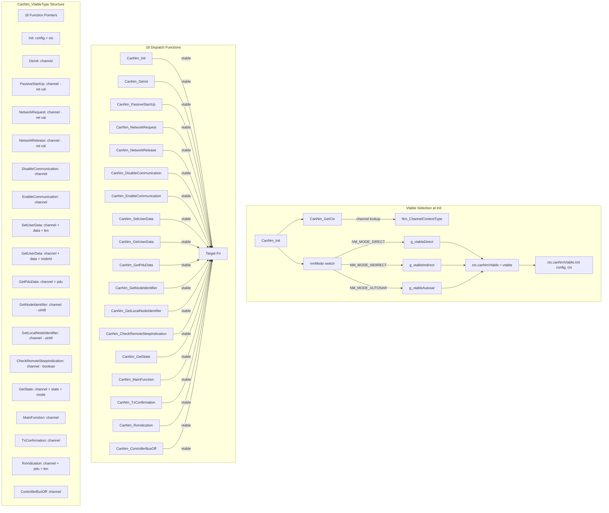
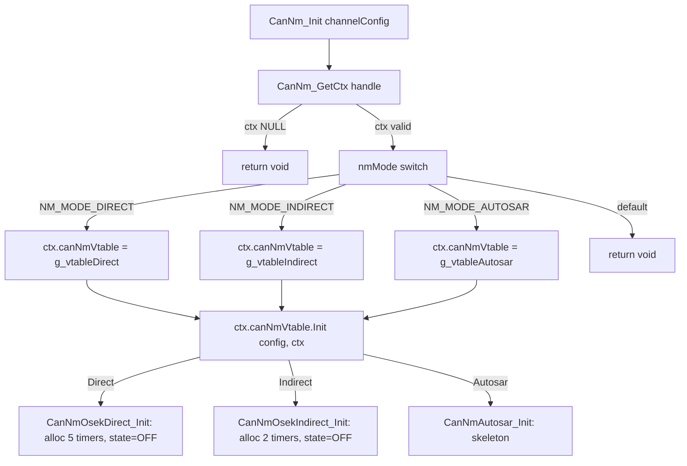

---
tags:
  - source-guide
  - cannm
  - vtable
---

# CanNm 适配层源码导读

> 文件: `NM/CanNm/CanNm.c` (369行) | 基于 vtable 的多态分发层，连接 Nm Core 与三个状态机实现。

---

## 1. 模块定位

CanNm.c 是 **Nm Core 与具体状态机 (Direct/Indirect/Autosar) 之间的适配层**。它的核心设计是: **根据 nmMode 在 Init 时选择一个函数指针表 (vtable)，此后所有 18 个 CanNm_*() 函数都通过 vtable 免分支转发**。

应用层绝不应直接调用 CanNm_*()，所有交互都通过 `Nm_*()` API 间接进行。

---

## 2. vtable 分发架构



---

## 3. 三个 vtable 实例

### 3.1 静态实例 (内部使用)

定义于 `CanNm.c:86-147`, `static const`, 仅在 `CanNm_Init` 中通过 switch-case 引用:

```c
static const CanNm_VtableType g_vtableDirect = {
    CanNmOsekDirect_Init,       //  0: Init
    CanNmOsekDirect_DeInit,     //  1: DeInit
    CanNmOsekDirect_PassiveStartUp, // 2
    CanNmOsekDirect_NetworkRequest, // 3
    CanNmOsekDirect_NetworkRelease, // 4
    CanNmOsekDirect_DisableCommunication, // 5
    CanNmOsekDirect_EnableCommunication,  // 6
    CanNmOsekDirect_SetUserData,          // 7
    CanNmOsekDirect_GetUserData,          // 8
    CanNmOsekDirect_GetPduData,           // 9
    CanNmOsekDirect_GetNodeIdentifier,    // 10
    CanNmOsekDirect_GetLocalNodeIdentifier, // 11
    CanNmOsekDirect_CheckRemoteSleepIndication, // 12
    CanNmOsekDirect_GetState,             // 13
    CanNmOsekDirect_MainFunction,         // 14
    CanNmOsekDirect_TxConfirmation,       // 15
    CanNmOsekDirect_RxIndication,         // 16
    CanNmOsekDirect_ControllerBusOff      // 17
};
```

`g_vtableIndirect` 和 `g_vtableAutosar` 结构完全对称，分别绑定 Indirect 和 AUTOSAR 的实现函数。

### 3.2 外部导出实例 (测试/调试用)

定义于 `CanNm.c:150-184`, `const` (无 static), 可供外部引用:

```c
extern const CanNm_VtableType CanNm_VtableDirect;
extern const CanNm_VtableType CanNm_VtableIndirect;
extern const CanNm_VtableType CanNm_VtableAutosar;
```

---

## 4. 18 个分发函数的实现模式

每个 CanNm_*() 分发函数都遵循相同的两行模式:

```c
// 模式1: 有返回值
CanNm_ReturnType CanNm_PassiveStartUp(NetworkHandleType channel) {
    Nm_ChannelContextType* ctx = CanNm_GetCtxChecked(channel);
    if (NULL == ctx) { return CANNM_E_NOT_OK; }
    return ctx->canNmVtable->PassiveStartUp(channel);
}

// 模式2: 无返回值
void CanNm_MainFunction(NetworkHandleType channel) {
    Nm_ChannelContextType* ctx = CanNm_GetCtxChecked(channel);
    if (NULL != ctx) { ctx->canNmVtable->MainFunction(channel); }
}
```

**GetCtxChecked 实现** (`CanNm.c:200-205`):
```c
static Nm_ChannelContextType* CanNm_GetCtxChecked(NetworkHandleType channel) {
    Nm_ChannelContextType* ctx = CanNm_GetCtx(channel);
    if (NULL == ctx || NULL == ctx->canNmVtable) { return NULL; }
    return ctx;
}
```
额外检查 `canNmVtable != NULL` — 防止在未初始化通道上调用导致空指针解引用。

---

## 5. CanNm_Init 的 vtable 选择逻辑

`CanNm.c:209-223`:



**设计要点**: `nmMode` 是 `Nm_ChannelConfigType` 的字段, 在 `Nm_Init` 时从 ROM 配置拷贝到 `ctx->nmMode`。每个通道独立选择 vtable，允许同一系统混合使用 Direct + Indirect + AUTOSAR。

---

## 6. 平台弱符号 (Platform Hooks)

`CanNm.c:347-369` 定义了 3 个 `NM_WEAK` 函数 — 集成项目必须覆盖它们:

| 函数 | 签名 | 用途 |
|------|------|------|
| `CanNm_Transmit` | `(channel, pduData, pduLength) -> CanNm_ReturnType` | 将 NM PDU 发送到 CAN 总线 |
| `CanNm_ControllerEnable` | `(channel) -> void` | 启用 CAN 控制器 (从 Bus-Sleep 唤醒) |
| `CanNm_ControllerDisable` | `(channel) -> void` | 禁用 CAN 控制器 (进入 Bus-Sleep) |

弱默认实现直接返回 `CANNM_E_NOT_OK` 或空操作。实际工程中通过 `CanIf` 或直接 CAN 驱动实现覆盖。

---

## 7. 新增 NM 模式的步骤

按照 `CanNm.c:11-14` 注释，增加一种新 NM 类型只需 3 步:

1. 新建 `CanNm_Xxx.c`，实现 18 个匹配 `CanNm_VtableType` 的函数
2. 在 `CanNm.c` 中新增 `g_vtableXxx` 实例
3. 在 `CanNm_Init` 的 switch 中新增 `case NM_MODE_XXX`

---

## 8. 相关文件

- [[Nm_Core源码导读]] — Nm Core 如何调用 CanNm
- [[数据结构运行时全景]] — Nm_ChannelContextType 与 vtable 的关联
- [[函数调用关系总图]] — 全局函数调用层级
- [[Nm_Timer源码导读]] — 状态机依赖的定时器基础设施
