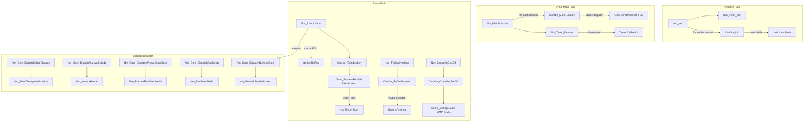

---
tags:
  - source-guide
  - nm-core
  - routing
---

# Nm_Core 源码导读

> 文件: `NM/Nm.c` (626行) | 对外 API 层，负责多通道协调、PDU 缓冲、回调分发。

---

## 1. 模块定位

Nm.c 是 NM 标准化模块的**唯一对外入口**。应用层通过 `Nm_*()` 系列 API 交互，Nm.c 再路由到总线特定的实现 (CanNm)。它同时维护全局单例 `Nm_Core`，管理最多 8 个通道的运行时状态。

核心职责:
- 初始化配置分发 (channel 遍历 + 完整性校验)
- API 参数校验 (channel handle 有效性检查)
- PDU 接收缓存 (lastRxPdu 写入, 供后续 Nm_GetPduData 读取)
- 状态变更回调分发 (5 个 Nm_Core_Dispatch* 函数)
- 周期性主函数调度 (遍历各通道 FSM + 定时器处理)

---

## 2. 函数调用关系图



---

## 3. 关键数据结构

### 3.1 Nm_Core (全局单例)

定义于 `Nm.c:25`, 类型 `Nm_CoreType` (定义于 `Nm_Internal.h:59`):

```c
typedef struct {
    uint8                 initialized;     // 模块初始化标志
    const Nm_ConfigType*  config;          // 指向 ROM 配置
    Nm_ChannelContextType channels[NM_MAX_CHANNELS]; // 8 个通道上下文
} Nm_CoreType;
```

- `initialized`: 由 Nm_Init 置 1, Nm_DeInit 清 0。所有 API 首先检查此标志。
- `config`: 指向静态配置块，包含 `numChannels` 和 `channels[]` 数组指针。
- `channels[]`: 最大 8 个通道。遍历时检查 `config != NULL` 判断是否激活。

### 3.2 Nm_ChannelContextType (通道上下文)

定义于 `Nm_Internal.h:22`:

```c
typedef struct Nm_ChannelContextType {
    const Nm_ChannelConfigType* config;       // ROM 配置指针
    NetworkHandleType          handle;         // 通道句柄 (0..7)
    uint8                      nodeId;         // 本地节点 ID
    Nm_BusType                 busType;        // CAN/LIN/FR
    Nm_NmModeType              nmMode;         // DIRECT/INDIRECT/AUTOSAR
    const CanNm_VtableType*    canNmVtable;   // 多态 vtable 指针

    Nm_StateType               state;          // 当前 NM 状态
    Nm_ModeType                mode;           // 当前 NM 模式

    Nm_PduType                 lastRxPdu;      // 最近接收的 PDU 缓存
    uint8                      lastRxNodeId;   // 来源节点 ID
    uint8                      rxPduAvailable; // PDU 缓存有效标志

    uint8                      txUserData[NM_USER_DATA_MAX]; // 待发送用户数据
    uint8                      txUserDataLength;

    uint8                      commEnabled;    // 通信使能标志
    uint8                      repeatMsgRequested;
    uint8                      remoteSleepInd;
    uint8                      busOffActive;   // Bus-Off 标志
} Nm_ChannelContextType;
```

**读写时机**:
| 字段 | 写入者 | 读取者 |
|------|--------|--------|
| `config` | Nm_Init | 所有函数 |
| `state` | DispatchStateChange, DispatchBusSleep, DispatchNetworkStart | Nm_GetState, ValidateChannel |
| `mode` | DispatchNetworkMode, DispatchPrepareBusSleep, DispatchBusSleep | Nm_GetState |
| `lastRxPdu` | Nm_RxIndication | Nm_GetPduData, Nm_GetUserData |
| `rxPduAvailable` | Nm_RxIndication (置 1) | Nm_GetPduData (读后不清) |
| `commEnabled` | Nm_EnableCommunication / Nm_DisableCommunication | CanNm FSM (Direct_SendPdu) |
| `busOffActive` | Nm_ControllerBusOff (置 1) | CanNm FSM |

---

## 4. 核心流程解读

### 4.1 Nm_Init (Nm.c:121)

```
1. 参数校验 (configPtr != NULL)
2. Nm_Timer_Init() -- 初始化软件定时器池
3. 临界区保护 (Nm_EnterCritical)
4. 遍历 channels[], 清零所有字段
5. 遍历 config->numChannels:
   a. 拷贝 config 字段到 ctx (handle, nodeId, busType, nmMode)
   b. CanNm_Init(chCfg) -- 根据 nmMode 选择 vtable
   c. 设置 ctx->state = NM_STATE_BUS_SLEEP
6. 退出临界区
```

**注意**: CanNm_Init 执行过程中可能触发状态机迁移 (Init -> InitReset -> Normal)，这些状态变更通过 `DispatchStateChange` 回调写入 `ctx->state`。Nm_Init 在 CanNm_Init 之后**强制覆盖 `ctx->state = NM_STATE_BUS_SLEEP`**，因为启动时所有通道应从 Bus-Sleep 开始，等待 NetworkRequest 唤醒。

### 4.2 Nm_MainFunction (Nm.c:497)

```c
void Nm_MainFunction(void) {
    // 1. 遍历各通道，调用 CanNm_MainFunction(channel)
    //    -> vtable->MainFunction() -> Direct_FSM() / Ind_FSM()
    //    状态机内部通过 Nm_Timer_IsExpired() 检查超时
    // 2. Nm_Timer_Process() -- 统一处理到期定时器
    //    注: 先跑状态机，再处理定时器。这样状态机在
    //    当前周期看到的是上一周期的到期状态，
    //    定时器在状态机执行后才重启 PERIODIC 模式。
}
```

### 4.3 Nm_RxIndication (Nm.c:544)

```
1. 初始化检查
2. PDU 参数校验 (长度 1..8)
3. 获取通道上下文
4. 缓存 PDU 到 ctx->lastRxPdu (data[] + length)
5. 提取 lastRxNodeId (PDU 第 2 字节)
6. 设置 rxPduAvailable = 1
7. 转发到 CanNm_RxIndication -> vtable->RxIndication()
```

**双层缓存**: Nm.c 层面 `ctx->lastRxPdu` 供 Nm_GetPduData 读取；CanNm 内部也有独立缓存 (Direct_ProcessRx 会写入 `g_channels[].lastRxPdu`)，两者独立。

### 4.4 五个 Dispatch 回调 (Nm.c:576-625)

| 函数 | 触发场景 | 操作 | 应用回调 |
|------|----------|------|----------|
| `DispatchStateChange` | 任何状态迁移 | 保存 prevState, 更新 ctx->state | `Nm_StateChangeNotification` |
| `DispatchNetworkMode` | 进入 NORMAL/NETWORK | 设置 mode = NM_MODE_NETWORK | `Nm_NetworkMode` |
| `DispatchPrepareBusSleep` | 进入 Prepare Sleep | 设置 mode = NM_MODE_PREPARE_BUS_SLEEP | `Nm_PrepareBusSleepMode` |
| `DispatchBusSleep` | 进入 Bus-Sleep | 设置 state + mode 双清 | `Nm_BusSleepMode` |
| `DispatchNetworkStart` | Bus-Sleep 被唤醒 | 设置 state = REPEAT_MESSAGE | `Nm_NetworkStartIndication` |

这些函数由 CanNm 状态机在 `ChangeState()` 时调用 (例如 `CanNm_Osek_Direct.c:74-99`)。

### 4.5 Nm_ControllerBusOff (Nm.c:519)

```
1. 校验通道
2. 设置 ctx->busOffActive = 1
3. CanNm_ControllerBusOff -> vtable 分发
   -> Direct_ChangeState(CANNM_STATE_LIMPHOME)
   -> 启动 TError 定时器
```

---

## 5. 相关文件

- [[CanNm适配层源码导读]] — vtable 分发机制详解
- [[数据结构运行时全景]] — 全部结构体关系 classDiagram
- [[函数调用关系总图]] — 全局函数调用层级
- [[PDU数据流全程追踪]] — PDU 收发全生命周期
- [[Nm_Timer源码导读]] — 软件定时器实现
