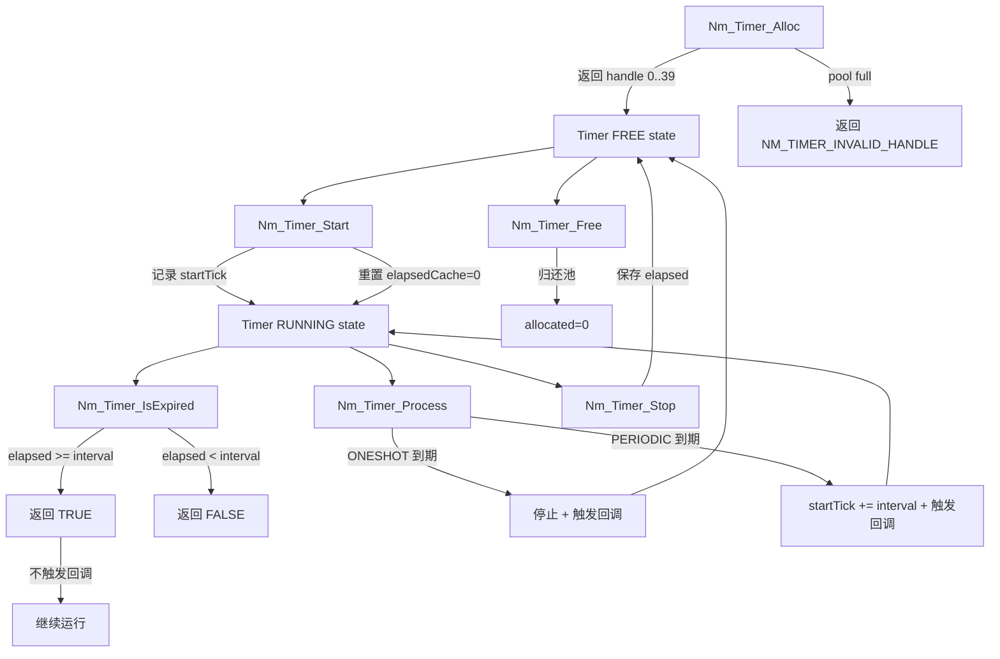

---
tags:
  - source-guide
  - timer
  - infrastructure
---

# Nm_Timer 源码导读

> 文件: `NM/Nm_Timer/Nm_Timer.c` (182行), `Nm_Timer.h` (161行) | 轻量级软件定时器子系统，NM 模块的唯一时间来源。

---

## 1. 模块定位

Nm_Timer 为 NM 状态机的所有超时判断提供统一的服务。它抽象了平台系统时钟，使得 NM 核心代码不直接依赖任何 RTOS 或裸机时钟 API。

**设计特点**:
- 数组池分配 (非链表), O(n) 查找
- 支持 ONE-SHOT (单次) 和 PERIODIC (周期) 两种模式
- tick 值使用 uint32, 正确处理 32-bit 回绕
- 回调仅在 `Nm_Timer_Process()` 中触发 (非中断上下文)
- 只有一个函数需要平台移植: `Nm_Timer_GetTick()`

---

## 2. 定时器完整生命周期



---

## 3. 核心数据结构

### 3.1 Nm_TimerNode (内部, Nm_Timer.c:17-28)

```c
typedef struct {
    uint8            allocated;      // 是否已分配 (0=free, 1=in-use)
    uint8            running;        // 是否正在计时

    Nm_TimerMsType   intervalMs;     // 超时间隔 (ms)
    Nm_TimerMode     mode;           // ONESHOT or PERIODIC
    Nm_TimerCallback callback;       // 到期回调 (在 Process 中调用)
    void*            userData;       // 回调参数

    uint32           startTick;      // 启动时的 tick 值 (snapshot)
    uint32           elapsedCache;   // 停止时保存的已流逝时间
} Nm_TimerNode;
```

### 3.2 全局定时器池

```c
#define NM_TIMER_MAX_COUNT  40U  // Nm_Timer.h:38
static Nm_TimerNode g_timers[NM_TIMER_MAX_COUNT];  // Nm_Timer.c:32
```

每个 Direct 通道占用 5 个定时器 (TTyp, TMax, TError, TWbs, TTx)。8 个通道 × 5 = 40, 刚好填满默认池。Indirect 通道每个仅用 2 个, AUTOSAR 通道约 4-5 个。

### 3.3 Nm_TimerMsType

定义于 `Nm_ConfigTypes.h:212`:

```c
typedef uint32 Nm_TimerMsType;
```

32 位无符号, 最大值约 49.7 天。所有定时器参数 (TTyp, TMax 等) 均用此类型。

---

## 4. tick 回绕处理

`Timer_Elapsed` (`Nm_Timer.c:46-57`) 正确处理 uint32 溢出:

```c
static uint32 Timer_Elapsed(Nm_TimerNode* node) {
    uint32 now = Nm_Timer_GetTick();
    if (now >= node->startTick) {
        return node->elapsedCache + (now - node->startTick);
    }
    /* wrap-around */
    return node->elapsedCache + (0xFFFFFFFFUL - node->startTick + now + 1U);
}
```

- **正常情况** (`now >= startTick`): 直接 `now - startTick`, 加 elapsedCache (stop 时保留的进度)
- **回绕情况** (`now < startTick`): 计算 `(0xFFFFFFFF - startTick + now + 1)`, 即完整的回绕跨度

`elapsedCache` 的作用: 当 Stop/Start 周期交替时，已流逝的时间不会丢失。Stop 时保存 elapsed, Start 时重置为 0, 但后续的 `+ elapsedCache` 会累加。

**为什么 32-bit 足够**: 最大超时值通常在秒级 (如 TError 1000ms)。uint32 约 49.7 天, 远大于任何 NM 超时。回绕主要影响系统运行超过 49 天后的正确性。

---

## 5. ONE-SHOT vs PERIODIC 的 Process 差异

`Nt_Timer_Process` (`Nm_Timer.c:161-182`):

```c
void Nm_Timer_Process(void) {
    for (i = 0; i < NM_TIMER_MAX_COUNT; i++) {
        node = &g_timers[i];
        // 跳过未分配 / 未运行 / 未到期
        if (!node->allocated || !node->running) continue;
        if (Timer_Elapsed(node) < node->intervalMs) continue;

        if (NM_TIMER_MODE_ONESHOT == node->mode) {
            node->running      = 0U;          // 停止
            node->elapsedCache = node->intervalMs; // 锁定已到期
        } else {
            node->startTick   += node->intervalMs;  // 推进起点
            node->elapsedCache = 0U;                // 下一轮从零开始
        }
        if (node->callback) {
            node->callback((Nm_TimerHandle)i, node->userData);
        }
    }
}
```

| 特性 | ONE-SHOT | PERIODIC |
|------|----------|----------|
| 到期后行为 | 停止 (running=0) | 自动延续 (startTick += intervalMs) |
| elapsedCache 处理 | 设为 intervalMs (禁止二次触发) | 清零 (新周期开始) |
| 典型用途 | TMax (接收看门狗), TWbs (等待总线休眠) | TTyp (NM 消息周期), TError (LimpHome 周期) |
| 重启方式 | 需显式调用 Nm_Timer_Start | 自动 (startTick 累加实现滑动窗口) |

**PERIODIC 的设计意图**: `startTick += intervalMs` 而非 `startTick = now`, 这样即使 Process 调用周期抖动，平均频率仍准确。代价是如果单次延迟超过 1 个周期，会立即触发一次回调 (elapsed 累积)。

**NM 的使用模式**:
- TTyp (PERIODIC): 在 NORMAL 状态下每 `timerTyp` ms 通过 `Nm_Timer_IsExpired(hTTyp)` 检测到期, 到期后手动 `Nm_Timer_Start(hTTyp)` 重启并发送 Ring 消息。实际 Nm_Timer_Process 对 PERIODIC 的 auto-restart 被手动 Start 覆盖。
- TMax (ONESHOT): 每次收到 NM 消息时 `Nm_Timer_Start(hTMax)` 复位。连续超时则进入 LimpHome。

---

## 6. 平台移植

**唯一需要移植的函数**:

```c
extern uint32 Nm_Timer_GetTick(void);
```

`Nm_Timer.h:159` 提供了 3 种参考实现:

| 环境 | 实现 |
|------|------|
| FreeRTOS | `xTaskGetTickCount() * portTICK_PERIOD_MS` |
| 裸机 | `g_msCounter` (SysTick ISR 递增) |
| Linux 测试 | `clock_gettime(CLOCK_MONOTONIC, &ts)` |

测试代码 (`test/test_nm_state.c`) 通过 `-DNM_HOST_TEST` 使用 `clock_gettime` 或 `GetTickCount` 提供 PC 端 tick。

---

## 7. 相关文件

- [[Nm_Core源码导读]] — Nm_MainFunction 中如何调度 Nm_Timer_Process
- [[CanNm适配层源码导读]] — 状态机如何使用 Nm_Timer_Start/IsExpired
- [[函数调用关系总图]] — 定时器在各路径中的位置
- [[数据结构运行时全景]] — Nm_TimerNode 与 ChannelContext 的关系
