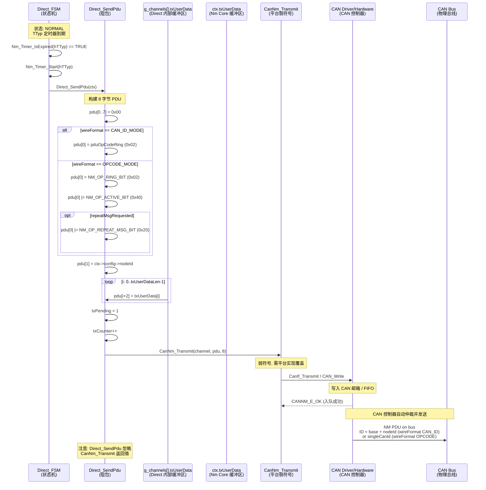
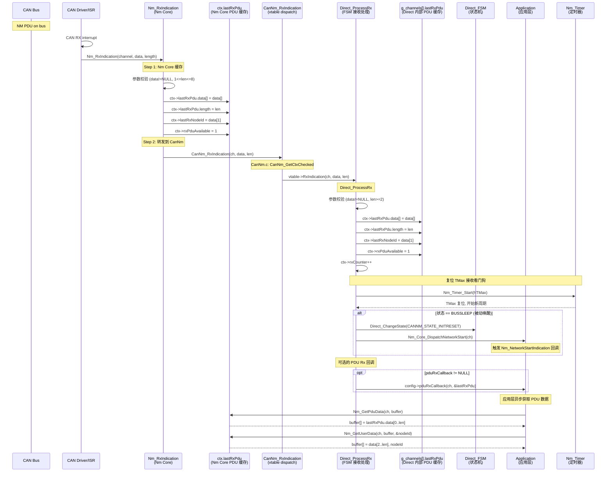
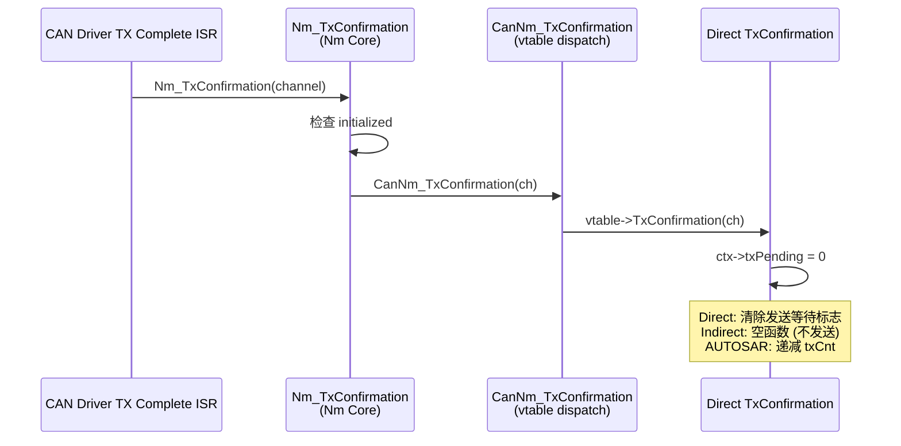
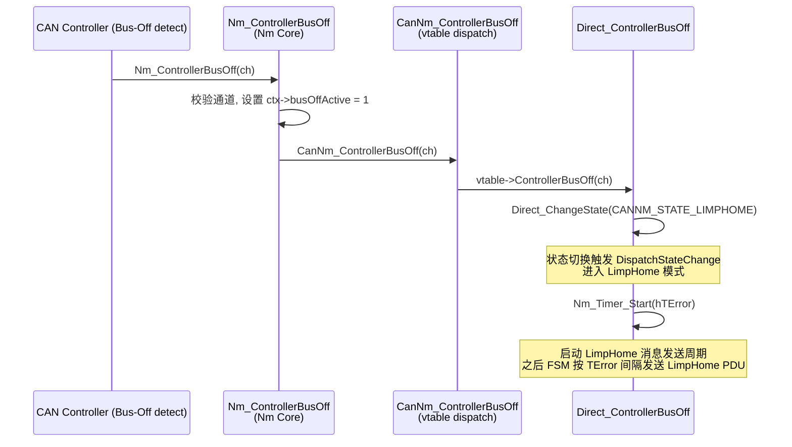

---
tags:
  - architecture
  - pdu-dataflow
  - sequence-diagram
---

# PDU 数据流全程追踪

> NM PDU (8 字节网络管理消息) 的完整生命周期 — 从状态机组包发起到 CAN 总线上行、下行接收、到应用层读取。

---

## 1. PDU 字节布局

| 偏移 | 字段 | 大小 | 说明 |
|------|------|------|------|
| `[0]` | OpCode | 1 byte | 消息类型位图 (Alive=0x01, Ring=0x02, LimpHome=0x04, Active=0x40 等) |
| `[1]` | NodeID | 1 byte | 源节点 ID (0..31) |
| `[2..7]` | UserData | 0..6 bytes | 应用自定义数据 |

---

## 2. 发送端完整序列

### 2.1 发送端关键数据缓冲区

| 缓冲区 | 位置 | 数据类型 | 写入者 | 操作时机 |
|--------|------|----------|--------|----------|
| `ctx->txUserData[]` | Nm Core `channels[]` | uint8[6] | `Nm_SetUserData` | 应用层调用 |
| `g_channels[].txUserData[]` | Direct 内部 `CanNmOsekDirect_ChannelType` | uint8[6] | `CanNmOsekDirect_SetUserData` | Nm_SetUserData 转发, Init |
| `pdu[8]` | 栈变量 `Direct_SendPdu` | uint8[8] | `Direct_SendPdu` 现场构建 | FSM 每次发送前 |
| 用户数据传递链路: | `Nm_SetUserData` | -> `ctx->txUserData[]` | -> `CanNm_SetUserData(vtable)` | -> `g_channels[].txUserData[]` |
> 注意: `Direct_SendPdu` **直接从 `ctx->config->nodeId` 和 `ctx->txUserData[]` 读取**, 不经过 Nm Core 的 `ctx` 中的 `txUserData`。Nm Core 的 `txUserData` 仅作为 Nm Core 层的缓存备份。

---

## 3. 接收端完整序列

### 3.1 接收端关键检查点

| 检查点 | 位置 | 校验内容 |
|--------|------|----------|
| 初始化检查 | Nm_RxIndication:552 | `Nm_Core.initialized == 0` 则丢弃 |
| 参数检查 | Nm_RxIndication:555 | `NULL == data \|\| 0 == len \|\| len > 8` 则丢弃 |
| 通道检查 | Nm_RxIndication:560 | `ctx == NULL` (无效 handle) 丢弃 |
| PDU 长度检查 | Direct_ProcessRx:146 | `len < 2` (无 NodeID) 丢弃 |
| vtable 检查 | CanNm_GetCtxChecked:203 | `ctx == NULL \|\| canNmVtable == NULL` 丢弃 |

---

## 4. 发送确认 (TxConfirmation) 序列

---

## 5. Bus-Off 事件序列

---

## 6. 数据缓冲区全景

| 缓冲区 | 所属结构 | 大小 | 写入者 | 读取者 | 生命周期 |
|--------|----------|------|--------|--------|----------|
| `ctx->lastRxPdu` | Nm_ChannelContextType | 8B + 1B len | `Nm_RxIndication` | `Nm_GetPduData`, `Nm_GetUserData` | 每次 Rx 覆盖 |
| `ctx->txUserData[]` | Nm_ChannelContextType | 6B | `Nm_SetUserData` | (Nm Core 层备份, 不做实际发送) | 应用设置 |
| `g_channels[].lastRxPdu` | CanNmOsekDirect_ChannelType | 8B + 1B len | `Direct_ProcessRx` | CanNm 内部状态机 | 每次 Rx 覆盖 |
| `g_channels[].txUserData[]` | CanNmOsekDirect_ChannelType | 6B | `CanNmOsekDirect_SetUserData` 转发 | `Direct_SendPdu` | 应用设置 |
| `pdu[8]` (栈) | `Direct_SendPdu` 函数 | 8B | 每次 `Direct_SendPdu` 构造 | `CanNm_Transmit` | 函数调用期间 |
| (CAN 驱动) | 平台 CAN 驱动发送邮箱/FIFO | 8B | `CanNm_Transmit` | CAN 控制器 | 发送完成后释放 |

**数据复制次数 (发送路径)**:
1. `txUserData[6]` (ROM/应用) -> `g_channels[].txUserData[6]` (Nm_SetUserData 时)
2. `g_channels[].txUserData[]` -> `pdu[2..7]` (Direct_SendPdu 组包时)
3. `pdu[8]` -> CAN 邮箱 (CanNm_Transmit)

**数据复制次数 (接收路径)**:
1. CAN 硬件 -> ISR 数据指针
2. ISR 数据 -> `ctx->lastRxPdu` (Nm Core 缓存, Nm_RxIndication)
3. ISR 数据 -> `g_channels[].lastRxPdu` (CanNm 内部缓存, Direct_ProcessRx)
4. `ctx->lastRxPdu` -> 应用缓冲区 (Nm_GetPduData)

---

## 7. 相关文件

- [[Nm_Core源码导读]] — Nm_RxIndication 和 Nm_TxConfirmation 实现
- [[CanNm适配层源码导读]] — CanNm_RxIndication vtable 分发
- [[数据结构运行时全景]] — Nm_PduType 及缓冲区结构
- [[函数调用关系总图]] — PDU 收发在全局调用图中的位置
