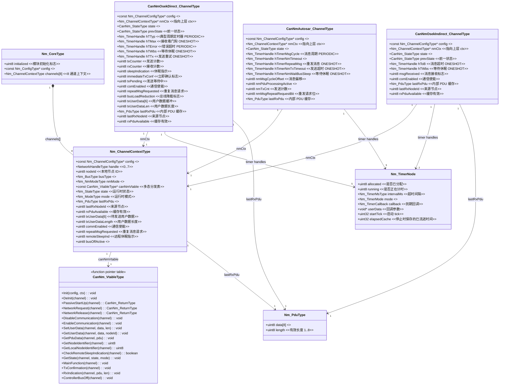

---
tags:
  - architecture
  - data-structures
  - class-diagram
---

# 数据结构运行时全景

> NM 模块全部 7 个核心数据结构的 classDiagram，涵盖类型定义、字段用途、关联关系和读写时机。

---

## 1. classDiagram 全景



---

## 2. 各数据结构详解

### 2.1 Nm_CoreType (全局单例)

| 字段 | 类型 | 写入者 | 写入时机 | 读取者 | 读取时机 |
|------|------|--------|----------|--------|----------|
| `initialized` | uint8 | Nm_Init(+), Nm_DeInit(0) | 初始化/反初始化 | 所有 API, Nm_MainFunction | 每次调用验证 |
| `config` | const Nm_ConfigType* | Nm_Init | 初始化 | Nm_MainFunction | 遍历 numChannels |
| `channels[]` | Nm_ChannelContextType[8] | Nm_Init, Dispatch* | 初始化 + 运行时 | CanNm, 各 API | 通道查找 |

实例定义: `Nm_CoreType Nm_Core;` (Nm.c:25)
对外声明: `extern Nm_CoreType Nm_Core;` (Nm_Internal.h:69)

### 2.2 Nm_ChannelContextType (通道上下文)

这是 NM 模块中**最核心的数据结构** — 连接 Nm Core 和 CanNm 状态机。

**状态字段的写入级联**:
```
应用 API (Nm_NetworkRequest)
  -> CanNm_NetworkRequest
    -> vtable->NetworkRequest
      -> Direct_ChangeState(ctx, CANNM_STATE_INIT)
        -> Nm_Core_DispatchStateChange(ch, mappedState)
          -> ctx->state = newState  <-- 写入
```

**PDU 缓存字段的写入级联**:
```
CAN 中断
  -> Nm_RxIndication(ch, data, len)
    -> ctx->lastRxPdu.data[] = data[]  <-- Nm Core 缓存
    -> ctx->rxPduAvailable = 1
    -> CanNm_RxIndication(ch, data, len)
      -> vtable->RxIndication
        -> internal_ctx->lastRxPdu = data[]  <-- CanNm 内部缓存 (双重)
        -> Nm_Timer_Start(hTMax)  (Direct only)
```

**为什么有两层 PDU 缓存?**
- `ctx->lastRxPdu` (Nm Core): 供 `Nm_GetPduData` / `Nm_GetUserData` 读取 — 这些 Nm Core API 不经过 vtable 分发
- `g_channels[].lastRxPdu` (CanNm 内部): 供 CanNm 状态机内部逻辑使用 (`Direct_ProcessRx`)

### 2.3 CanNm_VtableType (多态分发表)

```c
typedef struct CanNm_VtableType {
    void             (*Init)(...);
    void             (*DeInit)(...);
    CanNm_ReturnType (*PassiveStartUp)(...);
    CanNm_ReturnType (*NetworkRequest)(...);
    CanNm_ReturnType (*NetworkRelease)(...);
    void             (*DisableCommunication)(...);
    void             (*EnableCommunication)(...);
    void             (*SetUserData)(...);
    void             (*GetUserData)(...);
    void             (*GetPduData)(...);
    uint8            (*GetNodeIdentifier)(...);
    uint8            (*GetLocalNodeIdentifier)(...);
    boolean          (*CheckRemoteSleepIndication)(...);
    void             (*GetState)(...);
    void             (*MainFunction)(...);
    void             (*TxConfirmation)(...);
    void             (*RxIndication)(...);
    void             (*ControllerBusOff)(...);
} CanNm_VtableType;
```

**设计意图**: 消除 CanNm.c 中的所有 if/else 分支和 switch-case。每一组 18 个函数构成一个策略对象，在 `CanNm_Init` 时绑定到 `ctx->canNmVtable`。

**三个具体实例**:
| 实例 | 定义位置 | 绑定函数前缀 |
|------|----------|--------------|
| `g_vtableDirect` | CanNm.c:86 | `CanNmOsekDirect_` |
| `g_vtableIndirect` | CanNm.c:107 | `CanNmOsekIndirect_` |
| `g_vtableAutosar` | CanNm.c:128 | `CanNmAutosar_` |

### 2.4 CanNmOsekDirect_ChannelType (Direct 内部状态)

**5 个定时器及其用途**:

| 定时器 | 句柄 | 模式 | 配置参数 | 功能 |
|------|------|------|----------|------|
| TTyp | hTTyp | PERIODIC | timerTyp | NM 消息发送周期 (通常在 100-500ms) |
| TMax | hTMax | ONESHOT | timerMax | 接收看门狗 — 超时进入 LimpHome |
| TError | hTError | PERIODIC | timerError | LimpHome 消息发送周期 |
| TWbs | hTWbs | ONESHOT | timerWaitBusSleep | 等待总线休眠超时 |
| TTx | hTTx | ONESHOT | timerTx | 发送重试超时 |

**状态枚举** (匹配 CanNm_StateType): 10 个 Direct 状态 + 7 个 Indirect 状态 + 7 个 AUTOSAR 状态

### 2.5 CanNmOsekIndirect_ChannelType (Indirect 内部状态)

**2 个定时器**:
| 定时器 | 句柄 | 模式 | 功能 |
|------|------|------|------|
| ToB | hToB | ONESHOT | 应用消息超时 — 持续无消息则进入休眠 |
| TWbs | hTWbs | ONESHOT | 等待总线休眠 |

**与 Direct 的关键差异**: Indirect NM 不主动发送 NM PDU, 仅监控总线上的应用消息。`SetUserData` 为空函数, `TxConfirmation` 为空函数。

### 2.6 Nm_TimerNode (定时器节点)

定义于 `Nm_Timer.c:17-28`:

```c
typedef struct {
    uint8            allocated;      // 0=free, 1=in-use
    uint8            running;        // 0=stopped, 1=running
    Nm_TimerMsType   intervalMs;     // timeout in ms
    Nm_TimerMode     mode;           // ONESHOT or PERIODIC
    Nm_TimerCallback callback;       // expiry handler
    void*            userData;       // callback argument
    uint32           startTick;      // tick snapshot at Start
    uint32           elapsedCache;   // saved elapsed on Stop
} Nm_TimerNode;
```

全局数组: `static Nm_TimerNode g_timers[40]` (Nm_Timer.c:32)

**NM 状态机不使用回调机制**: 所有定时器分配时 `callback = NULL`。状态机在 `Direct_FSM` 中主动轮询 `Nm_Timer_IsExpired(handle)`, 不使用定时器回调触发状态迁移。

### 2.7 Nm_PduType (PDU 缓存)

```c
typedef struct {
    uint8 data[NM_PDU_MAX_LENGTH];  // 8 bytes
    uint8 length;                    // actual length 1..8
} Nm_PduType;
```

**PDU 字节布局**:
| 偏移 | 字段 | 说明 |
|------|------|------|
| [0] | OpCode | 消息类型 (Alive=0x01, Ring=0x02, LimpHome=0x04 等) |
| [1] | NodeID | 源节点 ID |
| [2..7] | User Data | 最多 6 字节用户数据 |

---

## 3. 内存布局估算

假设默认配置编译:

| 数据结构 | 实例数 | 单实例大小 (est.) | 总计 |
|----------|--------|--------------------|------|
| Nm_CoreType | 1 | ~4 + 8*(~48) = ~388 B | ~388 B |
| Nm_ChannelContextType | 8 | ~48 B | ~384 B |
| CanNmOsekDirect_ChannelType | 最多 8 | ~52 B | ~416 B |
| CanNmOsekIndirect_ChannelType | 最多 8 | ~36 B | ~288 B |
| Nm_TimerNode | 40 | ~24 B | ~960 B |
| **总计 (混合模式)** | - | - | **~2 KB** |

---

## 4. 相关文件

- [[Nm_Core源码导读]] — Nm_CoreType 和 Nm_ChannelContextType 的运行时操作
- [[CanNm适配层源码导读]] — CanNm_VtableType 的使用
- [[函数调用关系总图]] — 各结构体函数的调用关系
- [[Nm_Timer源码导读]] — Nm_TimerNode 详析
- [[PDU数据流全程追踪]] — Nm_PduType 的数据流转
