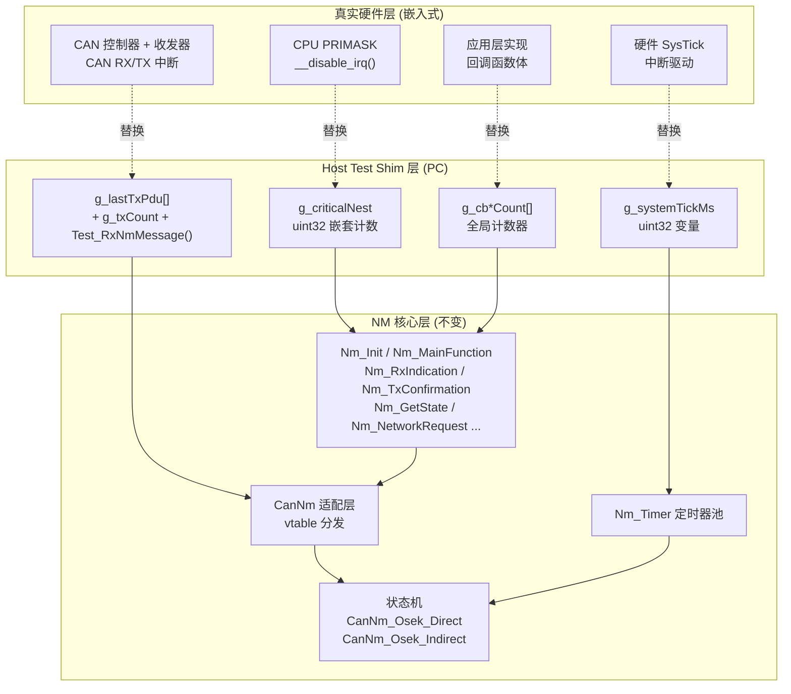

# PC端测试框架详解

> 属于 [[../00_MOC_总索引|MOC 总索引]] > **06_测试与验证**

NM 模块的 PC 端测试不依赖任何硬件。通过 `-DNM_HOST_TEST` 宏启用 Host Test Shim 层，用纯 C + `<assert.h>` 在 PC 上完整验证所有状态机行为。

---

## Host Test Shim 机制

`-DNM_HOST_TEST` 在编译期启用 PC 端桩代码，将四个平台依赖层替换为可控的虚拟实现：

### 1. 虚拟 Tick — `g_systemTickMs`

```c
static uint32 g_systemTickMs = 0U;

uint32 Nm_Timer_GetTick(void) { return g_systemTickMs; }
```

- 时间完全由测试代码控制，不依赖硬件定时器
- `Test_AdvanceTime()` 中每次步进 5ms 并调用 `Nm_MainFunction()`
- 状态机全部由虚拟 Tick 驱动，行为完全确定

### 2. 虚拟 CAN — `g_lastTxPdu` 捕获数组

```c
static uint8  g_lastTxPdu[NM_PDU_MAX_LENGTH];
static uint8  g_lastTxLength;
static uint8  g_txCount;
static uint8  g_controllerEnabled;

CanNm_ReturnType CanNm_Transmit(NetworkHandleType channel,
                                 const uint8* pduData, uint8 pduLength)
{
    /* 将发送内容存入全局数组 */
    for (i = 0; i < pduLength; i++) { g_lastTxPdu[i] = pduData[i]; }
    g_lastTxLength = pduLength;
    g_txCount++;
    return CANNM_E_OK;
}
```

- `CanNm_Transmit` 是弱符号，Host Test 提供强符号覆盖
- `g_lastTxPdu[]` 验证发送的 PDU 内容（OpCode / NodeId / UserData）
- `g_txCount` 验证发送次数（如通信禁用时期望 `g_txCount` 不增长）
- `g_controllerEnabled` 验证控制器使能/禁能状态
- `Test_RxNmMessage()` 模拟接收 NM PDU，触发状态迁移

### 3. 虚拟临界区 — `g_criticalNest` 计数器

```c
static uint32 g_criticalNest = 0U;

void Nm_EnterCritical(void) { g_criticalNest++; }
void Nm_ExitCritical(void)  { if (g_criticalNest > 0U) g_criticalNest--; }
```

- 验证临界区嵌套是否成对（离开时 `g_criticalNest == 0`）
- 确保 `Nm_EnterCritical/ExitCritical` 宏在 PC 端编译不报错
- `Nm_OsIf.h` 的 `#error` 检测因此不会触发

### 4. 虚拟回调 — 全局计数器

```c
static uint8 g_cbNetworkStartCount;
static uint8 g_cbNetworkModeCount;
static uint8 g_cbPrepareBusSleepCount;
static uint8 g_cbBusSleepCount;
static uint8 g_lastStateChangePrev;
static uint8 g_lastStateChangeNew;

void Nm_NetworkStartIndication(NetworkHandleType ch)   { g_cbNetworkStartCount++; }
void Nm_NetworkMode(NetworkHandleType ch)              { g_cbNetworkModeCount++; }
void Nm_PrepareBusSleepMode(NetworkHandleType ch)      { g_cbPrepareBusSleepCount++; }
void Nm_BusSleepMode(NetworkHandleType ch)             { g_cbBusSleepCount++; }
void Nm_StateChangeNotification(NetworkHandleType ch,
                                 Nm_StateType prev, Nm_StateType cur) {
    g_lastStateChangePrev = prev;
    g_lastStateChangeNew = cur;
}
```

- 验证回调触发次数（如唤醒时期望 `g_cbNetworkStartCount > 0`）
- 验证状态变更通知的前后状态
- 其余回调（`Nm_PduRxIndication`、`Nm_LimpHomeIndication` 等）均有空实现，避免链接错误

---

## Shim 层替代关系



关键设计原则：**NM 核心层（Nm.c / CanNm/ / Nm_Timer/）零修改**，仅替换 4 个 shim 边界。

---

## 辅助函数

### Test_AdvanceTime()

```c
static void Test_AdvanceTime(uint32 ms)
{
    uint32 steps = ms / 5U;
    uint32 i;
    for (i = 0; i < steps; i++) {
        g_systemTickMs += 5U;
        Nm_MainFunction();
    }
}
```

- 模拟时间推进：每 5ms 步进一次（与 `mainFunctionPeriodMs` 对齐）
- 每步调用 `Nm_MainFunction()`，驱动定时器递减和状态机进展
- 用于不同时间窗口：`Test_AdvanceTime(2000)` 跳过 INITRESET，`Test_AdvanceTime(3000)` 触发 TMax 超时

### Test_Reset()

```c
static void Test_Reset(void)
{
    memset(&Nm_Core, 0, sizeof(Nm_Core));
    memset(&g_lastTxPdu, 0, sizeof(g_lastTxPdu));
    g_systemTickMs         = 0U;
    g_txCount              = 0U;
    g_controllerEnabled    = 0U;
    g_cbNetworkStartCount  = 0U;
    g_cbNetworkModeCount   = 0U;
    g_cbPrepareBusSleepCount = 0U;
    g_cbBusSleepCount      = 0U;
}
```

- 每个测试用例开始时调用，确保干净的环境
- 清零 NM 核心运行时数据 + 所有 shim 全局变量
- 保证各测试用例之间完全隔离，无状态泄漏

### Test_RxNmMessage()

```c
static void Test_RxNmMessage(uint8 opCode, uint8 srcNodeId)
{
    uint8 pdu[8] = {0};
    pdu[0] = opCode;
    pdu[1] = srcNodeId;
    Nm_RxIndication(0, pdu, 8);
}
```

- 模拟接收一条 NM PDU（OpCode + 源节点 ID）
- 直接调用 `Nm_RxIndication`，绕过 CAN 驱动
- 唤醒、LimpHome 恢复等测试中用此函数注入消息

---

## 测试配置

所有 7 个测试用例共用同一套配置：

| 参数 | 值 | 说明 |
|------|:--:|------|
| `nmMode` | `NM_MODE_DIRECT` | 默认 OSEK 直接 NM |
| `wireFormat` | `NM_WIRE_FORMAT_OPCODE` | OpCode 模式 |
| `singleCanId` | `0x500` | 单一 CAN ID |
| `pduOpCodeAlive` | `0x01` | Alive 消息 OpCode |
| `pduOpCodeRing` | `0x02` | Ring 消息 OpCode |
| `pduOpCodeLimpHome` | `0x04` | LimpHome 消息 OpCode |
| `timerTyp` | `1000ms` | 典型周期 |
| `timerMax` | `2000ms` | 最大超时 |
| `timerError` | `1000ms` | LimpHome 周期 |
| `timerWaitBusSleep` | `2000ms` | TWbs |
| `mainFunctionPeriodMs` | `5ms` | 主函数周期 |

Test7（Indirect NM）在此基础上将 `nmMode` 改为 `NM_MODE_INDIRECT`。

---

> 7 个测试用例的详细拆解见 [[test_nm_state_7个用例详解|test_nm_state_7个用例详解]]。
